# Memory

### 虚拟地址空间

#### 用户态空间


- 二进制文件中的机器指令的代码段
- 二进制文件中定义的全局变量和静态变量的数据段和 BSS 段。
- 程序运行过程中动态申请内存的堆。
- 动态链接库以及内存映射区域的文件映射与匿名映射区。
- 函数调用过程中的局部变量和函数参数的栈。

###### 32 位机器上进程虚拟内存空间分布


###### 64 位机器上进程虚拟内存空间分布


###### mm_struct


```c
struct mm_struct {
    unsigned long task_size;    /* size of task vm space */
    /* start_code 和 end_code 定义代码段的起始和结束位置，程序编译后的二进制文件中的机器码被加载进内存之后就存放在这里。
     * start_data 和 end_data 定义数据段的起始和结束位置，二进制文件中存放的全局变量和静态变量被加载进内存中就存放在这里。
     * BSS 段在加载进内存时会生成一段 0 填充的内存区域， BSS 段的大小是固定的，不会扩展，无需记录。
     */
    unsigned long start_code, end_code, start_data, end_data;
    /* start_brk 定义堆的起始位置，brk 定义堆当前的结束位置。start_stack 是栈的起始位置在 RBP 寄存器中存储，
     * 栈的结束位置也就是栈顶指针 stack pointer 在 RSP 寄存器中存储。在栈中内存地址的增长方向也是由高地址向低地址增长。
	 */
    unsigned long start_brk, brk, start_stack;
    /* arg_start 和 arg_end 是参数列表的位置， env_start 和 env_end 是环境变量的位置。它们都位于栈中的最高地址处。*/
    unsigned long arg_start, arg_end, env_start, env_end;
    /* 内存映射区内存地址的增长方向是由高地址向低地址增长，mmap_base 定义内存映射区的起始地址。
     * 进程运行时所依赖的动态链接库中的代码段，数据段，BSS 段以及我们调用 mmap 映射出来的一段虚拟内存空间就保存在这个区域。
     */
    unsigned long mmap_base;  /* base of mmap area */
    /* total_vm 表示在进程虚拟内存空间中总共与物理内存映射的页的总数。*/
    unsigned long total_vm;    /* Total pages mapped */
    /* 当内存吃紧的时候，有些页可以换出到硬盘上，而有些页因为比较重要，不能换出。locked_vm 就是被锁定不能换出的内存页总数。*/
    unsigned long locked_vm;  /* Pages that have PG_mlocked set */
    /* pinned_vm  表示既不能换出，也不能移动的内存页总数。*/
    unsigned long pinned_vm;  /* Refcount permanently increased */
    /* data_vm 表示数据段中映射的内存页数目 */
    unsigned long data_vm;    /* VM_WRITE & ~VM_SHARED & ~VM_STACK */
    /* exec_vm 是代码段中存放可执行文件的内存页数目 */
    unsigned long exec_vm;    /* VM_EXEC & ~VM_WRITE & ~VM_STACK */
    /* stack_vm 是栈中所映射的内存页数目 */
    unsigned long stack_vm;    /* VM_STACK */
    /* struct vm_area_struct 双向链表的头指针 */
    struct vm_area_struct *mmap;  /* list of VMAs */
    /* struct vm_area_struct 红黑树的根节点 */
    struct rb_root mm_rb;
	......
}
```


###### vm_area_struct

每个 `vm_area_struct` 结构对应于虚拟内存空间中的唯一虚拟内存区域 VMA，`vm_start` 指向了这块虚拟内存区域的起始地址（最低地址），`vm_start` 本身包含在这块虚拟内存区域内。`vm_end` 指向了这块虚拟内存区域的结束地址（最高地址），而 `vm_end` 本身包含在这块虚拟内存区域之外，所以 `vm_area_struct` 结构描述的是 `[vm_start，vm_end)` 这样一段左闭右开的虚拟内存区域。

```c
struct vm_area_struct {
    /*  vm_next ，vm_prev 指针分别指向 VMA 节点所在双向链表中的后继节点和前驱节点，内核中的这个 VMA 双向链表是有顺序的，
     * 所有 VMA 节点按照低地址到高地址的增长方向排序。可以通过 cat /proc/pid/maps 或者 pmap pid 查看进程的虚拟内存空间布局
     * 以及其中包含的所有内存区域。这两个命令背后的实现原理就是通过遍历内核中的 vm_area_struct 双向链表获取的。
     */
    struct vm_area_struct *vm_next, *vm_prev;
    /* 红黑树节点 */
 	struct rb_node vm_rb;
    struct list_head anon_vma_chain; 
    /* 指向了所属的虚拟内存空间 mm_struct。 */
 	struct mm_struct *vm_mm; /* The address space we belong to. */
    
    unsigned long vm_start;  /* Our start address within vm_mm. */
    unsigned long vm_end;  /* The first byte after our end address within vm_mm. */
    /*
  	* Access permissions of this VMA.
  	*/
    pgprot_t vm_page_prot;
    unsigned long vm_flags; 

    /*  mmap 在上图虚拟内存空间中的文件映射与匿名映射区创建出一块 VMA 内存区域（这里是匿名映射）*/
    struct anon_vma *anon_vma; /* Serialized by page_table_lock */
    /* 关联文件映射中被映射的文件，匿名映射 vm_file 为空 */
    struct file * vm_file;  /* File we map to (can be NULL). */
    /* 表示文件映射进虚拟内存中的文件内容，在文件中的偏移。 */
    unsigned long vm_pgoff;  /* Offset (within vm_file) in PAGE_SIZE units */ 
    /* 用于存储 VMA 中的私有数据。具体的存储内容和内存映射的类型有关 */
    void * vm_private_data;  /* was vm_pte (shared mem) */
    /* Function pointers to deal with this struct. */
    const struct vm_operations_struct *vm_ops;
}

struct vm_operations_struct {
    /* 当指定的虚拟内存区域被加入到进程虚拟内存空间中时，open 函数会被调用 */
	void (*open)(struct vm_area_struct * area);
    /* 当虚拟内存区域 VMA 从进程虚拟内存空间中被删除时，close 函数会被调用 */
	void (*close)(struct vm_area_struct * area);
    /* 当进程访问虚拟内存时，访问的页面不在物理内存中，可能是未分配物理内存也可能是被置换到磁盘中，
     * 这时就会产生缺页异常，fault 函数就会被调用。
     */
    vm_fault_t (*fault)(struct vm_fault *vmf);
    /* 当一个只读的页面将要变为可写时，page_mkwrite 函数会被调用。 */
    vm_fault_t (*page_mkwrite)(struct vm_fault *vmf);

    ......
}
```

`vm_page_prot` 偏向于定义底层内存管理架构中页这一级别的访问控制权限，它可以直接应用在底层页表中。虚拟内存区域 VMA 由许多的虚拟页 (page) 组成，每个虚拟页需要经过页表的转换才能找到对应的物理页面。页表中关于内存页的访问权限就是由 `vm_page_prot` 决定的。

`vm_flags` 则偏向于定于整个虚拟内存区域的访问权限以及行为规范。描述的是虚拟内存区域中的整体信息，而不是虚拟内存区域中具体的某个独立页面。它是一个抽象的概念。可以通过 `vma->vm_page_prot = vm_get_page_prot(vma->vm_flags)` 实现到具体页面访问权限 `vm_page_prot` 的转换。下表是一些常用的 `vm_flags`

|   vm_flags   |        访问权限        |
| :----------: | :--------------------: |
|   VM_READ    |          可读          |
|   VM_WRITE   |          可写          |
|   VM_EXEC    |         可执行         |
|   VM_SHARD   |    可多进程之间共享    |
|    VM_IO     |  可映射至设备 IO 空间  |
| VM_RESERVED  |   内存区域不可被换出   |
| VM_SEQ_READ  | 内存区域可能被顺序访问 |
| VM_RAND_READ | 内存区域可能被随机访问 |


###### 其他 file_operations

针对 socket 文件类型，这里的 `file_operations` 指向的是 `socket_file_ops`。


socket 相关的操作接口定义在 `inet_stream_ops` 函数集合中，负责对上给用户提供接口。而 socket 与内核协议栈之间的操作接口定义在 `struct sock` 中的 `sk_prot` 指针上，这里指向 `tcp_prot` 协议操作函数集合。

对 socket 发起的系统 IO 调用时，在内核中首先会调用 socket 的文件结构 `struct file` 中的 `file_operations` 文件操作集合，然后调用 `struct socket` 中的 `ops` 指向的 `inet_stream_ops` socket 操作函数，最终调用到 `struct sock` 中 `sk_prot` 指针指向的 `tcp_prot` 内核协议栈操作函数接口集合。


在 ext4 文件系统中管理的文件对应的 `file_operations` 指向 `ext4_file_operations`，专门用于操作 ext4 文件系统中的文件。还有针对 page cache 页高速缓存相关操作定义的 `address_space_operations` 。


###### 二进制文件映射到虚拟内存空间

ELF 格式的二进制文件中包含了程序运行时所需要的元信息，比如程序的机器码，程序中的全局变量以及静态变量等。ELF 格式的二进制文件中的布局也是一段一段的，每一段包含了不同的元数据。磁盘文件中的段叫做 Section，内存中的段叫做 Segment，也就是内存区域。磁盘文件中的这些 Section 会在进程运行之前加载到内存中并映射到内存中的 Segment。通常是多个 Section 映射到一个 Segment。比如磁盘文件中的 .text，.rodata 等一些只读的 Section，会被映射到内存的一个只读可执行的 Segment 里（代码段）。而 .data，.bss 等一些可读写的 Section，则会被映射到内存的一个具有读写权限的 Segment 里（数据段，BSS 段）。

内核中完成这个映射过程的函数是 `load_elf_binary` ，这个函数的作用很大，加载内核的是它，启动第一个用户态进程 init 的是它，fork 完了以后，调用 exec 运行一个二进制程序的也是它。当 exec 运行一个二进制程序的时候，除了解析 ELF 的格式之外，另外一个重要的事情就是建立上述提到的内存映射。

```c
static int load_elf_binary(struct linux_binprm *bprm)
{
      ......
  /* 设置虚拟内存空间中的内存映射区域起始地址 mmap_base */
  setup_new_exec(bprm);

     .....
  /* 创建并初始化栈对应的 vm_area_struct 结构。
   * 设置 mm->start_stack 就是栈的起始地址也就是栈底，并将 mm->arg_start 是指向栈底的。
   */
  retval = setup_arg_pages(bprm, randomize_stack_top(STACK_TOP),
         executable_stack);

     ......
  /* 将二进制文件中的代码部分映射到虚拟内存空间中 */
  error = elf_map(bprm->file, load_bias + vaddr, elf_ppnt,
        elf_prot, elf_flags, total_size);

     ......
  /* 创建并初始化堆对应的的 vm_area_struct 结构，设置 current->mm->start_brk = current->mm->brk，
   * 设置堆的起始地址 start_brk，结束地址 brk。 起初两者相等表示堆是空的
   */
  retval = set_brk(elf_bss, elf_brk, bss_prot);

     ......
  /* 将进程依赖的动态链接库 .so 文件映射到虚拟内存空间中的内存映射区域 */
  elf_entry = load_elf_interp(&loc->interp_elf_ex,
              interpreter,
              &interp_map_addr,
              load_bias, interp_elf_phdata);

     ......
  /* 初始化内存描述符 mm_struct */
  current->mm->end_code = end_code;
  current->mm->start_code = start_code;
  current->mm->start_data = start_data;
  current->mm->end_data = end_data;
  current->mm->start_stack = bprm->p;

     ......
}
```


### 32 位体系内核虚拟内存空间布局

###### 直接映射区域

假定物理内存大小为 4G，在总共大小 1G 的内核虚拟内存空间中，位于最前边有一块 896M 大小的区域，称之为直接映射区或者线性映射区，地址范围为 3G -- 3G + 896m 。之所以这块 896M 大小的区域称为直接映射区或者线性映射区，是因为这块连续的虚拟内存地址会映射到 0 - 896M 这块连续的物理内存上。也就是说 3G -- 3G + 896m 这块 896M 大小的虚拟内存会直接映射到 0 - 896M 这块 896M 大小的物理内存上，**这块区域中的虚拟内存地址直接减去 0xC000 0000 (3G) 就得到了物理内存地址**。所以称这块区域为直接映射区。


可以通过 `cat /proc/iomem` 命令查看具体物理内存布局情况。在这段 896M 大小的物理内存中，前 1M 已经在系统启动的时候被系统占用，1M 之后的物理内存存放的是内核代码段，数据段，BSS 段（这些信息起初存放在 ELF格式的二进制文件中，在系统启动的时候被加载进内存）。

使用 fork 系统调用创建进程的时候，内核会创建一系列进程相关的描述符，比如之前提到的进程的核心数据结构 `task_struct`，进程的内存空间描述符 `mm_struct`，以及虚拟内存区域描述符 `vm_area_struct` 等。这些进程相关的数据结构也会存放在物理内存前 896M 的这段区域中，当然也会被直接映射至内核态虚拟内存空间中的 3G -- 3G + 896m 这段直接映射区域中。

当进程被创建完毕之后，在内核运行的过程中，会涉及内核栈的分配，内核会为每个进程分配一个固定大小的内核栈（一般是两个页大小，依赖具体的体系结构），每个进程的整个调用链必须放在自己的内核栈中，内核栈也是分配在直接映射区。（内核栈容量小而且是固定的，不像用户态栈可以动态扩展）

###### ZONE_DMA

在 X86 体系结构下，ISA 总线的 DMA （直接内存存取）控制器，只能对内存的前16M 进行寻址，这就导致了 ISA 设备不能在整个 32 位地址空间中执行 DMA，只能使用物理内存的前 16M 进行 DMA 操作。因此直接映射区的前 16M 专门让内核用来为 DMA 分配内存，这块 16M 大小的内存区域我们称之为 ZONE_DMA。**用于 DMA 的内存必须从 ZONE_DMA 区域中分配。**

###### ZONE_NORMAL

直接映射区中剩下的部分也就是从 16M 到 896M（不包含 896M）这段区域，称之为 ZONE_NORMAL。ZONE_NORMAL 也是属于直接映射区的一部分，对应的物理内存 16M 到 896M 这段区域也是被直接映射至内核态虚拟内存空间中的 3G + 16M 到 3G + 896M 这段虚拟内存上。

###### ZONE_HIGHMEM

物理内存 896M 以上的区域被内核划分为 ZONE_HIGHMEM 区域，称之为高端内存。本例中的物理内存假设为 4G，高端内存区域为 4G - 896M = 3200M。由于内核虚拟内存空间中的前 896M 虚拟内存已经被直接映射区所占用，而在 32 体系结构下内核虚拟内存空间总共也就 1G 的大小，这样一来内核剩余可用的虚拟内存空间就变为了 1G - 896M = 128M。显然物理内存中 3200M 大小的 ZONE_HIGHMEM 区域无法继续通过直接映射的方式映射到这 128M 大小的虚拟内存空间中。这样一来物理内存中的 ZONE_HIGHMEM 区域就只能采用动态映射的方式映射到 128M 大小的内核虚拟内存空间中，也就是说只能动态的一部分一部分的分批映射，先映射正在使用的这部分，使用完毕解除映射，接着映射其他部分。


###### vmalloc 动态映射区

内核虚拟内存空间中的 3G + 896M 这块地址在内核中定义为 high_memory，high_memory 往上有一段 8M 大小的内存空洞。空洞范围为：high_memory 到  `VMALLOC_START` 。接下来 `VMALLOC_START` 到 `VMALLOC_END` 之间的这块区域成为动态映射区。采用动态映射的方式映射物理内存中的高端内存。

在这块动态映射区内核是使用 vmalloc 进行内存分配。由于之前介绍的动态映射的原因，vmalloc 分配的内存在虚拟内存上是连续的，但是物理内存是不连续的。通过页表来建立物理内存与虚拟内存之间的映射关系，从而可以将不连续的物理内存映射到连续的虚拟内存上。由于 vmalloc 获得的物理内存页是不连续的，因此它只能将这些物理内存页一个一个地进行映射，在性能开销上会比直接映射大得多。

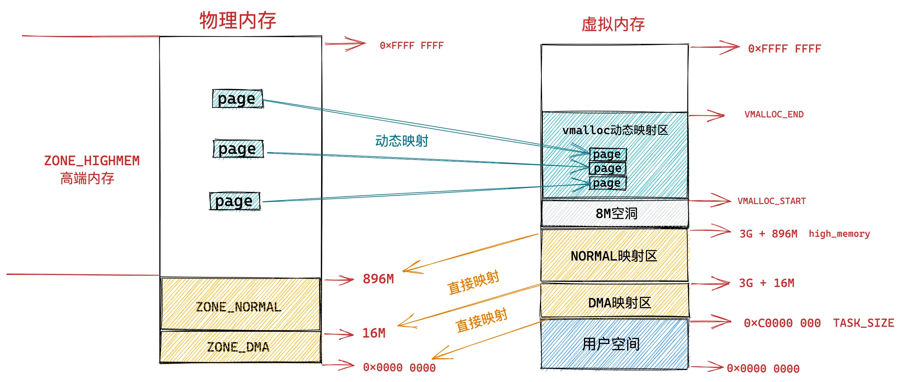

###### 永久映射区

而在 `PKMAP_BASE` 到 `FIXADDR_START` 之间的这段空间称为永久映射区。在内核的这段虚拟地址空间中允许建立与物理高端内存的长期映射关系。比如内核通过 `alloc_pages()` 函数在物理内存的高端内存中申请获取到的物理内存页，这些物理内存页可以通过调用 `kmap` 映射到永久映射区中。


###### 固定映射区

内核虚拟内存空间中的下一个区域为固定映射区，区域范围为：`FIXADDR_START` 到 `FIXADDR_TOP`。

在固定映射区中的虚拟内存地址可以自由映射到物理内存的高端地址上，但是与动态映射区以及永久映射区不同的是，在固定映射区中虚拟地址是固定的，而被映射的物理地址是可以改变的。也就是说，有些虚拟地址在编译的时候就固定下来了，是在内核启动过程中被确定的，而这些虚拟地址对应的物理地址不是固定的。采用固定虚拟地址的好处是它相当于一个指针常量（常量的值在编译时确定），指向物理地址，如果虚拟地址不固定，则相当于一个指针变量。

那为什么会有固定映射这个概念呢 ?  比如：在内核的启动过程中，有些模块需要使用虚拟内存并映射到指定的物理地址上，而且这些模块也没有办法等待完整的内存管理模块初始化之后再进行地址映射。因此，内核固定分配了一些虚拟地址，这些地址有固定的用途，使用该地址的模块在初始化的时候，将这些固定分配的虚拟地址映射到指定的物理地址上去。


###### 临时映射区


临时映射是相对于永久映射来说的，永久映射的 `kmap()` 和 `kunmap()` 函数不能用于中断处理程序，因为它可能会睡眠。当必须创建一个映射而当前的上下文又不能睡眠时，内核提供了临时映射（也就是所谓的原子映射）。API 如下

```c
void *kmap_atomic(struct *page, enum kmtype type);
void kunmap_atomic(void *kvaddr, enum km_type type);
```


### 64 位体系内核虚拟内存空间布局

在 64 位体系下的内核虚拟内存空间与物理内存的映射就变得非常简单，由于虚拟内存空间足够的大，即便是内核要访问全部的物理内存，直接映射就可以了，不在需要用到高端内存那种动态映射方式。


64 位内核虚拟内存空间从 0xFFFF 8000 0000 0000 开始到 0xFFFF 8800 0000 0000 这段地址空间是一个 8T 大小的内存空洞区域。

紧着着 8T 大小的内存空洞下一个区域就是 64T 大小的直接映射区。这个区域中的虚拟内存地址减去 `PAGE_OFFSET` 就直接得到了物理内存地址。

`VMALLOC_START` 到 `VMALLOC_END` 的这段区域是 32T 大小的 vmalloc 映射区，这里类似用户空间中的堆，内核在这里使用 vmalloc 系统调用申请内存。

从 `VMEMMAP_START` 开始是 1T 大小的虚拟内存映射区，用于存放物理页面的描述符 `struct page` 结构用来表示物理内存页。

从` __START_KERNEL_map` 开始是大小为 512M 的区域用于存放内核代码段、全局变量、BSS 等。这里对应到物理内存开始的位置，减去 `__START_KERNEL_map` 就能得到物理内存的地址。这里和直接映射区有点像，但是不矛盾，因为直接映射区之前有 8T 的空洞区域，早就过了内核代码在物理内存中加载的位置。

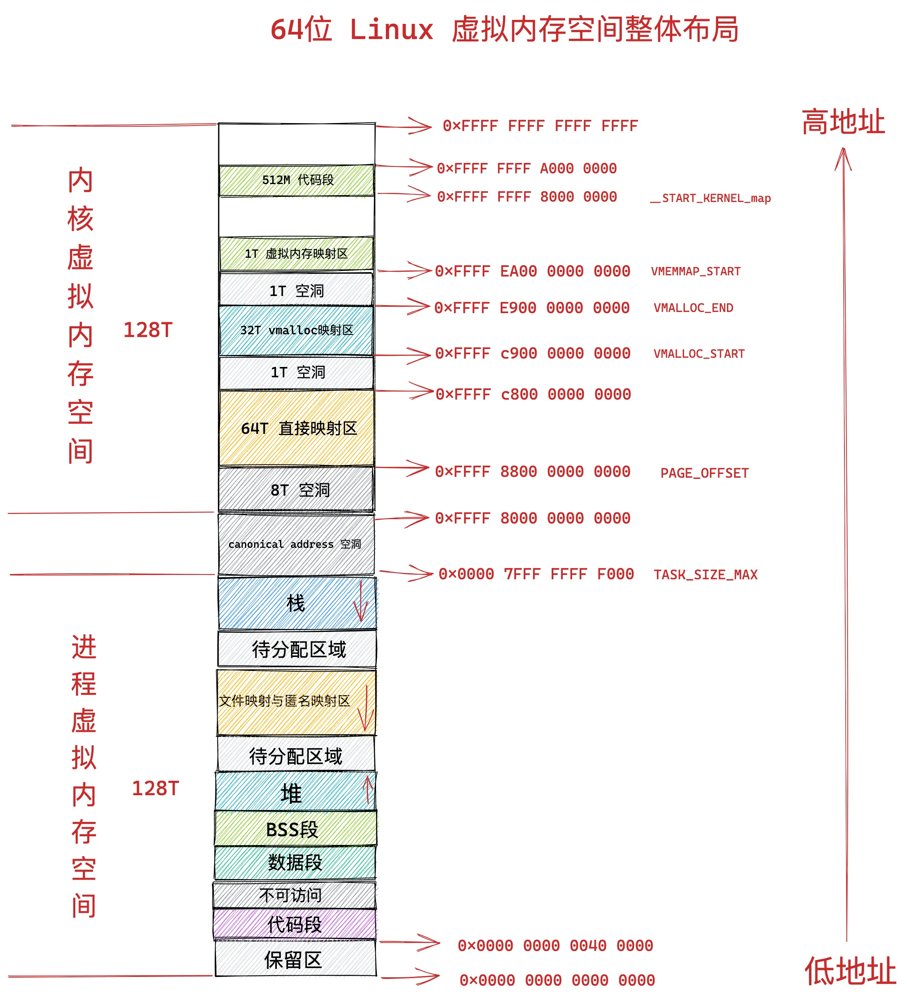

### 物理内存

内存也叫随机访问存储器（ random-access memory ）也叫 RAM 。而 RAM 分为两类：

- 一类是静态 RAM（ `SRAM` ），这类 SRAM 用于 CPU 高速缓存 L1Cache，L2Cache，L3Cache。其特点是访问速度快，访问速度为 1 - 30 个时钟周期，但是容量小，造价高。

  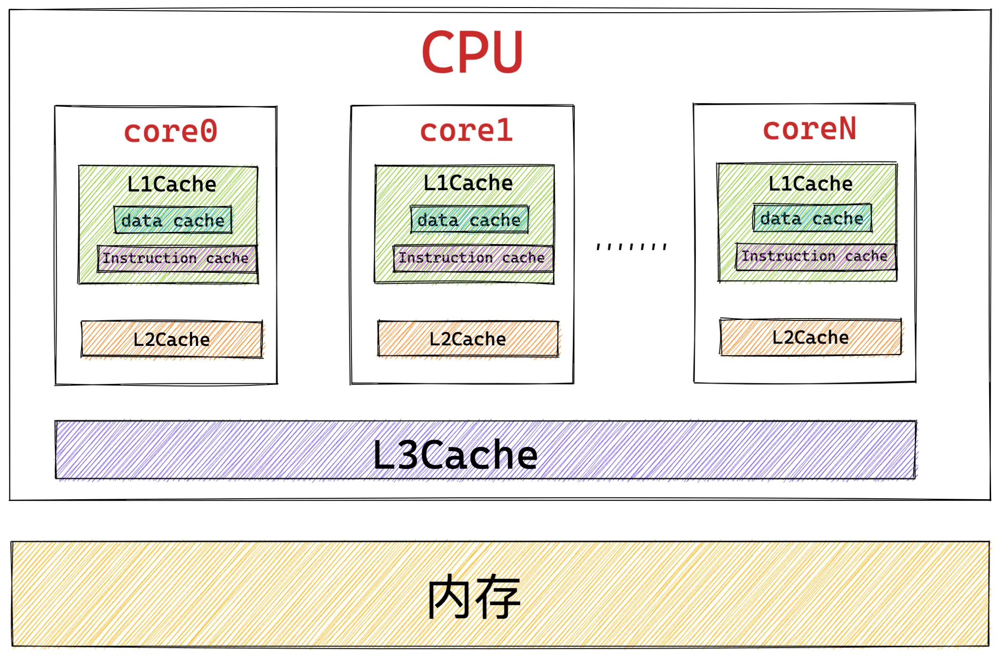

- 另一类则是动态 RAM ( `DRAM` )，这类 DRAM 用于常说的主存上，其特点的是访问速度慢（相对高速缓存），访问速度为 50 - 200 个时钟周期，但是容量大，造价便宜些（相对高速缓存）。

内存由一个一个的存储器模块（memory module）组成，它们插在主板的扩展槽上。常见的存储器模块通常以 64 位为单位（ 8 个字节）传输数据到存储控制器上或者从存储控制器传出数据。


如图所示内存条上黑色的元器件就是存储器模块（memory module）。多个存储器模块连接到存储控制器上，就聚合成了主存。


而 DRAM 芯片就包装在存储器模块中，每个存储器模块中包含 8 个 DRAM 芯片，依次编号为 0 - 7 。

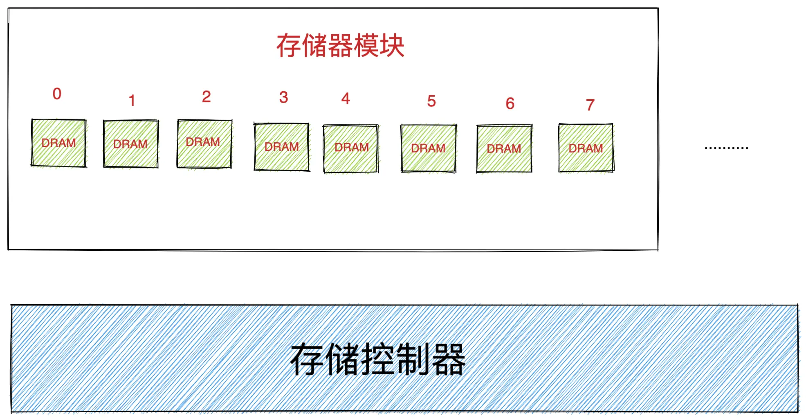

而每一个 DRAM 芯片的存储结构是一个二维矩阵，二维矩阵中存储的元素称为超单元（supercell），每个 supercell 大小为一个字节（8 bit）。每个 supercell 都由一个坐标地址（i，j）。i 表示二维矩阵中的行地址，在计算机中行地址称为 RAS (row access strobe，行访问选通脉冲)。 j 表示二维矩阵中的列地址，在计算机中列地址称为 CAS (column access strobe，列访问选通脉冲)。下图中的 supercell 的 RAS = 2，CAS = 2。


DRAM 芯片中的信息通过引脚流入流出 DRAM 芯片。每个引脚携带 1 bit的信号。

图中 DRAM 芯片包含了两个地址引脚( `addr` )，因为要通过 RAS，CAS 来定位要获取的 supercell 。还有 8 个数据引脚（`data`），因为 DRAM 芯片的 IO 单位为一个字节（8 bit），所以需要 8 个 data 引脚从 DRAM 芯片传入传出数据。（注意这里只是为了解释地址引脚和数据引脚的概念，实际硬件中的引脚数量是不一定的。）

##### DRAM 芯片的访问


1. 首先存储控制器将行地址 RAS = 2 通过地址引脚发送给 DRAM 芯片。
2. DRAM 芯片根据 RAS = 2 将二维矩阵中的第二行的全部内容拷贝到内部行缓冲区中。
3. 接下来存储控制器会通过地址引脚发送 CAS = 2 到 DRAM 芯片中。
4. DRAM 芯片从内部行缓冲区中根据 CAS = 2 拷贝出第二列的 supercell 并通过数据引脚发送给存储控制器。

DRAM 芯片的 IO 单位为一个 supercell ，也就是一个字节(8 bit)。

##### CPU 如何读写主存


CPU 与内存之间的数据交互是通过总线（bus）完成的，而数据在总线上的传送是通过一系列的步骤完成的，这些步骤称为总线事务（bus transaction）。

其中数据从内存传送到 CPU 称之为读事务（read transaction），数据从 CPU 传送到内存称之为写事务（write transaction）。

总线上传输的信号包括：地址信号，数据信号，控制信号。其中控制总线上传输的控制信号可以同步事务，并能够标识出当前正在被执行的事务信息：

- 当前这个事务是到内存的？还是到磁盘的？或者是到其他 IO 设备的？
- 这个事务是读还是写？
- 总线上传输的地址信号（物理内存地址），还是数据信号（数据）？。

**总线上传输的地址均为物理内存地址**。比如：在 MESI 缓存一致性协议中当 CPU core0 修改字段 a 的值时，其他 CPU 核心会在总线上嗅探字段 a 的**物理内存地址**，如果嗅探到总线上出现字段 a 的**物理内存地址**，说明有人在修改字段 a，这样其他 CPU 核心就会失效字段 a 所在的 cache line 。

如上图所示，其中系统总线是连接 CPU 与 IO bridge 的，存储总线是来连接 IO bridge 和主存的。IO bridge 负责将系统总线上的电子信号转换成存储总线上的电子信号。IO bridge 也会将系统总线和存储总线连接到IO总线（磁盘等IO设备）上。这里 IO bridge 其实起的作用就是转换不同总线上的电子信号。

##### CPU 从内存读取数据过程

假设 CPU 现在需要将物理内存地址为 A 的内容加载到寄存器中进行运算。


首先 CPU 芯片中的总线接口会在总线上发起读事务（read transaction）。 该读事务分为以下步骤进行：

1. CPU 将物理内存地址 A 放到系统总线上。随后 IO bridge 将信号传递到存储总线上。
2. 主存感受到存储总线上的地址信号并通过存储控制器将存储总线上的物理内存地址 A 读取出来。
3. 存储控制器通过物理内存地址 A 定位到具体的存储器模块，从 DRAM 芯片中取出物理内存地址 A 对应的数据 X。
4. 存储控制器将读取到的数据 X 放到存储总线上，随后 IO bridge 将存储总线上的数据信号转换为系统总线上的数据信号，然后继续沿着系统总线传递。
5. CPU 芯片感受到系统总线上的数据信号，将数据从系统总线上读取出来并拷贝到寄存器中。

##### 根据物理内存地址从主存中读取数据

一个 supercell 存储了一个字节（ 8 bit ） 数据，从 DRAM0 到 DRAM7 依次读取到了 8 个 supercell 也就是 8 个字节，然后将这 8 个字节返回给存储控制器，由存储控制器将数据放到存储总线上。

CPU 总是以 word size 为单位从内存中读取数据，在 64 位处理器中的 word size 为 8 个字节。64 位的内存每次只能吞吐 8 个字节。CPU 每次会向内存读写一个 cache line 大小的数据（ 64 个字节），但是内存一次只能吞吐 8 个字节。

所以在物理内存地址对应的存储器模块中，DRAM0 芯片存储第一个低位字节（ supercell ），DRAM1 芯片存储第二个字节，......依次类推 DRAM7 芯片存储最后一个高位字节。


由于存储器模块中这种由 8 个 DRAM 芯片组成的物理存储结构的限制，内存读取数据只能是按照物理内存地址，8 个字节 8 个字节地顺序读取数据。所以说内存一次读取和写入的单位是 8 个字节。


而且所谓连续的物理内存地址实际上在物理上是不连续的。因为这连续的 8 个字节其实是存储于不同的 DRAM 芯片上的。每个 DRAM 芯片存储一个字节（supercell）

##### CPU 向内存写入数据过程

假设 CPU 要将寄存器中的数据 X 写到物理内存地址 A 中。同样的道理，CPU 芯片中的总线接口会向总线发起写事务（write transaction）。写事务步骤如下：

1. CPU 将要写入的物理内存地址 A 放入系统总线上。
2. 通过 IO bridge 的信号转换，将物理内存地址 A 传递到存储总线上。
3. 存储控制器感受到存储总线上的地址信号，将物理内存地址 A 从存储总线上读取出来，并等待数据的到达。
4. CPU 将寄存器中的数据拷贝到系统总线上，通过 IO bridge 的信号转换，将数据传递到存储总线上。
5. 存储控制器感受到存储总线上的数据信号，将数据从存储总线上读取出来。
6. 存储控制器通过内存地址 A 定位到具体的存储器模块，最后将数据写入存储器模块中的 8 个 DRAM 芯片中。

#### 物理内存模型

为了快速索引到具体的物理内存页，内核为每个物理页 `struct page` 结构体定义了一个索引编号：PFN（Page Frame Number）。PFN 与 `struct page` 是一一对应的关系。内核提供了两个宏来完成 PFN 与 物理页结构体 `struct page` 之间的相互转换。它们分别是 `page_to_pfn` 与 `pfn_to_page`。内核中如何组织管理这些物理内存页 `struct page` 的方式我们称之为做物理内存模型，不同的物理内存模型，应对的场景以及 `page_to_pfn` 与 `pfn_to_page` 的计算逻辑都是不一样的。

##### FLATMEM 平坦内存模型

先把物理内存想象成一片地址连续的存储空间，在这一大片地址连续的内存空间中，内核将这块内存空间分为一页一页的内存块 `struct page` 。由于这块物理内存是连续的，物理地址也是连续的，划分出来的这一页一页的物理页必然也是连续的，并且每页的大小都是固定的，所以很容易想到用一个数组来组织这些连续的物理内存页 `struct page` 结构，其在数组中对应的下标即为 PFN 。这种内存模型就叫做平坦内存模型 FLATMEM 。


内核中使用了一个 `mem_map` 的全局数组用来组织所有划分出来的物理内存页。`mem_map` 全局数组的下标就是相应物理页对应的 PFN 。在平坦内存模型下 ，`page_to_pfn` 与 `pfn_to_page` 的计算逻辑就非常简单，本质就是基于 `mem_map` 数组进行偏移操作。

```c
#if defined(CONFIG_FLATMEM)
#define __pfn_to_page(pfn) (mem_map + ((pfn)-ARCH_PFN_OFFSET)) /* ARCH_PFN_OFFSET 是 PFN 的起始偏移量。 */
#define __page_to_pfn(page) ((unsigned long)((page)-mem_map) + ARCH_PFN_OFFSET)
#endif
```

FLATMEM 平坦内存模型只适合管理一整块连续的物理内存，而对于多块非连续的物理内存来说使用 FLATMEM 平坦内存模型进行管理则会造成很大的内存空间浪费。因为底层数据结构是 `mem_map` 数组，数组的特性又要求这些物理页是连续的，所以只能为这些内存地址空洞也分配 `struct page` 结构用来填充数组使其连续。而每个 `struct page` 结构大部分情况下需要占用 40 字节（`struct page` 结构在不同场景下内存占用会有所不同），如果物理内存中存在的大块的地址空洞，那么为这些空洞而分配的 `struct page` 将会占用大量的内存空间，导致巨大的浪费。

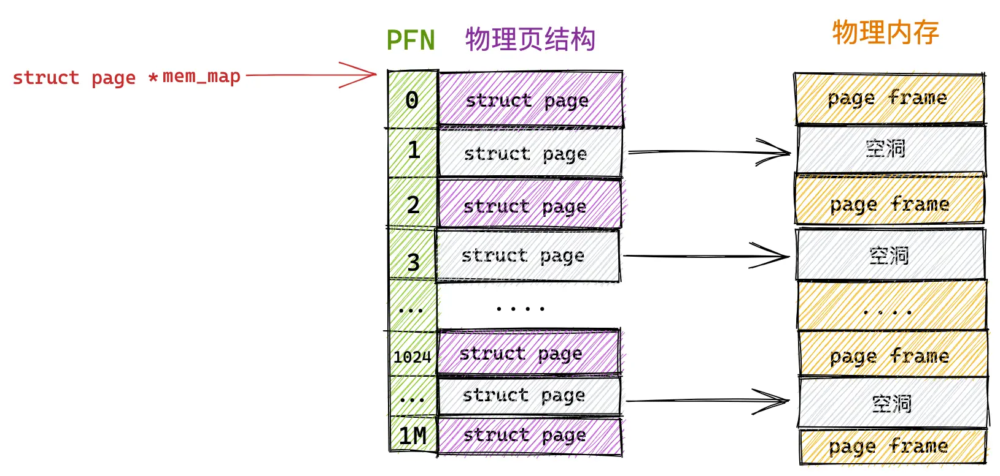

##### DISCONTIGMEM 非连续内存模型

为了组织和管理不连续的物理内存，内核引入了 DISCONTIGMEM 非连续内存模型，用来消除这些不连续的内存地址空洞对 mem_map 的空间浪费。在 DISCONTIGMEM 非连续内存模型中，内核将物理内存从宏观上划分成了一个一个的节点 node （微观上还是一页一页的物理页），每个 node 节点管理一块连续的物理内存。这样一来这些连续的物理内存页均被划归到了对应的 node 节点中管理，就避免了内存空洞造成的空间浪费。


内核中使用 `struct pglist_data` 表示用于管理连续物理内存的 node 节点（内核假设 node 中的物理内存是连续的），既然每个 node 节点中的物理内存是连续的，于是在每个 node 节点中还是采用 FLATMEM 平坦内存模型的方式来组织管理物理内存页。每个 node 节点中包含一个  `struct page *node_mem_map` 数组，用来组织管理 node 中的连续物理内存页。

```c
typedef struct pglist_data {
   #ifdef CONFIG_FLATMEM
   struct page *node_mem_map;
   #endif
}
```

可以看出 DISCONTIGMEM 非连续内存模型其实就是 FLATMEM 平坦内存模型的一种扩展，在面对大块不连续的物理内存管理时，通过将每段连续的物理内存区间划归到 node 节点中进行管理，避免了为内存地址空洞分配 `struct page` 结构，从而节省了内存资源的开销。

由于引入了 node 节点这个概念，所以在 DISCONTIGMEM 非连续内存模型下 `page_to_pfn` 与 `pfn_to_page` 的计算逻辑就比 FLATMEM 内存模型下的计算逻辑多了一步定位 page 所在 node 的操作。

- 通过 `arch_pfn_to_nid` 可以根据物理页的 PFN 定位到物理页所在 node。
- 通过 `page_to_nid` 可以根据物理页结构 `struct page` 定义到 page 所在 node。

当定位到物理页 `struct page` 所在 node 之后，剩下的逻辑就和 FLATMEM 内存模型一模一样了。

```c
#if defined(CONFIG_DISCONTIGMEM)

#define __pfn_to_page(pfn)   \
({ unsigned long __pfn = (pfn);  \
 unsigned long __nid = arch_pfn_to_nid(__pfn);  \
 NODE_DATA(__nid)->node_mem_map + arch_local_page_offset(__pfn, __nid);\
})

#define __page_to_pfn(pg)      \
({ const struct page *__pg = (pg);     \
 struct pglist_data *__pgdat = NODE_DATA(page_to_nid(__pg)); \
 (unsigned long)(__pg - __pgdat->node_mem_map) +   \
  __pgdat->node_start_pfn;     \
})
```

##### SPARSEMEM 稀疏内存模型

随着内存技术的发展，内核可以支持物理内存的热插拔了，这样一来物理内存的不连续就变为常态。在 DISCONTIGMEM 内存模型中，其实每个 node 中的物理内存也不一定都是连续的。


而且每个 node 中都有一套完整的内存管理系统，如果 node 数目多的话，那这个开销就大了，于是就有了对连续物理内存更细粒度的管理需求，为了能够更灵活地管理粒度更小的连续物理内存，SPARSEMEM 稀疏内存模型就此登场了。SPARSEMEM 稀疏内存模型的核心思想就是对粒度更小的连续内存块进行精细的管理，用于管理连续内存块的单元被称作 section 。物理页大小为 4k 的情况下， section 的大小为 128M ，物理页大小为 16k 的情况下， section 的大小为 512M。在内核中用 `struct mem_section` 结构体表示 SPARSEMEM 模型中的 section。

```c
struct mem_section {
	unsigned long section_mem_map;
        ...
}
```

由于 section 被用作管理小粒度的连续内存块，这些小的连续物理内存在 section 中也是通过数组的方式被组织管理，每个 `struct mem_section` 结构体中有一个 `section_mem_map` 指针用于指向 section 中管理连续内存的 page 数组。SPARSEMEM 内存模型中的这些所有的 `mem_section` 会被存放在一个全局的数组中，并且每个 `mem_section` 都可以在系统运行时改变 offline / online （下线 / 上线）状态，以便支持内存的热插拔（hotplug）功能。

```c
#ifdef CONFIG_SPARSEMEM_EXTREME
extern struct mem_section *mem_section[NR_SECTION_ROOTS];
...
#endif
```


在 SPARSEMEM 稀疏内存模型下 `page_to_pfn` 与 `pfn_to_page` 的计算逻辑又发生了变化。

- 在 `page_to_pfn` 的转换中，首先需要通过 `page_to_section` 根据 `struct page` 结构定位到 `mem_section` 数组中具体的 section 结构。然后在通过 `section_mem_map` 定位到具体的 PFN。

  在 `struct page` 结构中有一个 `unsigned long flags` 属性，在 flag 的高位 bit 中存储着 page 所在 `mem_section` 数组中的索引，从而可以定位到所属 section。

- 在 `pfn_to_page` 的转换中，首先需要通过 `__pfn_to_section` 根据 PFN 定位到 `mem_section` 数组中具体的 section 结构。然后在通过 PFN 在 `section_mem_map` 数组中定位到具体的物理页 Page 。

  PFN  的高位 bit 存储的是全局数组 `mem_section` 中的 section 索引，PFN 的低位 bit 存储的是 `section_mem_map` 数组中具体物理页 page 的索引。

```c
#if defined(CONFIG_SPARSEMEM)
/*
 * Note: section's mem_map is encoded to reflect its start_pfn.
 * section[i].section_mem_map == mem_map's address - start_pfn;
 */
#define __page_to_pfn(pg)     \
({ const struct page *__pg = (pg);    \
 int __sec = page_to_section(__pg);   \
 (unsigned long)(__pg - __section_mem_map_addr(__nr_to_section(__sec))); \
})

#define __pfn_to_page(pfn)    \
({ unsigned long __pfn = (pfn);   \
 struct mem_section *__sec = __pfn_to_section(__pfn); \
 __section_mem_map_addr(__sec) + __pfn;  \
})
#endif
```

SPARSEMEM 稀疏内存模型已经完全覆盖了前两个内存模型的所有功能，因此稀疏内存模型可被用于所有内存布局的情况。

##### 物理内存热插拔

在大规模的集群中，尤其是现在处于云原生的时代，为了实现集群资源的动态均衡，可以通过物理内存热插拔的功能实现集群机器物理内存容量的动态增减。集群的规模一大，那么物理内存出故障的几率也会大大增加，物理内存的热插拔对提供集群高可用性也是至关重要的。

从总体上来讲，内存的热插拔分为两个阶段：

- 物理热插拔阶段：这个阶段主要是从物理上将内存硬件插入（hot-add），拔出（hot-remove）主板的过程，其中涉及到硬件和内核的支持。
- 逻辑热插拔阶段：这一阶段主要是由内核中的内存管理子系统来负责，涉及到的主要工作为：如何动态的上线启用（online）刚刚 hot-add 的内存，如何动态下线（offline）刚刚 hot-remove 的内存。

物理内存拔出的过程需要关注的事情比插入的过程要多的多，实现起来也更加的困难。因为即将要被拔出的物理内存中可能已经为进程分配了物理页，如何妥善安置这些已经被分配的物理页是一个棘手的问题。在 SPARSEMEM 内存模型中，每个 `mem_section` 都可以在系统运行时改变 offline ，online 状态，以便支持内存的热插拔（hotplug）功能。 当 `mem_section` offline 时, 内核会把这部分内存隔离开, 使得该部分内存不可再被使用, 然后再把 `mem_section` 中已经分配的内存页迁移到其他 `mem_section` 的内存上。


但是这里会有一个问题，就是并非所有的物理页都可以迁移，因为迁移意味着物理内存地址的变化，而内存的热插拔应该对进程来说是透明的，所以这些迁移后的物理页映射的虚拟内存地址是不能变化的。这一点在进程的用户空间是没有问题的，因为进程在用户空间访问内存都是根据虚拟内存地址通过页表找到对应的物理内存地址，这些迁移之后的物理页，虽然物理内存地址发生变化，但是内核通过修改相应页表中虚拟内存地址与物理内存地址之间的映射关系，可以保证虚拟内存地址不会改变。

但是在内核态的虚拟地址空间中，有一段直接映射区，在这段虚拟内存区域中虚拟地址与物理地址是直接映射的关系，虚拟内存地址直接减去一个固定的偏移量（32位为0xC000 0000） 就得到了物理内存地址。直接映射区中的物理页的虚拟地址会随着物理内存地址变动而变动，因此这部分物理页是无法轻易迁移的，然而不可迁移的页会导致内存无法被拔除，因为无法妥善安置被拔出内存中已经为进程分配的物理页。

既然是这些不可迁移的物理页导致内存无法拔出，那么可以把内存分一下类，将内存按照物理页是否可迁移，划分为不可迁移页，可回收页，可迁移页。内核会根据分类，在可能会被拔出的内存中只分配那些可迁移的内存页，这些信息会在内存初始化的时候被设置，这样一来那些不可迁移的页就不会包含在可能会拔出的内存中。当需要将这块内存热拔出时，因为里边的内存页全部是可迁移的，从而使内存可以被拔除。

#### **物理内存架构**

##### 一致性内存访问 UMA 架构

在 UMA 架构下，多核服务器中的多个 CPU 位于总线的一侧，所有的内存条组成一大片内存位于总线的另一侧，所有的 CPU 访问内存都要过总线，而且距离都是一样的，由于所有 CPU 对内存的访问距离都是一样的，所以在 UMA 架构下所有 CPU 访问内存的速度都是一样的。这种访问模式称为 SMP（Symmetric multiprocessing），即对称多处理器。这里的一致性是指同一个 CPU 对所有内存的访问的速度是一样的。即一致性内存访问 UMA（Uniform Memory Access）。


但是随着多核技术的发展，服务器上的 CPU 个数会越来越多，而 UMA 架构下所有 CPU 都是需要通过总线来访问内存的，这样总线很快就会成为性能瓶颈，主要体现在以下两个方面：

1. 总线的带宽压力会越来越大，随着 CPU 个数的增多导致每个 CPU 可用带宽会减少
2. 总线的长度也会因此而增加，进而增加访问延迟

UMA 架构的优点很明显就是结构简单，所有的 CPU 访问内存速度都是一致的，都必须经过总线。可以考虑扩宽总线，然而成本十分高昂，未来可能仍然面临带宽压力。为了解决以上问题，提高 CPU 访问内存的性能和扩展性，于是引入了一种新的架构：非一致性内存访问 NUMA（Non-uniform memory access）。

##### 非一致性内存访问 NUMA 架构

在 NUMA 架构下，内存就不是一整片的了，而是被划分成了一个一个的内存节点 （NUMA 节点），每个 CPU 都有属于自己的本地内存节点，CPU 访问自己的本地内存不需要经过总线，因此访问速度是最快的。当 CPU 自己的本地内存不足时，CPU 就需要跨节点去访问其他内存节点，这种情况下 CPU 访问内存就会慢很多。这就导致了 CPU 访问内存的速度不一致，所以叫做非一致性内存访问架构。


如上图所示，CPU 和它的本地内存组成了 NUMA 节点，CPU 与 CPU 之间通过 QPI（Intel QuickPath Interconnect）点对点完成互联，在 CPU  的本地内存不足的情况下，CPU 需要通过 QPI 访问远程 NUMA 节点上的内存控制器从而在远程内存节点上分配内存，这就导致了远程访问比本地访问多了额外的延迟开销（需要通过 QPI 遍历远程 NUMA 节点）。在 NUMA 架构下，只有 DISCONTIGMEM 非连续内存模型和 SPARSEMEM 稀疏内存模型是可用的。而 UMA 架构下，前面介绍的三种内存模型都可以配置使用。

#####  NUMA 的内存分配策略

|   内存分配策略    |                           策略描述                           |
| :---------------: | :----------------------------------------------------------: |
|     MPOL_BIND     |   必须在绑定的节点进行内存分配，如果内存不足，则进行 swap    |
|  MPOL_INTERLEAVE  |              本地节点和远程节点均可允许分配内存              |
|  MPOL_PREFERRED   | 优先在指定节点分配内存，当指定节点内存不足时，选择离指定节点最近的节点分配内存 |
| MPOL_LOCAL (默认) | 优先在本地节点分配，当本地节点内存不足时，可以在远程节点分配内存 |

```c
#include <numaif.h>

/* mode : 指定 NUMA 内存分配策略。
 * nodemask：指定 NUMA 节点 Id。
 * maxnode：指定最大 NUMA 节点 Id，用于遍历远程节点，实现跨 NUMA 节点分配内存。
 */
long set_mempolicy(int mode, const unsigned long *nodemask, unsigned long maxnode);
```

##### NUMA 的使用简介

```c
available: 4 nodes (0-3)
node 0 cpus: 0 1 2 3 4 5 6 7 8 9 10 11 12 13 14 15 
node 0 size: 64794 MB
node 0 free: 55404 MB

node 1 cpus: 16 17 18 19 20 21 22 23 24 25 26 27 28 29 30 31
node 1 size: 65404 MB
node 1 free: 58642 MB

node 2 cpus: 32 33 34 35 36 37 38 39 40 41 42 43 44 45 46 47
node 2 size: 65404 MB
node 2 free: 61181 MB

node 3 cpus:  48 49 50 51 52 53 54 55 56 57 58 59 60 61 62 63
node 3 size: 65402 MB
node 3 free: 55592 MB

node distances:
node   0   1   2   3
  0:  10  16  32  33
  1:  16  10  25  32
  2:  32  25  10  16
  3:  33  32  16  10
```

`numactl -H` 命令可以查看服务器的 NUMA 配置，上图中的服务器配置共包含 4 个 NUMA 节点（0 - 3），每个 NUMA 节点中包含 16个 CPU 核心，本地内存大小约为 64G。`node distances` 给出了不同 NUMA 节点之间的访问距离，对角线上的值均为本地节点的访问距离 10 。比如 [0,0] 表示 NUMA 节点 0 的本地内存访问距离。可以明显看到当出现跨 NUMA 节点访问的时候，访问距离就会明显增加，比如节点 0 访问节点 1 的距离 [0,1] 是16，节点 0 访问节点 3 的距离 [0,3] 是 33。距离越远，跨 NUMA 节点内存访问的延时越大。应用程序运行时应减少跨 NUMA 节点访问内存。

```c
/* 通过 numactl -s 可以查看 NUMA 的内存分配策略设置 */
policy: default
preferred node: current
    
/* 通过 numastat 可以查看各个 NUMA 节点的内存访问命中率 */
                           node0           node1            node2           node3
numa_hit              1296554257       918018444       1296574252       828018454
numa_miss                8541758        40297198          7544751        41267108
numa_foreign            40288595         8550361         41488585         8450375
interleave_hit             45651           45918            46654           49718
local_node            1231897031       835344122       1141898045       915354158
other_node              64657226        82674322        594657725        82675425 
```

- numa_hit ：内存分配在该节点中成功的次数。
- numa_miss : 内存分配在该节点中失败的次数。
- numa_foreign：表示其他 NUMA 节点本地内存分配失败，跨节点（numa_miss）来到本节点分配内存的次数。
- interleave_hit : 在 MPOL_INTERLEAVE 策略下，在本地节点分配内存的次数。
- local_node：进程在本地节点分配内存成功的次数。
- other_node：运行在本节点的进程跨节点在其他节点上分配内存的次数。

##### 绑定 NUMA 节点

```c
numactl --membind=nodes  --cpunodebind=nodes  command
```

- 通过 `--membind` 可以指定应用程序只能在哪些具体的 NUMA 节点上分配内存，如果这些节点内存不足，则分配失败。
- 通过 `--cpunodebind` 可以指定应用程序只能运行在哪些 NUMA 节点上。

```c
numactl --physcpubind=cpus  command
```

可以通过 `--physcpubind` 将应用程序绑定到具体的物理 CPU 上。这个选项后边指定的参数可以通过 `cat /proc/cpuinfo` 输出信息中的 processor 这一栏查看。例如：通过 `numactl --physcpubind= 0-15 ./numatest.out` 命令将进程 numatest 绑定到 0~15 CPU 上执行。

##### **管理 NUMA 节点**

内核使用了一个大小为 `MAX_NUMNODES` ，类型为 `struct pglist_data` 的全局数组 `node_data[]` 来管理所有的 NUMA 节点。


```c
/* /arch/arm64/include/asm/mmzone.h */
#ifdef CONFIG_NUMA
extern struct pglist_data *node_data[];
#define NODE_DATA(nid)  (node_data[(nid)])

/* /include/linux/numa.h */
#ifdef CONFIG_NODES_SHIFT
#define NODES_SHIFT     CONFIG_NODES_SHIFT
#else
#define NODES_SHIFT     0 // UMA  架构下 NODES_SHIFT 为 0 ，内核中只用一个 NUMA 节点来管理所有物理内存。
#endif
#define MAX_NUMNODES    (1 << NODES_SHIFT)

/* /include/linux/mmzone.h */
typedef struct pglist_data {
    // NUMA 节点id，可以通过 numactl -H 命令的输出结果查看节点 id。从 0 开始依次对 NUMA 节点进行编号。
    int node_id;
    // 指向 NUMA 节点内管理所有物理页 page 的数组
    struct page *node_mem_map;
    // NUMA 节点内第一个物理页的 pfn，系统中所有 NUMA 节点中的物理页都是依次编号的，每个物理页的 PFN 都是全局唯一的（不只是其所在 NUMA 节点内唯一）
    unsigned long node_start_pfn;
    // NUMA 节点内所有可用的物理页个数（不包含内存空洞）
    unsigned long node_present_pages;
    // NUMA 节点内所有的物理页个数（包含内存空洞）
    unsigned long node_spanned_pages; 
    // 保证多进程可以并发安全的访问 NUMA 节点
    spinlock_t node_size_lock;
    .............
}
```

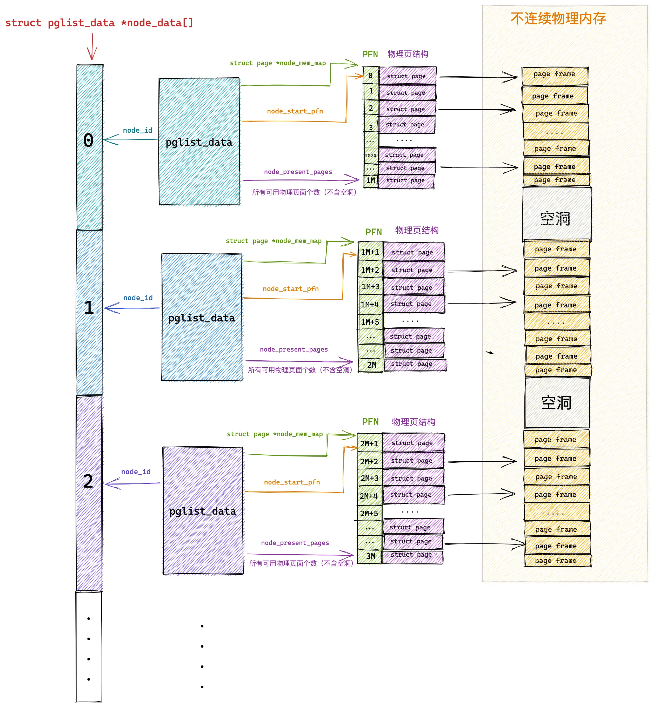

##### NUMA  节点物理内存区域的划分

```c
/* /include/linux/mmzone.h */
enum zone_type {
#ifdef CONFIG_ZONE_DMA
 /* 用于那些无法对全部物理内存进行寻址的硬件设备，进行 DMA 时的内存分配。例如 ISA 设备只能对物理内存的前 16M 进行寻址。
  * 该区域的长度依赖于具体的处理器类型。
  */
 ZONE_DMA,
#endif
#ifdef CONFIG_ZONE_DMA32
 /* 与 ZONE_DMA 区域类似，该区域内的物理页面可用于执行 DMA 操作，不同之处在于该区域是提供给 32 位设备（只能寻址 4G 物理内存）执行 DMA 操作时使用的。
  * 该区域只在 64 位系统中起作用，因为只有在 64 位系统中才会专门为 32 位设备提供专门的 DMA 区域。 
  */
 ZONE_DMA32,
#endif
 /* 这个区域的物理页都可以直接映射到内核中的虚拟内存，由于是线性映射，内核可以直接进行访问。 */
 ZONE_NORMAL,
#ifdef CONFIG_HIGHMEM
 /* 这个区域包含的物理页就是高端内存，内核不能直接访问这些物理页，这些物理页需要动态映射进内核虚拟内存空间中（非线性映射）。
  * 该区域只在 32 位系统中才会存在，因为 64 位系统中的内核虚拟内存空间太大了（128T），都可以进行直接映射。
  */
 ZONE_HIGHMEM,
#endif
 /* 是内核定义的一个虚拟内存区域，该区域中的物理页可以来自于上面的四种真实的物理区域。
  * 该区域中的页全部都是可以迁移的，主要是为了防止内存碎片和支持内存的热插拔。
  */
 ZONE_MOVABLE,
#ifdef CONFIG_ZONE_DEVICE
 /* 是为支持热插拔设备而分配的非易失性内存（ Non Volatile Memory ），也可用于内核崩溃时保存相关的调试信息。 */
 ZONE_DEVICE,
#endif
    // 充当结束标记, 在内核中想要迭代系统中所有内存域时, 会用到该常量
 __MAX_NR_ZONES

};

typedef struct pglist_data {
    // NUMA 节点中的物理内存区域个数。不是每个 NUMA 节点都会包含所有物理内存区域，NUMA 节点之间所包含的物理内存区域个数是不一样的。
 	int nr_zones; 
  	// NUMA 节点中的物理内存区域
	struct zone node_zones[MAX_NR_ZONES];
  	/* NUMA 节点的备用列表。它包含了备用 NUMA 节点和这些备用节点中的物理内存区域。备用节点是按照访问距离的远近，依次排列在 node_zonelists 数组中，
     * 数组第一个备用节点是访问距离最近的，这样当本节点内存不足时，可以从备用 NUMA 节点中分配内存。
     */
 	struct zonelist node_zonelists[MAX_ZONELISTS];
} pg_data_t;
```

事实上只有第一个 NUMA 节点可以包含所有的物理内存区域，其它的节点并不能包含所有的区域类型，因为有些内存区域比如：ZONE_DMA，ZONE_DMA32 必须从物理内存的起点开始。这些在物理内存开始的区域可能已经被划分到第一个 NUMA 节点了，后面的物理内存才会被依次划分给接下来的 NUMA 节点。因此后面的 NUMA 节点并不会包含 ZONE_DMA，ZONE_DMA32 区域。ZONE_NORMAL、ZONE_HIGHMEM 和 ZONE_MOVABLE 是可以出现在所有 NUMA 节点上的。


##### NUMA 节点中的内存规整与回收

内核会为每个 NUMA 节点分配一个 kswapd 进程用于回收不经常使用的页面，还会为每个 NUMA 节点分配一个 kcompactd 进程用于内存的规整避免内存碎片。

```c
typedef struct pglist_data {
    .........
    // 页面回收进程
    struct task_struct *kswapd;
    // kswapd 进程周期性回收页面时使用到的等待队列
    wait_queue_head_t kswapd_wait;
    // 内存规整进程
    struct task_struct *kcompactd;
    // kcompactd 进程周期性规整内存时使用到的等待队列
    wait_queue_head_t kcompactd_wait;
	..........
} pg_data_t;
```


如上图所示，假如现在系统一共有 16 个物理内存页，当前系统只是分配了 3 个物理页，那么在当前系统中还剩余 13 个物理内存页的情况下，如果内核想要分配 8 个连续的物理页的话，就会由于内存碎片的存在导致分配失败。只能分配最多 4 个连续的物理页，内核中请求分配的物理页面数只能是 2 的次幂。如果这些物理页处于 ZONE_MOVABLE 区域，它们就可以被迁移，内核可以通过迁移页面来避免内存碎片的问题：


内核通过迁移页面来规整内存，这样就可以避免内存碎片，从而得到一大片连续的物理内存，以满足内核对大块连续内存分配的请求。**所以这就是内核需要根据物理页面是否能够迁移的特性，而划分出 ZONE_MOVABLE 区域的目的**。

##### NUMA 节点的状态 node_states

如果系统中的 NUMA 节点多于一个，内核会维护一个位图 node_states，用于维护各个 NUMA 节点的状态信息。如果系统中只有一个 NUMA  节点，则没有节点位图。

```c
/* /include/linux/nodemask.h */
typedef struct { DECLARE_BITMAP(bits, MAX_NUMNODES); } nodemask_t;
extern nodemask_t node_states[NR_NODE_STATES];

/* 节点状态掩码 */
enum node_states {
	N_POSSIBLE,  /* The node could become online at some point */
	N_ONLINE,  /* The node is online */
	N_NORMAL_MEMORY, /* The node has regular memory(regular means ZONE_NORMAL) */
#ifdef CONFIG_HIGHMEM
	N_HIGH_MEMORY,  /* The node has regular or high memory */
#else
	N_HIGH_MEMORY = N_NORMAL_MEMORY,
#endif
#ifdef CONFIG_MOVABLE_NODE
	N_MEMORY,  /* The node has memory(regular, high, movable) */
#else
	N_MEMORY = N_HIGH_MEMORY,
#endif
	N_CPU,  /* The node has one or more cpus */
	NR_NODE_STATES
};

/* 用于设置或者清除指定节点的特定状态 */
static inline void node_set_state(int node, enum node_states state);
static inline void node_clear_state(int node, enum node_states state);
```

可以通过 `cat /proc/zoneinfo | grep Node` 命令来查看 NUMA 节点中内存区域的分布情况（服务器是 64 位，所以不包含 ZONE_HIGHMEM 区域）


通过 `cat /proc/zoneinfo` 命令来查看系统中各个 NUMA 节点中的各个内存区域的内存使用情况


内核中用于描述和管理 NUMA 节点中的物理内存区域的结构体是 `struct zone`，上图中显示的 ZONE_NORMAL 区域中，物理内存使用统计的相关数据均来自于 struct zone 结构体

```c
struct zone {
    // 防止并发访问该内存区域
    spinlock_t      lock;
    // 内存区域名称：Normal，DMA，HighMem
    const char      *name;
    // 指向该内存区域所属的 NUMA 节点
    struct pglist_data  *zone_pgdat;
    // 属于该内存区域中的第一个物理页 PFN
    unsigned long       zone_start_pfn;
    // 该内存区域中所有的物理页个数（包含内存空洞）spanned_pages = zone_end_pfn - zone_start_pfn
    unsigned long       spanned_pages;
    // 该内存区域所有可用的物理页个数（不包含内存空洞）present_pages = spanned_pages - absent_pages(pages in holes)
    unsigned long       present_pages;
    // 被伙伴系统所管理的物理页数
    atomic_long_t       managed_pages;
    // 伙伴系统的核心数据结构
    struct free_area    free_area[MAX_ORDER];
    // 该内存区域内存使用的统计信息，cat /proc/zoneinfo 的来源
    atomic_long_t       vm_stat[NR_VM_ZONE_STAT_ITEMS];
} ____cacheline_internodealigned_in_smp;
```


物理内存在内核中管理的层级关系为：`Node -> Zone -> page`


##### 物理内存区域中的预留内存

内核中关于内存分配的场景无外乎有两种方式：

1. 当进程请求内核分配内存时，如果此时内存比较充裕，那么进程的请求会被立刻满足；如果此时内存已经比较紧张，内核就需要将一部分不经常使用的内存进行回收，从而腾出一部分内存满足进程的内存分配的请求，在这个回收内存的过程中，进程会一直阻塞等待。
2. 另一种内存分配场景，进程是不允许阻塞的，内存分配的请求必须马上得到满足，比如执行中断处理程序或者执行持有自旋锁等临界区内的代码时，进程就不允许睡眠，因为中断程序无法被重新调度。这时就需要内核提前为这些核心操作预留一部分内存，当内存紧张时，可以使用这部分预留的内存给这些操作分配。

```c
struct zone {
    ......
    /* 该内存区域内预留内存的大小，范围为 128 到 65536 KB 之间。 */
    unsigned long nr_reserved_highatomic;
    /* 规定每个内存区域必须为自己保留的物理页数量，防止更高位的内存区域对自己的内存空间进行过多的侵占挤压。 */
    long lowmem_reserve[MAX_NR_ZONES];
	......
}
```

根据物理内存地址的高低，低位内存区域到高位内存区域的顺序依次是：ZONE_DMA，ZONE_DMA32，ZONE_NORMAL，ZONE_HIGHMEM。用于常规用途的物理内存则可以从多个物理内存区域中进行分配，当 ZONE_HIGHMEM 区域中的内存不足时，内核可以从 ZONE_NORMAL 进行内存分配，ZONE_NORMAL 区域内存不足时可以进一步降级到 ZONE_DMA 区域进行分配。

而低位内存区域中的内存总是宝贵的，内核肯定希望这些用于常规用途的物理内存从常规内存区域中进行分配，这样能够节省 ZONE_DMA 区域中的物理内存保证 DMA 操作的内存使用需求，但是如果内存很紧张了，高位内存区域中的物理内存不够用了，那么内核就会去占用挤压其他内存区域中的物理内存从而满足内存分配的需求。但是内核又不会允许高位内存区域对低位内存区域的无限制挤压占用，因为毕竟低位内存区域有它特定的用途，所以每个内存区域会给自己预留一定的内存，防止被高位内存区域挤压占用。而每个内存区域为自己预留的这部分内存就存储在 `lowmem_reserve` 数组中。

每个内存区域是按照一定的比例来计算自己的预留内存的，这个比例可以通过 `cat /proc/sys/vm/lowmem_reserve_ratio` 命令查看。从左到右分别代表了 ZONE_DMA，ZONE_DMA32，ZONE_NORMAL，ZONE_MOVABLE，ZONE_DEVICE 物理内存区域的预留内存比例。（服务器是 64 位，所以没有 ZONE_HIGHMEM 区域）


以 ZONE_DMA，ZONE_NORMAL，ZONE_HIGHMEM 这三个物理内存区域举例，它们的 lowmem_reserve_ratio 分别为 256，32，0。它们的大小分别是：8M，64M，256M，按照每页大小 4K 计算它们区域里包含的物理页个数分别为：2048, 16384, 65536。

|              | lowmem_reserve_ratio | 内存区域大小 | 物理内存页个数 |
| :----------: | :------------------: | :----------: | -------------- |
|   ZONE_DMA   |         256          |      8M      | 2048           |
| ZONE_NORMAL  |          32          |     64M      | 16384          |
| ZONE_HIGHMEM |          0           |     256M     | 65536          |

- ZONE_DMA 为防止被 ZONE_NORMAL 挤压侵占而为自己预留的物理内存页为：`16384 / 256 = 64`。
- ZONE_DMA 为防止被 ZONE_HIGHMEM 挤压侵占而为自己预留的物理内存页为：`(65536 + 16384) / 256 = 320`。
- ZONE_NORMAL 为防止被 ZONE_HIGHMEM 挤压侵占而为自己预留的物理内存页为：`65536 / 32 = 2048`。

各个内存区域为防止被高位内存区域过度挤压占用，而为自己预留的内存大小，可以通过前边 `cat /proc/zoneinfo` 命令来查看，输出信息的 `protection：`则表示各个内存区域预留内存大小。


此外还可以通过 `sysctl `对内核参数 `lowmem_reserve_ratio` 进行动态调整，这样内核会根据新的 `lowmem_reserve_ratio` 动态重新计算各个内存区域的预留内存大小。物理内存区域内被伙伴系统所管理的物理页数量 `managed_pages` 的计算方式就通过 `present_pages` 减去这些预留的物理内存页 `reserved_pages` 得到的。

##### 物理内存区域中的水位线

内存资源是系统中最宝贵的系统资源，是有限的。当内存资源紧张的时候，系统的应对方法无非就是三种：

1. 产生 OOM，内核直接将系统中占用大量内存的进程，将 OOM 优先级最高的进程干掉，释放出这个进程占用的内存供其他更需要的进程分配使用。
2. 内存回收，将不经常使用到的内存回收，腾挪出来的内存供更需要的进程分配使用。
3. 内存规整，将可迁移的物理页面进行迁移规整，消除内存碎片。从而获得更大的一片连续物理内存空间供进程分配。

内存回收的单位也是按页来的。在内核中，物理内存页有两种类型，针对这两种类型的物理内存页，内核会有不同的回收机制。

第一种就是文件页，所谓文件页就是其物理内存页中的数据来自于磁盘中的文件，当进行文件读取的时候，内核会根据局部性原理将读取的磁盘数据缓存在 page cache 中，page cache 里存放的就是文件页。当进程再次读取读文件页中的数据时，内核直接会从 page cache 中获取并拷贝给进程，省去了读取磁盘的开销。对于文件页的回收通常会比较简单，因为文件页中的数据来自于磁盘，所以当回收文件页的时候直接回收就可以了，当进程再次读取文件页时，大不了再从磁盘中重新读取就是了。但是当进程已经对文件页进行修改过但还没来得及同步回磁盘，此时文件页就是脏页，不能直接进行回收，需要先将脏页回写到磁盘中才能进行回收。可以在进程中通过  `fsync()`  系统调用将指定文件的所有脏页同步回写到磁盘，同时内核也会根据一定的条件唤醒专门用于回写脏页的 `pflush` 内核线程。

另外一种物理页类型是匿名页，所谓匿名页就是它背后并没有一个磁盘中的文件作为数据来源，匿名页中的数据都是通过进程运行过程中产生的，比如应用程序中动态分配的堆内存。当内存资源紧张需要对不经常使用的那些匿名页进行回收时，因为匿名页的背后没有一个磁盘中的文件做依托，所以匿名页不能像文件页那样直接回收，无论匿名页是不是脏页，都需要先将匿名页中的数据先保存在磁盘空间中，然后在对匿名页进行回收。并把释放出来的这部分内存分配给更需要的进程使用，当进程再次访问这块内存时，在重新把之前匿名页中的数据从磁盘空间中读取到内存就可以了，而这块磁盘空间可以是单独的一片磁盘分区（Swap 分区）或者是一个特殊的文件（Swap 文件）。匿名页的回收机制就是 Swap 机制。所谓的页面换出就是在 Swap 机制下，当内存资源紧张时，内核就会把不经常使用的这些匿名页中的数据写入到 Swap 分区或者 Swap 文件中。从而释放这些数据所占用的内存空间。所谓的页面换入就是当进程再次访问那些被换出的数据时，内核会重新将这些数据从 Swap 分区或者 Swap 文件中读取到内存中来。

Linux 提供了一个 swappiness 的内核选项，可以通过 `cat /proc/sys/vm/swappiness` 命令查看，swappiness 选项的取值范围为 0 到 100，默认为 60。swappiness 用于表示 Swap 机制的积极程度，数值越大，Swap 的积极程度越高，内核越倾向于回收匿名页。数值越小，Swap 的积极程度越低。内核就越倾向于回收文件页。swappiness 只是表示 Swap 积极的程度，当内存非常紧张的时候，即使将 swappiness 设置为 0 ，也还是会发生 Swap 的。

```c
/* 内核会为每个 NUMA 节点中的每个物理内存区域定制三条用于指示内存容量的水位线，
 * 分别是：WMARK_MIN（页最小阈值）， WMARK_LOW （页低阈值），WMARK_HIGH（页高阈值）。 
 * /include/linux/mmzone.h
 */
enum zone_watermarks {
	WMARK_MIN,
	WMARK_LOW,
	WMARK_HIGH,
	NR_WMARK
};

#define min_wmark_pages(z) (z->_watermark[WMARK_MIN] + z->watermark_boost)
#define low_wmark_pages(z) (z->_watermark[WMARK_LOW] + z->watermark_boost)
#define high_wmark_pages(z) (z->_watermark[WMARK_HIGH] + z->watermark_boost)

struct zone {
    // 物理内存区域中的水位线
    unsigned long _watermark[NR_WMARK];
    // 优化内存碎片对内存分配的影响，可以动态改变内存区域的基准水位线。
    unsigned long watermark_boost;
} ____cacheline_internodealigned_in_smp;
```


- 当该物理内存区域的剩余内存容量高于 `_watermark[WMARK_HIGH]` 时，说明此时该物理内存区域中的内存容量非常充足，内存分配完全没有压力。
- 当剩余内存容量在 `_watermark[WMARK_LOW]` 与 `_watermark[WMARK_HIGH]` 之间时，说明此时内存有一定的消耗但是还可以接受，能够继续满足进程的内存分配需求。
- 当剩余内容容量在 `_watermark[WMARK_MIN]` 与 `_watermark[WMARK_LOW]`  之间时，说明此时内存容量已经有点危险了，内存分配面临一定的压力，但是还可以满足进程的内存分配要求，当给进程分配完内存之后，就会唤醒 kswapd 进程开始内存回收，直到剩余内存高于 `_watermark[WMARK_HIGH]` 为止。在这种情况下，进程的内存分配会触发内存回收，但请求进程本身不会被阻塞，由内核的 kswapd 进程异步回收内存。
- 当剩余内容容量低于 `_watermark[WMARK_MIN]` 时，说明此时的内容容量已经非常危险了，如果进程在这时请求内存分配，内核就会进行**直接内存回收**，这时请求进程会同步阻塞等待，直到内存回收完毕。位于 _watermark[WMARK_MIN] 以下的内存容量是预留给内核在紧急情况下使用的，这部分内存就是预留内存 `nr_reserved_highatomic`。

可以通过 `cat /proc/zoneinfo` 命令来查看不同 NUMA 节点中不同内存区域中的水位线


- free 就是该物理内存区域内剩余的内存页数，它的值和后面的 `nr_free_pages` 相同。
- min、low、high 就是上面提到的三条内存水位线：`_watermark[WMARK_MIN]`，`_watermark[WMARK_LOW]` ，`_watermark[WMARK_HIGH]`。
- `nr_zone_active_anon` 和 `nr_zone_inactive_anon` 分别是该内存区域内活跃和非活跃的匿名页数量。
- `nr_zone_active_file` 和 `nr_zone_inactive_file` 分别是该内存区域内活跃和非活跃的文件页数量。

##### 水位线的计算

`WMARK_MIN`，`WMARK_LOW` ，`WMARK_HIGH` 这三个水位线的数值是通过内核参数  `/proc/sys/vm/min_free_kbytes` 为基准分别计算出来的，用户也可以通过 `sysctl` 来动态设置这个内核参数。内核参数 `min_free_kbytes` 的单位为 KB 。


通常情况下 `WMARK_LOW` 的值是 `WMARK_MIN` 的 1.25 倍，`WMARK_HIGH` 的值是 `WMARK_LOW` 的 1.5 倍。而 `WMARK_MIN` 的数值就是由这个内核参数 `min_free_kbytes` 来决定的。

```c
/* 计算最小水位线 WMARK_MIN 的数值 min_free_kbytes （单位为 KB）。 水位线的单位是物理内存页的数量。 */
int __meminit init_per_zone_wmark_min(void)
{
	// 低位内存区域（除高端内存之外）的总和
	unsigned long lowmem_kbytes;
 	// 待计算的 min_free_kbytes
	int new_min_free_kbytes;

 	// 将低位内存区域内存容量总的页数转换为 KB
	lowmem_kbytes = nr_free_buffer_pages() * (PAGE_SIZE >> 10);
	// min_free_kbytes 计算逻辑：对 lowmem_kbytes * 16 进行开平方
	new_min_free_kbytes = int_sqrt(lowmem_kbytes * 16);
	// min_free_kbytes 的范围为 128 到 65536 KB 之间
	if (new_min_free_kbytes > user_min_free_kbytes) { // 用户设置的 /proc/sys/vm/min_free_kbytes
  		min_free_kbytes = new_min_free_kbytes;
  		if (min_free_kbytes < 128)
   			min_free_kbytes = 128;
  		if (min_free_kbytes > 65536)
   			min_free_kbytes = 65536;
	} else {
		pr_warn("min_free_kbytes is not updated to %d because user defined value %d is preferred\n",
    	new_min_free_kbytes, user_min_free_kbytes);
 	}
	// 计算内存区域内的三条水位线
	setup_per_zone_wmarks();
	// 计算内存区域的预留内存大小，防止被高位内存区域过度挤压占用
	setup_per_zone_lowmem_reserve();
    ......
	return 0;
}
core_initcall(init_per_zone_wmark_min)
    
/**
 * nr_free_zone_pages - count number of pages beyond high watermark
 * @offset: The zone index of the highest zone
 *
 * nr_free_zone_pages() counts the number of counts pages which are beyond the
 * high watermark within all zones at or below a given zone index.  For each
 * zone, the number of pages is calculated as:
 *     managed_pages - high_pages
 */
static unsigned long nr_free_zone_pages(int offset)
{
	struct zoneref *z;
 	struct zone *zone;

 	unsigned long sum = 0;
    // 获取当前 NUMA 节点中的所有物理内存区域 zone
 	struct zonelist *zonelist = node_zonelist(numa_node_id(), GFP_KERNEL);
    // 计算所有物理内存区域内 managed_pages - high_pages 的总和
 	for_each_zone_zonelist(zone, z, zonelist, offset) {
  		unsigned long size = zone->managed_pages;
  		unsigned long high = high_wmark_pages(zone);
  		if (size > high)
   			sum += size - high;
 	}
    // lowmem_kbytes 的值
 	return sum;
}
```

`nr_free_zone_pages` 方法的计算逻辑本意是给定一个 zone index （方法参数 offset），计算范围为：这个给定 zone 下面的所有低位内存区域。`nr_free_zone_pages` 方法会计算这些低位内存区域内在 high watermark 水位线之上的内存容量（ `managed_pages - high_pages` ）之和。作为该方法的返回值。但在初始化时，水位线还没有值，所以此时这个方法的语义就是计算低位内存区域内被伙伴系统所管理的内存容量（ `managed_pages` ）之和。也就是想要的 `lowmem_kbytes`。


```c
static void __setup_per_zone_wmarks(void)
{
	// 将 min_free_kbytes 转换为页
	unsigned long pages_min = min_free_kbytes >> (PAGE_SHIFT - 10);
  	// 所有低位内存区域 managed_pages 之和
 	unsigned long lowmem_pages = 0;
 	struct zone *zone;
 	unsigned long flags;

 	/* Calculate total number of !ZONE_HIGHMEM pages */
 	for_each_zone(zone) {
  		if (!is_highmem(zone))
   			lowmem_pages += zone->managed_pages;
 	}

  	// 循环计算各个内存区域中的水位线
 	for_each_zone(zone) {
  		u64 tmp;
  		tmp = (u64)pages_min * zone->managed_pages;
  		// 计算 WMARK_MIN 水位线的核心方法
  		do_div(tmp, lowmem_pages);
  		if (is_highmem(zone)) {
            ......
  		} else {
    		// WMARK_MIN水位线
   			zone->watermark[WMARK_MIN] = tmp;
  		}
  		/*
         * Set the kswapd watermarks distance according to the
         * scale factor in proportion to available memory, but
         * ensure a minimum size on small systems.
         */
        /* 通过内核参数 watermark_scale_factor 来调节水位线：WMARK_MIN，WMARK_LOW，WMARK_HIGH 之间的间距。
         * 水位线间距计算逻辑是：(WMARK_MIN / 4) 与 (zone_managed_pages * watermark_scale_factor / 10000) 之间较大的那个值。
         */
  		tmp = max_t(u64, tmp >> 2, mult_frac(zone->managed_pages, watermark_scale_factor, 10000));

  		zone->watermark[WMARK_LOW]  = min_wmark_pages(zone) + tmp;
  		zone->watermark[WMARK_HIGH] = min_wmark_pages(zone) + tmp * 2;
 	}
}
```

计算 `WMARK_MIN` 水位线的方法是，先计算每个 zone 内存容量之间的比例，然后根据这个比例去从 `min_free_kbytes` 中划分出对应 zone 的 `WMARK_MIN` 水位线来。比如：当前 NUMA 节点中有两个 zone ：`ZONE_DMA` 和 `ZONE_NORMAL`，内存容量大小分别是：100 M 和 800 M。那么 `ZONE_DMA` 与 `ZONE_NORMAL` 之间的比例就是 1 ：8。根据这个比例，`ZONE_DMA` 区域里的 `WMARK_MIN` 水位线就是：`min_free_kbytes  *  1 / 8` 。`ZONE_NORMAL` 区域里的 `WMARK_MIN` 水位线就是：`min_free_kbytes  *  7 / 8 `。

计算出了 `WMARK_MIN` 的值，那么接下来 `WMARK_LOW`， `WMARK_HIGH` 的值也就好办了，它们都是基于 `WMARK_MIN` 计算出来的。`WMARK_LOW` 的值是 `WMARK_MIN` 的 1.25 倍，`WMARK_HIGH` 的值是 `WMARK_LOW` 的 1.5 倍。

为了避免内核的直接内存回收 direct reclaim 阻塞进程影响系统的性能，所以需要尽量保持内存区域中的剩余内存容量尽量在 `WMARK_MIN` 水位线之上，但是有一些极端情况，比如突然遇到网络流量增大，需要短时间内申请大量的内存来存放网络请求数据，此时 `kswapd` 回收内存的速度可能赶不上内存分配的速度，从而造成直接内存回收 direct reclaim，影响系统性能。而为了应对这种突发的网络流量暴增，需要保证 `kswapd` 进程活动的范围大一些，这样内核就能够时刻进行内存回收使得剩余内存容量较长时间的保持在 `WMARK_HIGH` 水位线之上。这样一来就要求  `WMARK_MIN` 与 `WMARK_LOW` 水位线之间的间距不能太小，因为 `WMARK_LOW` 水位线之上就不会唤醒 `kswapd` 进程了。因此内核引入了 `/proc/sys/vm/watermark_scale_factor` 参数来调节水位线之间的间距。该内核参数默认值为 10，最大值为 3000。


用户可以通过 `sysctl` 来动态调整 `watermark_scale_factor` 参数，内核会动态重新计算水位线之间的间距，使得 `WMARK_MIN` 与 `WMARK_LOW` 之间留有足够的缓冲余地，使得 `kswapd` 能够有时间回收足够的内存，从而解决直接内存回收导致的性能抖动问题。

##### 物理内存区域中的冷热页

所谓的热页就是已经加载进 CPU 高速缓存中的物理内存页，所谓的冷页就是还未加载进 CPU 高速缓存中的物理内存页，冷页是热页的后备选项。

```c
struct zone {
	/* 集中管理系统中所有 CPU 高速缓存冷热页。热页放在列表的头部，冷页放在列表的尾部。*/
    struct per_cpu_pages __percpu *per_cpu_pageset;

 	int pageset_high;
 	int pageset_batch;

} ____cacheline_internodealigned_in_smp;


struct per_cpu_pages {
	int count;  /* number of pages in the list */
    // 如果集合中页面的数量 count 值超过了 high 的值，那么表示 list 中的页面太多了，内核会从高速缓存中释放 batch 个页面到物理内存区域中的伙伴系统中。
 	int high;  /* high watermark, emptying needed */
    // 每次批量向 CPU 高速缓存填充或者释放的物理页面个数。
 	int batch;  /* chunk size for buddy add/remove */ 
 	......
 	/* Lists of pages, one per migrate type stored on the pcp-lists */
 	struct list_head lists[NR_PCP_LISTS];
};
```

内核为了最大程度的防止内存碎片，将物理内存页面按照是否可迁移的特性分为了多种迁移类型：可迁移，可回收，不可迁移。在 `struct per_cpu_pages` 结构中，每一种迁移类型都会对应一个冷热页链表。

#### 物理内存页

物理页面的大小，Linux 规定必须是 2 的整数次幂，因为 2 的整数次幂可以将一些数学运算转换为移位操作，比如乘除运算可以通过移位操作来实现，这样效率更高。 使用 4KB 是因为在内存紧张的时候，内核会将不经常使用到的物理页面进行换入换出等操作，还有在内存与文件映射的场景下，都会涉及到与磁盘的交互。数据在磁盘中组织形式也是根据一个磁盘块一个磁盘块来管理的，4KB 和 4MB 都是磁盘块大小的整数倍，但在大多数情况下，内存与磁盘之间传输小块数据时会更加的高效，所以综上所述内核会采用 4KB 作为默认物理内存页大小。

```c
struct page {
    // 存储 page 的定位信息以及相关标志位
    unsigned long flags;        

    union {
        struct {    /* Page cache and anonymous pages */
            // 用来指向物理页 page 被放置在了哪个 lru 链表上
            struct list_head lru;
            // 如果 page 为文件页的话，低位为0，指向 page 所在的 page cache
            // 如果 page 为匿名页的话，低位为1，指向其对应虚拟地址空间的匿名映射区 anon_vma
            // address_space 类型的指针实现总是对齐至 sizeof(long)
            struct address_space *mapping;
            // 如果 page 为文件页的话，index 为 page 在 page cache 中的索引
            // 如果 page 为匿名页的话，表示匿名页在对应进程虚拟内存区域 VMA 中的偏移
            pgoff_t index;
            // 在不同场景下，private 指向的场景信息不同
            unsigned long private;
        };
        
        struct {    /* slab, slob and slub */
            union {
                /* slab 的管理结构中有众多用于管理 page 的链表，比如：完全空闲的 page 链表，完全分配的 page 链表，
                 * 部分分配的 page 链表，slab_list 用于指定当前 page 位于 slab 中的哪个具体链表上。
                 */
                struct list_head slab_list;
                struct {
                    // 当 page 位于 slab 结构中的某个管理链表上时，next 指针用于指向链表中的下一个 page
                    struct page *next;
#ifdef CONFIG_64BIT
                    // 表示 slab 中总共拥有的 page 个数
                    int pages;  
                    // 表示 slab 中拥有的特定类型的对象个数
                    int pobjects;   
#else
                    short int pages;
                    short int pobjects;
#endif
                };
            };
            // 用于指向当前 page 所属的 slab 管理结构，通过 slab_cache 将 page 和 slab 关联起来。
            struct kmem_cache *slab_cache; 
        
            /* 指向 page 中的第一个未分配出去的空闲对象，slab 向伙伴系统申请一个或者多个 page，并将一整页 page 划分出多个大小相等的内存块，
             * 用于存储特定类型的对象。
             */
            void *freelist;     
            union {
                // 指向 page 中的第一个对象
                void *s_mem;    
                struct {            /* SLUB */
                    /* 表示 slab 中已经被分配出去的对象个数，当该值为 0 时，表示 slab 中所管理的对象全都是空闲的，
                     * 当所有的空闲对象达到一定数目，该 slab 就会被伙伴系统回收掉。
                     */
                    unsigned inuse:16;
                    // slab 中所有的对象个数
                    unsigned objects:15;
                    // 当前内存页 page 被 slab 放置在 CPU 本地缓存列表中，frozen = 1，否则 frozen = 0
                    unsigned frozen:1;
                };
            };
        };
        struct {    /* 复合页 compound page 相关*/
            // 复合页的尾页指向首页
            unsigned long compound_head;    
            // 用于释放复合页的析构函数，保存在首页中
            unsigned char compound_dtor;
            // 该复合页有多少个 page 组成
            unsigned char compound_order;
            // 该复合页被多少个进程使用，内存页反向映射的概念，首页中保存
            atomic_t compound_mapcount;
            // 复合页使用计数，首页中保存
            atomic_t compound_pincount;
        };

        // 表示 slab 中需要释放回收的对象链表
        struct rcu_head rcu_head;
    };

    union {     /* This union is 4 bytes in size. */
        // 表示该 page 映射了多少个进程的虚拟内存空间，一个 page 可以被多个进程映射。比如：共享内存映射，父子进程的创建等。page 与 VMA 是一对多的关系。
        atomic_t _mapcount;

    };

    // 内核中引用该物理页的次数，表示该物理页的活跃程度。
    atomic_t _refcount;

#if defined(WANT_PAGE_VIRTUAL)
    void *virtual;  // 内存页对应的虚拟内存地址
#endif /* WANT_PAGE_VIRTUAL */

} _struct_page_alignment;
```

在内核中每个文件都会有一个属于自己的 page cache（页高速缓存），页高速缓存在内核中的结构体就是这个 `struct address_space`。它被文件的 `inode` 所持有。如果当前物理内存页 `struct page` 是一个文件页的话，那么 `mapping` 指针的最低位会被设置为 0 ，指向该内存页关联文件的 `struct address_space`（页高速缓存），`pgoff_t index` 字段表示该内存页 page 在页高速缓存 page cache 中的 index 索引。内核会利用这个 index 字段从 page cache 中查找该物理内存页，同时该 `pgoff_t index` 字段也表示该内存页中的文件数据在文件内部的偏移 offset。偏移单位为 page size。


如果当前物理内存页 `struct page` 是一个匿名页的话，那么 `mapping` 指针的最低位会被设置为 1 ， 指向该匿名页在进程虚拟内存空间中的匿名映射区域 `struct anon_vma` 结构（每个匿名页对应唯一的 `anon_vma` 结构），用于物理内存到虚拟内存的反向映射。

##### 匿名页的反向映射

通常所说的内存映射是正向映射，即从虚拟内存到物理内存的映射。而反向映射则是从物理内存到虚拟内存的映射，用于当某个物理内存页需要进行回收或迁移时，此时需要去找到这个物理页被映射到了哪些进程的虚拟地址空间中，并断开它们之间的映射。在没有反向映射的机制前，需要去遍历所有进程的虚拟地址空间中的映射页表，这个效率显然是很低下的。有了反向映射机制之后内核就可以直接找到该物理内存页到所有进程映射的虚拟地址空间 VMA ，并从 VMA 使用的进程页表中取消映射。

```c
struct vm_area_struct {
    struct list_head anon_vma_chain;
    struct anon_vma *anon_vma;
}

struct anon_vma_chain {
    // 匿名页关联的进程虚拟内存空间（vma属于一个特定的进程，多个进程多个vma）
    struct vm_area_struct *vma;
    // 匿名页 page 指向的 anon_vma
    struct anon_vma *anon_vma;
    // 指向 vm_area_struct 中的 anon_vma_chain 列表
    struct list_head same_vma;
    // anon_vma 管理的红黑树中该 anon_vma_chain 对应的红黑树节点
    struct rb_node rb;         
    unsigned long rb_subtree_last;
#ifdef CONFIG_DEBUG_VM_RB
    unsigned long cached_vma_start, cached_vma_last;
#endif
};

struct anon_vma {
    struct anon_vma *root;      /* Root of this anon_vma tree */
    struct rw_semaphore rwsem; 
    atomic_t refcount;
    unsigned degree;
    struct anon_vma *parent;    /* Parent of this anon_vma */
    struct rb_root rb_root; /* Interval tree of private "related" vmas */
};
```

每个匿名页对应唯一的 `anon_vma` 结构，**但是一个匿名物理页可以映射到不同进程的虚拟内存空间中，每个进程的虚拟内存空间都是独立的，也就是说不同的进程就会有不同的 VMA**。不同的 VMA 意味着同一个匿名页 `anon_vma` 就会对应多个 `anon_vma_chain`。`struct anon_vma` 结构中管理了一颗红黑树，这颗红黑树上管理的全部都是与该 `anon_vma` 关联的 `anon_vma_chain`。可以通过 `struct page` 中的 `mapping` 指针找到 `anon_vma`，然后遍历 `anon_vma` 中的这颗红黑树 `rb_root` ，从而找到与其关联的所有 `anon_vma_chain`。物理内存页 page 到与其映射的进程虚拟内存空间 VMA，这样一种一对多的映射关系现在就算建立起来了。

`vm_area_struct` **表示的只是进程虚拟内存空间中的一段虚拟内存区域，这块虚拟内存区域中可能会包含多个匿名页，所以 VMA 与物理内存页 page 也是有一对多的映射关系存在**。 `struct anon_vma_chain` 结构中还有一个列表结构 `same_vma`，这个列表 `same_vma` 中存储的 `anon_vma_chain` 对应的 VMA 全都是一样的，而列表元素 `anon_vma_chain` 中的 `anon_vma` 却是不一样的。内核用这样一个链表结构 `same_vma` 存储了进程相应虚拟内存区域 VMA 中所包含的所有匿名页。`struct vm_area_struct` 结构中的 `struct list_head anon_vma_chain` 指向的也是这个列表 `same_vma`。


进程利用 `fork` 系统调用创建子进程的时候，内核会将父进程的虚拟内存空间相关的内容拷贝到子进程的虚拟内存空间中，此时子进程的虚拟内存空间和父进程的虚拟内存空间是一模一样的，其中虚拟内存空间中映射的物理内存页也是一样的，在内核中都是同一份，在父进程和子进程之间共享（包括 `anon_vma` 和 `anon_vma_chain`）。当进程在向内核申请内存的时候，内核首先会为进程申请的这块内存创建初始化一段虚拟内存区域 `struct vm_area_struct` 结构，但是并不会为其分配真正的物理内存。当进程开始访问这段虚拟内存时，内核会产生缺页中断，在缺页中断处理函数中才会去真正的分配物理内存（这时才会为子进程创建自己的 `anon_vma` 和 `anon_vma_chain`），并建立虚拟内存与物理内存之间的映射关系（正向映射）。

```c
static vm_fault_t handle_pte_fault(struct vm_fault *vmf)
{
	......
	if (!vmf->pte) {
        if (vma_is_anonymous(vmf->vma))
            // 处理匿名页缺页
            return do_anonymous_page(vmf);
        else
            // 处理文件页缺页
            return do_fault(vmf);
    }
	......
    if (vmf->flags & (FAULT_FLAG_WRITE|FAULT_FLAG_UNSHARE)) {
        if (!pte_write(entry))
            // 子进程缺页处理
            return do_wp_page(vmf);
    }
    ......
}

static vm_fault_t do_anonymous_page(struct vm_fault *vmf)
{
	struct vm_area_struct *vma = vmf->vma;
    struct page *page; 
    ......
    // 为匿名页创建 anon_vma 实例和 anon_vma_chain 实例，并建立它们之间的关联关系。
	if (unlikely(anon_vma_prepare(vma)))
  		goto oom;

    // 从伙伴系统中获取物理内存页 struct page
	page = alloc_zeroed_user_highpage_movable(vma, vmf->address);

	if (!page)
  		goto oom;
  	// 建立反向映射关系，完成 struct page 与 anon_vma 的关联
 	page_add_new_anon_rmap(page, vma, vmf->address);
	......
}

int __anon_vma_prepare(struct vm_area_struct *vma)
{
    // 获取进程虚拟内存空间
    struct mm_struct *mm = vma->vm_mm;
    // 准备为匿名页分配 anon_vma 以及 anon_vma_chain
    struct anon_vma *anon_vma, *allocated;
    struct anon_vma_chain *avc;
    // 分配 anon_vma_chain 实例
    avc = anon_vma_chain_alloc(GFP_KERNEL);
    if (!avc)
        goto out_enomem;
    // 在相邻的虚拟内存区域 VMA 中查找可复用的 anon_vma
    anon_vma = find_mergeable_anon_vma(vma);
    allocated = NULL;
 	if (!anon_vma) {
        // 没有可复用的 anon_vma 则创建一个新的实例
  		anon_vma = anon_vma_alloc();
  		if (unlikely(!anon_vma))
   			goto out_enomem_free_avc;
  		allocated = anon_vma;
 	}

 	anon_vma_lock_write(anon_vma);
 	/* page_table_lock to protect against threads */
 	spin_lock(&mm->page_table_lock);
 	if (likely(!vma->anon_vma)) {
        // VMA 中的 anon_vma 属性就是在这里赋值的
  		vma->anon_vma = anon_vma;
        // 建立反向映射关联
  		anon_vma_chain_link(vma, avc, anon_vma);
  		/* vma reference or self-parent link for new root */
  		anon_vma->degree++;
  		allocated = NULL;
  		avc = NULL;
 	}
    ......
}

static void anon_vma_chain_link(struct vm_area_struct *vma, struct anon_vma_chain *avc, struct anon_vma *anon_vma)
{
    // 通过 anon_vma_chain 关联 anon_vma 和对应的 vm_area_struct
	avc->vma = vma;
 	avc->anon_vma = anon_vma;
    // 将 vm_area_struct 中的 anon_vma_chain 链表加入到 anon_vma_chain 中的 same_vma 链表中
 	list_add(&avc->same_vma, &vma->anon_vma_chain);
    // 将初始化好的 anon_vma_chain 加入到 anon_vma 管理的红黑树 rb_root 中
 	anon_vma_interval_tree_insert(avc, &anon_vma->rb_root);
}

// page_add_new_anon_rmap 调用 __page_set_anon_rmap
static void __page_set_anon_rmap(struct page *page, struct vm_area_struct *vma, unsigned long address, int exclusive)
{
    struct anon_vma *anon_vma = vma->anon_vma;
    ......
    // 低位置 1，#define PAGE_MAPPING_ANON 0x1
    anon_vma = (void *) anon_vma + PAGE_MAPPING_ANON;
    // 转换为 address_space 指针赋值给 page 结构中的 mapping 字段，anon_vma = (struct anon_vma *) (mapping - PAGE_MAPPING_ANON)
    page->mapping = (struct address_space *) anon_vma;
    // page 结构中的 index 表示该匿名页在虚拟内存区域 vma 中的偏移
    page->index = linear_page_index(vma, address);
}

// 匿名页在对应进程虚拟内存区域 VMA 中的偏移
static inline pgoff_t linear_page_index(struct vm_area_struct *vma, unsigned long address)
{
    pgoff_t pgoff;
    if (unlikely(is_vm_hugetlb_page(vma)))
        return linear_hugepage_index(vma, address);
    pgoff = (address - vma->vm_start) >> PAGE_SHIFT;
    pgoff += vma->vm_pgoff;
    return pgoff;
}
```

##### 内存页回收

###### **为什么会有 active 链表和 inactive 链表**？

内存回收的关键是如何实现一个高效的页面替换算法 PFRA (Page Frame Replacement Algorithm) ，最典型的页面替换算法就是  LRU (Least-Recently-Used) 算法。LRU 算法的核心思想就是那些最近最少使用的页面，在未来的一段时间内可能也不会再次被使用，所以在内存紧张的时候，会优先将这些最近最少使用的页面置换出去。在这种情况下其实一个 active 链表就可以满足我们的需求。但是这里会有一个严重的问题，LRU 算法更多的是在时间维度上的考量，突出最近最少使用，但是它并没有考量到使用频率的影响，假设有这样一种状况，就是一个页面被疯狂频繁的使用，毫无疑问它肯定是一个热页，但是这个页面最近的一次访问时间离现在稍微久了一点点，此时进来大量的页面，这些页面的特点是只会使用一两次，以后将再也不会用到。在这种情况下，根据 LRU 的语义这个之前频繁地被疯狂访问的页面就会被置换出去了（本来应该将这些大量一次性访问的页面置换出去的），当这个页面在不久之后要被访问时，此时已经不在内存中了，还需要在重新置换进来，造成性能的损耗。这种现象也叫 Page Thrashing（页面颠簸）。因此，内核为了将页面使用频率这个重要的考量因素加入进来，于是就引入了 active 链表和 inactive 链表。工作原理如下：

1. 首先 inactive 链表的尾部存放的是访问频率最低并且最少访问的页面，在内存紧张的时候，这些页面被置换出去的优先级是最大的。
2. 对于文件页来说，当它被第一次读取的时候，内核会将它放置在 inactive 链表的头部，如果它继续被访问，则会提升至 active 链表的尾部。如果它没有继续被访问，则会随着新文件页的进入，内核会将它慢慢的推到  inactive 链表的尾部，如果此时再次被访问则会直接被提升到 active 链表的头部。大家可以看出此时页面的使用频率这个因素已经被考量了进来。
3. 对于匿名页来说，当它被第一次读取的时候，内核会直接将它放置在 active 链表的尾部，注意不是 inactive 链表的头部，这里和文件页不同。因为匿名页的换出 Swap Out 成本会更大，内核会对匿名页更加优待。当匿名页再次被访问的时候就会被被提升到 active 链表的头部。
4. 当遇到内存紧张的情况需要换页时，内核会从 active 链表的尾部开始扫描，将一定量的页面降级到  inactive 链表头部，这样一来原来位于 inactive 链表尾部的页面就会被置换出去。

内核在回收内存的时候，这两个列表中的回收优先级为：inactive 链表尾部 > inactive 链表头部 > active 链表尾部 > active 链表头部。

###### **为什么会把 active 链表和 inactive 链表分成两类，一类是匿名页，一类是文件页**？

假设现在只有 active 链表和 inactive 链表，不对这两个链表进行匿名页和文件页的归类，在需要页面置换的时候，内核会先从 active 链表尾部开始扫描，当  swappiness 被设置为 0 时，内核只会置换文件页，不会置换匿名页。由于 active 链表和 inactive 链表没有进行物理页面类型的归类，所以链表中既会有匿名页也会有文件页，如果链表中有大量的匿名页的话，内核就会不断的跳过这些匿名页去寻找文件页，并将文件页替换出去，这样从性能上来说肯定是低效的。因此内核将 active 链表和 inactive 链表按照匿名页和文件页进行了归类，当  swappiness 被设置为 0 时，内核只需要去 `nr_zone_active_file` 和 `nr_zone_inactive_file `链表中扫描即可，提升了性能。

其实除了以上的四种 LRU 链表（匿名页的 active 链表，inactive 链表和文件页的active 链表， inactive 链表）之外，内核还有一种链表，比如进程可以通过 `mlock()` 等系统调用把内存页锁定在内存里，保证该内存页无论如何不会被置换出去，比如出于安全或者性能的考虑，页面中可能会包含一些敏感的信息不想被 swap 到磁盘上导致泄密，或者一些频繁访问的内存页必须一直贮存在内存中。当这些被锁定在内存中的页面很多时，内核在扫描 active 链表的时候也不得不跳过这些页面，所以内核又将这些被锁定的页面单独拎出来放在一个独立的链表中。

##### 物理内存页属性和状态的标志位 flag


```c
/* /include/linux/mm.h */
// page to mem_section
static inline unsigned long page_to_section(const struct page *page)
{
	return (page->flags >> SECTIONS_PGSHIFT) & SECTIONS_MASK;
}

// page to numa node
static inline pg_data_t *page_pgdat(const struct page *page)
{
	return NODE_DATA(page_to_nid(page));
}

// page to zone
static inline struct zone *page_zone(const struct page *page)
{
 	return &NODE_DATA(page_to_nid(page))->node_zones[page_zonenum(page)];
}

/* /include/linux/page-flags.h */
enum pageflags {
    /* 表示该物理页面已经被锁定，如果该标志位置位，说明有使用者正在操作该 page , 则内核的其他部分不允许访问该页， 这可以防止内存管理出现竞态条件，
     * 例如：在从硬盘读取数据到 page 时。
     */
	PG_locked,  /* Page is locked. Don't touch. */
    /* 表示该物理页面刚刚被访问过。 */
	PG_referenced,
    /* 表示该物理页的数据已经从块设备中读取到内存中，并且期间没有出错。 */
	PG_uptodate,
    /* 物理内存页的脏页标识，表示该物理内存页中的数据已经被进程修改，但还没有同步会磁盘中。 */
	PG_dirty,
    /* 表示该物理内存页现在被放置在哪个 lru 链表上，比如：是在 active list 链表中，还是在 inactive list 链表中。 */
	PG_lru,
    /* 表示该物理页位于 active list 链表中。PG_referenced 和 PG_active 共同控制了系统使用该内存页的活跃程度，在内存回收的时候这两个信息非常重要。 */
 	PG_active,
    /* 表示该物理内存页属于 slab 分配器所管理的一部分。 */
 	PG_slab,
 	PG_reserved,
    /* 表示物理内存页属于复合页的其中一部分。 */
    PG_compound,
    /* 标志被置位的时候表示该 struct page 结构中的 private 指针指向了具体的对象。不同场景指向的对象不同。 */
 	PG_private,
    /* 表示该物理内存页正在被内核的 pdflush 线程回写到磁盘中。 */
 	PG_writeback,
    /* 表示该物理内存页已经被内核选中即将要进行回收。 */
 	PG_reclaim,
#ifdef CONFIG_MMU
    /* 表示该物理内存页被进程通过 mlock 系统调用锁定常驻在内存中，不会被置换出去。 */
 	PG_mlocked,  /* Page is vma mlocked */
#endif
    /* 表示该物理内存页处于 swap cache 中。 struct page 中的 private 指针这时指向 swap_entry_t 。 */
 	PG_swapcache = PG_owner_priv_1,
    ......
};
```

- PG_readahead 当进程在顺序访问文件的时候，内核会预读若干相邻的文件页数据到 page 中，物理页 page 结构设置了该标志位，表示它是一个正在被内核预读的页。

- PG_highmem 表示该物理内存页是在高端内存中。
- PG_buddy 表示该物理内存页是空闲的并且被伙伴系统所管理。

内核定义了一些标准宏，用来检查某个物理内存页 page 是否设置了特定的标志位，以及对这些标志位的操作，这些宏在内核中的实现都是原子的，命名格式如下：

- PageXXX(page)：检查 page 是否设置了 PG_XXX 标志位
- SetPageXXX(page)：设置 page 的 PG_XXX 标志位
- ClearPageXXX(page)：清除 page 的 PG_XXX 标志位
- TestSetPageXXX(page)：设置 page 的 PG_XXX 标志位，并返回原值

```c
static inline void wait_on_page_locked(struct page *page)
static inline void wait_on_page_writeback(struct page *page)
```

- 当物理页面在锁定的状态下，进程调用了 `wait_on_page_locked` 函数，那么进程就会阻塞等待知道页面解锁。
- 当物理页面正在被内核回写到磁盘的过程中，进程调用了 `wait_on_page_writeback` 函数就会进入阻塞状态直到脏页数据被回写到磁盘之后被唤醒。

##### 复合页 compound_page 相关属性

大页就是通过两个或者多个物理上连续的内存页 page 组装成的一个比普通内存页 page 更大的页，这些大页要比普通的 4K 内存页要大很多，所以遇到缺页中断的情况就会相对减少，由于减少了缺页中断所以性能会更高。另外，由于大页比普通页要大，所以大页需要的页表项要比普通页要少，页表项里保存了虚拟内存地址与物理内存地址的映射关系，当 CPU 访问内存的时候需要频繁通过 MMU 访问页表项获取物理内存地址，由于要频繁访问，所以页表项一般会缓存在 TLB 中，因为大页需要的页表项较少，所以节约了 TLB 的空间同时降低了 TLB 缓存 MISS 的概率，从而加速了内存访问。还有一个使用大页受益场景就是，当一个内存占用很大的进程（比如 Redis）通过 fork 系统调用创建子进程的时候，会拷贝父进程的相关资源，其中就包括父进程的页表，由于大页使用的页表项少，所以拷贝的时候性能会提升不少。

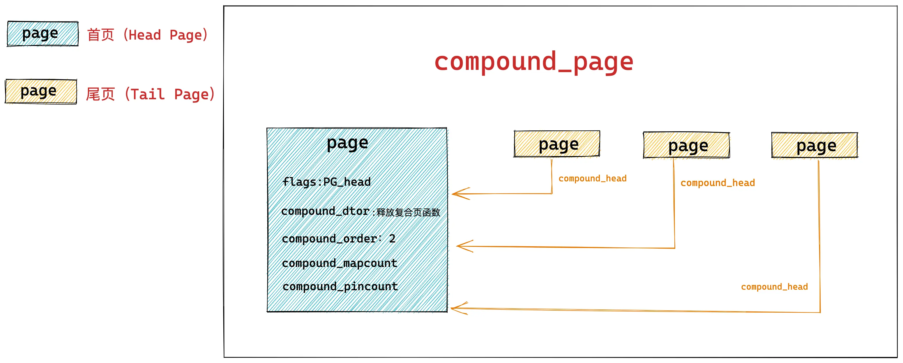

组成复合页的第一个 page 我们称之为首页（Head Page），其余的均称之为尾页（Tail Page）。首页 page 中的 flags 会被设置为 PG_head 表示复合页的第一页。

#### 物理内存分配

物理内存分配接口全部是基于伙伴系统的，伙伴系统有一个特点就是它所分配的物理内存页全部都是物理上连续的，并且只能分配 2 的整数幂个页，这里的整数幂在内核中称之为分配阶。

```c
/* 返回申请到的第一个物理页 */
struct page *alloc_pages(gfp_t gfp, unsigned int order);

#define alloc_page(gfp_mask) alloc_pages(gfp_mask, 0)

/* 返回第一个物理页对应的虚拟地址 */
unsigned long __get_free_pages(gfp_t gfp_mask, unsigned int order)
{
	struct page *page;

    // 不能在高端内存中分配物理页，因为无法直接映射获取虚拟内存地址
	page = alloc_pages(gfp_mask & ~__GFP_HIGHMEM, order);
	if (!page)
		return 0;

    // 将直接映射区中的物理内存页转换为虚拟内存地址
	return (unsigned long) page_address(page);
}

#define __get_free_page(gfp_mask) __get_free_pages((gfp_mask), 0)

/* 将从伙伴系统中申请到内存页全部初始化填充为 0 */
unsigned long get_zeroed_page(gfp_t gfp_mask)
{
	return __get_free_pages(gfp_mask | __GFP_ZERO, 0);
}

/* 从 DMA 内存区域分配适用于 DMA 的物理内存页 */
#define __get_dma_pages(gfp_mask, order) __get_free_pages((gfp_mask) | GFP_DMA, (order))

/* 对应 alloc_pages，释放 2 的 order 次幂个内存页，释放的物理内存区域起始地址由该区域中的第一个 page 指针表示 */
void __free_pages(struct page *page, unsigned int order);
/* 对应 __get_free_pages，释放 2 的 order 次幂个内存页，释放的物理内存区域起始地址对应的虚拟地址 */
void free_pages(unsigned long addr, unsigned int order);

#define __free_page(page) __free_pages((page), 0)
#define free_page(addr) free_pages((addr), 0)
```

`page_address` 函数用于将给定的物理内存页 page 转换为它的虚拟内存地址，不过这里只适用于内核虚拟内存空间中的直接映射区，因为在直接映射区中虚拟内存地址到物理内存地址是直接映射的，虚拟内存地址减去一个固定的偏移就可以直接得到物理内存地址。如果物理内存页处于高端内存中，则不能这样直接进行转换，在通过 `alloc_pages` 函数获取物理内存页 page 之后，需要调用 `kmap` 映射将 page 映射到内核虚拟地址空间中。

在释放内存时需要非常谨慎小心，只能释放属于你自己的内存页，传递了错误的 `struct page` 指针或者错误的虚拟内存地址，或者传递错了 `order` 值，都可能会导致系统的崩溃。在内核空间中，内核是完全信赖的，这点和用户空间不同。

```c
#define ___GFP_DMA      0x01u
#define ___GFP_HIGHMEM  0x02u
#define ___GFP_DMA32    0x04u
#define ___GFP_MOVABLE  0x08u
```

如果不指定物理内存的分配区域，那么内核会默认从 `ZONE_NORMAL` 区域中分配内存

```c
/* linux 5.19 */
static inline enum zone_type gfp_zone(gfp_t flags)
{
	enum zone_type z;
	int bit = (__force int) (flags & GFP_ZONEMASK);

	z = (GFP_ZONE_TABLE >> (bit * GFP_ZONES_SHIFT)) &
					 ((1 << GFP_ZONES_SHIFT) - 1);
	VM_BUG_ON((GFP_ZONE_BAD >> bit) & 1);
	return z;
}

/* linux 2.6.24 */
static inline enum zone_type gfp_zone(gfp_t flags)
{
	int base = 0;

#ifdef CONFIG_NUMA
 	if (flags & __GFP_THISNODE)
  		base = MAX_NR_ZONES;
#endif

#ifdef CONFIG_ZONE_DMA
 	if (flags & __GFP_DMA)
  		return base + ZONE_DMA;
#endif
#ifdef CONFIG_ZONE_DMA32
 	if (flags & __GFP_DMA32)
  		return base + ZONE_DMA32;
#endif
 	if ((flags & (__GFP_HIGHMEM | __GFP_MOVABLE)) == (__GFP_HIGHMEM | __GFP_MOVABLE))
  		return base + ZONE_MOVABLE;
#ifdef CONFIG_HIGHMEM
 	if (flags & __GFP_HIGHMEM)
  		return base + ZONE_HIGHMEM;
#endif
    // 默认从 normal 区域中分配内存
 	return base + ZONE_NORMAL;
}
```

- 只要掩码 flags 中设置了 `__GFP_DMA`，则不管 `__GFP_HIGHMEM` 有没有设置，内存分配都只会在 `ZONE_DMA` 区域中分配。
- 如果掩码只设置了 `ZONE_HIGHMEM`，则在物理内存分配时，优先在 `ZONE_HIGHMEM` 区域中进行分配，如果容量不够则降级到 `ZONE_NORMAL` 中，如果还是不够则进一步降级至 `ZONE_DMA` 中分配。
- 如果掩码既没有设置 `ZONE_HIGHMEM` 也没有设置 `__GFP_DMA`，则走到最后的分支，默认优先从 `ZONE_NORMAL` 区域中进行内存分配，如果容量不够则降级至 `ZONE_DMA` 区域中分配。
- 单独设置 ` __GFP_MOVABLE` 其实并不会影响内核的分配策略，如果想要让内核在 `ZONE_MOVABLE` 区域中分配内存需要同时指定 `__GFP_MOVABLE` 和 `__GFP_HIGHMEM` 。

`ZONE_MOVABLE` 只是内核定义的一个虚拟内存区域，目的是避免内存碎片和支持内存热插拔。上述介绍的 `ZONE_HIGHMEM`，`ZONE_NORMAL`，`ZONE_DMA` 才是真正的物理内存区域，`ZONE_MOVABLE` 虚拟内存区域中的物理内存来自于上述三个物理内存区域。在 32 位系统中 `ZONE_MOVABLE` 虚拟内存区域中的物理内存页来自于 `ZONE_HIGHMEM`。在 64 位系统中 `ZONE_MOVABLE` 虚拟内存区域中的物理内存页来自于 `ZONE_NORMAL` 或者 `ZONE_DMA` 区域。

|          gfp_t 掩码           |                内存区域降级策略                |
| :---------------------------: | :--------------------------------------------: |
|        什么都没有设置         |          `ZONE_NORMAL` ->  `ZONE_DMA`          |
|          `__GFP_DMA`          |                   `ZONE_DMA`                   |
| `__GFP_DMA` & `__GFP_HIGHMEM` |                   `ZONE_DMA`                   |
|        `__GFP_HIGHMEM`        | `ZONE_HIGHMEM` -> `ZONE_NORMAL` ->  `ZONE_DMA` |

```c
/* 用于指定分配的页面是可以回收的 */
#define ___GFP_RECLAIMABLE 0x10u
/* 表示该内存分配请求是高优先级的，内核急切的需要内存，如果内存分配失败则会给系统带来非常严重的后果，设置该标志通常内存是不允许分配失败的，
 * 如果空闲内存不足，则会从紧急预留内存中分配。
 */
#define ___GFP_HIGH  0x20u
/* 表示内核在分配物理内存的时候可以发起磁盘 IO 操作。比如当内核在进行内存分配的时候，发现物理内存不足，
 * 这时需要将不经常使用的内存页置换到 SWAP 分区或者 SWAP 文件中，这时就涉及到了 IO 操作，如果设置了该标志，表示允许内核将不常用的内存页置换出去。
 */
#define ___GFP_IO  0x40u
/* 允许内核执行底层文件系统操作，在与 VFS 虚拟文件系统层相关联的内核子系统中必须禁用该标志，否则可能会引起文件系统操作的循环递归调用，
 * 因为在设置 ___GFP_FS 标志分配内存的情况下，可能会引起更多的文件系统操作，而这些文件系统的操作可能又会进一步产生内存分配行为，这样一直递归持续下去。
 */
#define ___GFP_FS  0x80u
/* 在内核分配内存成功之后，将内存页初始化填充字节 0 。 */
#define ___GFP_ZERO  0x100u
/* 该标志的设置表示内存在分配物理内存的时候不允许睡眠必须是原子性地进行内存分配。比如在中断处理程序中，就不能睡眠，因为中断程序不能被重新调度。
 * 同时也不能在持有自旋锁的进程上下文中睡眠，因为可能导致死锁。综上所述这个标志只能用在不能被重新安全调度的进程上下文中。
 */
#define ___GFP_ATOMIC  0x200u
/* 表示内核在进行内存分配的时候，可以进行直接内存回收。当剩余内存容量低于水位线 _watermark[WMARK_MIN] 时，说明此时的内存容量已经非常危险了，
 * 如果进程在这时请求内存分配，内核就会进行直接内存回收，直到内存水位线恢复到 _watermark[WMARK_HIGH] 之上。
 */
#define ___GFP_DIRECT_RECLAIM 0x400u
/* 表示内核在分配内存的时候，如果剩余内存容量在 _watermark[WMARK_MIN] 与 _watermark[WMARK_LOW] 之间时，
 * 内核就会唤醒 kswapd 进程开始异步内存回收，直到剩余内存高于 _watermark[WMARK_HIGH] 为止。
 */
#define ___GFP_KSWAPD_RECLAIM 0x800u
/* 表示当内核分配内存失败时，抑制内核的分配失败错误报告。 */
#define ___GFP_NOWARN  0x2000u
/* 在内核分配内存失败的时候，允许重试，但重试仍然可能失败，重试若干次后停止。 */
#define ___GFP_RETRY_MAYFAIL 0x4000u
/* 在内核分配失败时一直重试直到成功为止。 */
#define ___GFP_NOFAIL  0x8000u
/* 表示分配内存失败时不允许重试。 */
#define ___GFP_NORETRY  0x10000u
/* 该标志限制了内核分配内存的行为只能在当前进程分配到的 CPU 所关联的 NUMA 节点上进行分配，当进程可以运行的 CPU 受限时，该标志才会有意义，
 * 如果进程允许在所有 CPU 上运行则该标志没有意义。
 */
#define ___GFP_HARDWALL  0x100000u
/* 该标志限制了内核分配内存的行为只能在当前 NUMA 节点或者在指定 NUMA 节点中分配内存，如果内存分配失败不允许从其他备用 NUMA 节点中分配内存。 */
#define ___GFP_THISNODE  0x200000u
/* 允许内核在分配内存时可以从所有内存区域中获取内存，包括从紧急预留内存中获取。但使用该标示时需要保证进程在获得内存之后会很快的释放掉内存不会过长时间的占用，
 * 尤其要警惕避免过多的消耗紧急预留内存区域中的内存。
 */
#define ___GFP_MEMALLOC  0x20000u
/* 明确禁止内核从紧急预留内存中获取内存。___GFP_NOMEMALLOC 标识的优先级要高于 ___GFP_MEMALLOC */
#define ___GFP_NOMEMALLOC 0x80000u

/* 表示内存分配行为必须是原子的，是高优先级的。在任何情况下都不允许睡眠，如果空闲内存不够，则会从紧急预留内存中分配。
 * 该标志适用于中断程序，以及持有自旋锁的进程上下文中。
 */
#define GFP_ATOMIC (__GFP_HIGH|__GFP_ATOMIC|__GFP_KSWAPD_RECLAIM)
/* 内核的分配内存行为可能会阻塞睡眠，可以允许内核置换出一些不活跃的内存页到磁盘中。适用于可以重新安全调度的进程上下文中。 */
#define GFP_KERNEL (__GFP_RECLAIM | __GFP_IO | __GFP_FS)
#define GFP_NOWAIT (__GFP_KSWAPD_RECLAIM)
/* 禁止内核在分配内存时进行磁盘 IO 操作 */
#define GFP_NOIO (__GFP_RECLAIM)
/* 禁止内核在分配内存时进行 文件系统 IO 操作 */
#define GFP_NOFS (__GFP_RECLAIM | __GFP_IO)
/* 用于映射到用户空间的内存分配，通常这些内存可以被内核或者硬件直接访问，比如硬件设备会将 Buffer 直接映射到用户空间中 */
#define GFP_USER (__GFP_RECLAIM | __GFP_IO | __GFP_FS | __GFP_HARDWALL)
/* 表示需要从 ZONE_DMA 内存区域中获取适用于 DMA 的内存页 */
#define GFP_DMA  __GFP_DMA
/* 表示需要从 ZONE_DMA32 内存区域中获取适用于 DMA 的内存页 */
#define GFP_DMA32 __GFP_DMA32
/* 用于给用户空间分配高端内存，因为在用户虚拟内存空间中，都是通过页表来访问非直接映射的高端内存区域，所以用户空间一般使用的是高端内存区域 ZONE_HIGHMEM。 */
#define GFP_HIGHUSER (GFP_USER | __GFP_HIGHMEM)
```


```c
static inline struct page *alloc_pages(gfp_t gfp_mask, unsigned int order)
{
	return alloc_pages_node(numa_node_id(), gfp_mask, order);
}

static inline struct page *__alloc_pages_node(int nid, gfp_t gfp_mask, unsigned int order)
{
    // 校验指定的 NUMA 节点 ID 是否合法，不要越界
    VM_BUG_ON(nid < 0 || nid >= MAX_NUMNODES);
    // 指定节点必须是有效在线的
    VM_WARN_ON((gfp_mask & __GFP_THISNODE) && !node_online(nid));

    return __alloc_pages(gfp_mask, order, nid, NULL);
}

/* /mm/internal.h */
/* 当前物理内存区域 zone 中剩余内存页的数量至少要达到水位线 _watermark[WMARK_MIN]，才能进行内存的分配。 */
#define ALLOC_WMARK_MIN     WMARK_MIN
/* 当前物理内存区域 zone 中剩余内存页的数量至少要达到水位线 _watermark[WMARK_LOW]，才能进行内存的分配。 */
#define ALLOC_WMARK_LOW     WMARK_LOW
/* 表示在内存分配的时候，当前物理内存区域 zone 中剩余内存页的数量至少要达到 _watermark[WMARK_HIGH] 水位线，才能进行内存的分配。 */
#define ALLOC_WMARK_HIGH    WMARK_HIGH
/* 表示在内存分配过程中完全不会考虑上述三个水位线的影响 */
#define ALLOC_NO_WATERMARKS 0x04 /* don't check watermarks at all */
/* 表示在内存分配的时候，会放宽内存分配规则的限制，所谓的放宽规则就是降低 _watermark[WMARK_MIN] 水位线，努力使内存分配最大可能成功 */
#define ALLOC_HARDER        0x10 /* try to alloc harder */
/* 在 gfp_t 掩码中设置了 ___GFP_HIGH 时，ALLOC_HIGH 标识才起作用，该标识表示当前内存分配请求是高优先级的，内核急切的需要内存，
 * 如果内存分配失败则会给系统带来非常严重的后果，设置该标志通常内存是不允许分配失败的，如果空闲内存不足，则会从紧急预留内存中分配。
 */
#define ALLOC_HIGH          0x20 /* __GFP_HIGH set */
/* 表示内存只能在当前进程所允许运行的 CPU 所关联的 NUMA 节点中进行分配。比如使用 cgroup 限制进程只能在某些特定的 CPU 上运行，
 * 那么进程所发起的内存分配请求，只能在这些特定 CPU 所在的 NUMA 节点中进行。
 */
#define ALLOC_CPUSET        0x40 /* check for correct cpuset */
/* 表示允许唤醒 NUMA 节点中的 KSWAPD 进程，异步进行内存回收。 */
#define ALLOC_KSWAPD        0x800 /* allow waking of kswapd, __GFP_KSWAPD_RECLAIM set */

/*
 * This is the 'heart' of the zoned buddy allocator.
 */
struct page *__alloc_pages(gfp_t gfp, unsigned int order, int preferred_nid,
                           nodemask_t *nodemask)
{
    // 用于指向分配成功的内存
    struct page *page;
    // 内存区域中的剩余内存需要在 WMARK_LOW 水位线之上才能进行内存分配，否则失败（初次尝试快速内存分配）
    unsigned int alloc_flags = ALLOC_WMARK_LOW;
    // 之前小节中介绍的内存分配掩码集合
    gfp_t alloc_gfp; 
    // 用于在不同内存分配辅助函数中传递参数
    struct alloc_context ac = { };

    // 检查用于向伙伴系统申请内存容量的分配阶 order 的合法性，内核定义最大分配阶 MAX_ORDER -1 = 10，即一次最多只能从伙伴系统中申请 1024 个内存页。
    if (WARN_ON_ONCE_GFP(order >= MAX_ORDER, gfp))
        return NULL;
    // 表示在内存分配期间进程可以休眠阻塞
    gfp &= gfp_allowed_mask;

    alloc_gfp = gfp;
    // 初始化 alloc_context，并为接下来的快速内存分配设置相关 gfp
    if (!prepare_alloc_pages(gfp, order, preferred_nid, nodemask, &ac,
            &alloc_gfp, &alloc_flags))
        // 提前判断本次内存分配是否能够成功，如果不能则尽早失败
        return NULL;

    // 避免内存碎片化的相关分配标识设置
    alloc_flags |= alloc_flags_nofragment(ac.preferred_zoneref->zone, gfp);

    // 内存分配快速路径：第一次尝试从底层伙伴系统分配内存，注意此时是在 WMARK_LOW 水位线之上分配内存。
    page = get_page_from_freelist(alloc_gfp, order, alloc_flags, &ac);
    if (likely(page))
        // 如果内存分配成功则直接返回
        goto out;
    // 流程走到这里表示内存分配在快速路径下失败，这里需要恢复最初的内存分配标识设置，后续会尝试更加激进的内存分配策略
    alloc_gfp = gfp;
    // 恢复最初的 node mask 因为它可能在第一次内存分配的过程中被改变，本函数中 nodemask 起初被设置为 null
    ac.nodemask = nodemask;

    /* 在第一次快速内存分配失败之后，说明内存已经不足了，内核需要做更多的工作，比如通过 kswap 回收内存，
     * 或者直接内存回收等方式获取更多的空闲内存以满足内存分配的需求，所以下面的过程称之为慢速分配路径
     */
    page = __alloc_pages_slowpath(alloc_gfp, order, &ac);

out:
    // 内存分配成功，直接返回 page。否则返回 NULL
    return page;
}
```


```c
struct alloc_context {
    // 运行进程 CPU 所在 NUMA  节点以及其所有备用 NUMA 节点中允许内存分配的内存区域
    struct zonelist *zonelist;
    // NUMA 节点状态掩码
    nodemask_t *nodemask;
    // 内存分配优先级最高的内存区域 zone
    struct zoneref *preferred_zoneref;
    // 物理内存页的迁移类型分为：不可迁移，可回收，可迁移类型，防止内存碎片
    int migratetype;

    // 内存分配最高优先级的内存区域 zone
    enum zone_type highest_zoneidx;
    // 是否允许当前 NUMA 节点中的脏页均衡扩散迁移至其他 NUMA 节点
    bool spread_dirty_pages;
};

static inline bool prepare_alloc_pages(gfp_t gfp_mask, unsigned int order,
        							   int preferred_nid, nodemask_t *nodemask,
        							   struct alloc_context *ac, gfp_t *alloc_gfp,
        							   unsigned int *alloc_flags)
{
    // 根据 gfp_mask 掩码中的内存区域修饰符获取内存分配最高优先级的内存区域 zone
    ac->highest_zoneidx = gfp_zone(gfp_mask);
    // 从 NUMA 节点的备用节点链表中一次性获取允许进行内存分配的所有内存区域
    ac->zonelist = node_zonelist(preferred_nid, gfp_mask);
    ac->nodemask = nodemask;
    // 从 gfp_mask 掩码中获取页面迁移属性，迁移属性分为：不可迁移，可回收，可迁移。
    ac->migratetype = gfp_migratetype(gfp_mask);

    // 如果使用 cgroup 将进程绑定限制在了某些 CPU 上，那么内存分配只能在这些绑定的 CPU 相关联的 NUMA 节点中进行
    if (cpusets_enabled()) {
        *alloc_gfp |= __GFP_HARDWALL;
        if (in_task() && !ac->nodemask)
            ac->nodemask = &cpuset_current_mems_allowed;
        else
            *alloc_flags |= ALLOC_CPUSET;
    }
      
    // 如果设置了允许直接内存回收，那么内存分配进程则可能会导致休眠被重新调度 
    might_sleep_if(gfp_mask & __GFP_DIRECT_RECLAIM);
    // 提前判断本次内存分配是否能够成功，如果不能则尽早失败
    if (should_fail_alloc_page(gfp_mask, order))
        return false;
    // 获取最高优先级的内存区域 zone，后续内存分配则首先会在该内存区域中进行分配
    ac->preferred_zoneref = first_zones_zonelist(ac->zonelist, ac->highest_zoneidx, ac->nodemask);

    return true;
}

static inline struct zonelist *node_zonelist(int nid, gfp_t flags)
{
	return NODE_DATA(nid)->node_zonelists + gfp_zonelist(flags);
}
```


```c
static inline struct page *__alloc_pages_slowpath(gfp_t gfp_mask, unsigned int order, struct alloc_context *ac)
{
    // 在慢速内存分配路径中可能会导致内核进行直接内存回收，这里设置 __GFP_DIRECT_RECLAIM 表示允许内核进行直接内存回收
    bool can_direct_reclaim = gfp_mask & __GFP_DIRECT_RECLAIM;
    /* 本次内存分配是否是针对大量内存页的分配，内核定义 PAGE_ALLOC_COSTLY_ORDER = 3，也就是说内存请求内存页的数量大于 2 ^ 3 = 8 个内存页时，
     * costly_order = true，后续会影响是否进行 OOM
     */
    const bool costly_order = order > PAGE_ALLOC_COSTLY_ORDER;
    // 用于指向成功申请的内存
    struct page *page = NULL;
    // 内存分配标识，后续会根据不同标识进入到不同的内存分配逻辑处理分支
    unsigned int alloc_flags;
    // 后续用于记录直接内存回收了多少内存页，会影响是否需要进行内存分配重试
    unsigned long did_some_progress;
    // 关于内存整理相关参数
    enum compact_priority compact_priority;
    enum compact_result compact_result;
    int compaction_retries;
    // 记录重试的次数，超过一定的次数（MAX_RECLAIM_RETRIES = 16）则内存分配失败
    int no_progress_loops;
    unsigned int cpuset_mems_cookie;
    // 临时保存调整后的内存分配策略
    int reserve_flags;

    /* 流程现在来到了慢速内存分配这里，说明快速分配路径已经失败了。内核需要对 gfp_mask 分配行为掩码做一些修改，修改为一些更可能导致内存分配成功的标识。
     * 因为接下来的直接内存回收非常耗时可能会导致进程阻塞睡眠，不适用原子 __GFP_ATOMIC 内存分配的上下文。
     */
    if (WARN_ON_ONCE((gfp_mask & (__GFP_ATOMIC|__GFP_DIRECT_RECLAIM)) ==
                (__GFP_ATOMIC|__GFP_DIRECT_RECLAIM)))
        gfp_mask &= ~__GFP_ATOMIC;

retry_cpuset:

    /* 在之前的快速内存分配路径下设置的相关分配策略比较保守，不是很激进，用于在 WMARK_LOW 水位线之上进行快速内存分配。走到这里表示快速内存分配失败，
     * 此时空闲内存严重不足了。所以在慢速内存分配路径下需要重新设置更加激进的内存分配策略，采用更大的代价来分配内存。
     */
    alloc_flags = gfp_to_alloc_flags(gfp_mask);

    // 重新按照新的设置按照内存区域优先级计算 zonelist 的迭代起点（最高优先级的 zone），fast path 和 slow path 的设置不同所以这里需要重新计算
    ac->preferred_zoneref = first_zones_zonelist(ac->zonelist,
                    ac->highest_zoneidx, ac->nodemask);
    // 如果没有合适的内存分配区域，则跳转到 nopage , 内存分配失败
    if (!ac->preferred_zoneref->zone)
        goto nopage;
    // 唤醒所有的 kswapd 进程异步回收内存
    if (alloc_flags & ALLOC_KSWAPD)
        wake_all_kswapds(order, gfp_mask, ac);

    /* 此时所有的 kswapd 进程已经被唤醒，正在异步进行内存回收。之前已经在 gfp_to_alloc_flags 方法中重新调整了 alloc_flags
     * 换成了一套更加激进的内存分配策略，注意此时是在 WMARK_MIN 水位线之上进行内存分配。调整后的 alloc_flags 很可能会立即成功，因此这里先尝试一下。
     */
    page = get_page_from_freelist(gfp_mask, order, alloc_flags, ac);
    if (page)
        // 内存分配成功，跳转到 got_pg 直接返回 page
        goto got_pg;

    /* 对于分配大内存来说 costly_order = true (超过 8 个内存页)，需要首先进行内存整理，这样内核可以避免直接内存回收从而获取更多的连续空闲内存页
     * 对于需要分配不可移动的高阶内存的情况，也需要先进行内存整理，防止永久内存碎片
     */
    if (can_direct_reclaim &&
            (costly_order ||
               (order > 0 && ac->migratetype != MIGRATE_MOVABLE))
            && !gfp_pfmemalloc_allowed(gfp_mask)) {
        // 进行直接内存整理，获取更多的连续空闲内存防止内存碎片
        page = __alloc_pages_direct_compact(gfp_mask, order,
                        alloc_flags, ac,
                        INIT_COMPACT_PRIORITY,
                        &compact_result);
        if (page)
            goto got_pg;

        if (costly_order && (gfp_mask & __GFP_NORETRY)) {
            // 流程走到这里表示经过内存整理之后依然没有足够的内存供分配。但是设置了 NORETRY 标识不允许重试，那么就直接失败，跳转到 nopage
            if (compact_result == COMPACT_SKIPPED ||
                compact_result == COMPACT_DEFERRED)
                goto nopage;
            // 同步内存整理开销太大，后续开启异步内存整理
            compact_priority = INIT_COMPACT_PRIORITY;
        }
    }

retry:
    // 确保所有 kswapd 进程不要意外进入睡眠状态
    if (alloc_flags & ALLOC_KSWAPD)
        wake_all_kswapds(order, gfp_mask, ac);

    /* 流程走到这里，说明在 WMARK_MIN 水位线之上也分配内存失败了。并且经过内存整理之后，内存分配仍然失败，说明当前内存容量已经严重不足。
     * 接下来就需要使用更加激进的非常手段来尝试内存分配（忽略掉内存水位线），继续修改 alloc_flags 保存在 reserve_flags 中。
     */
    reserve_flags = __gfp_pfmemalloc_flags(gfp_mask);
    if (reserve_flags)
        alloc_flags = gfp_to_alloc_flags_cma(gfp_mask, reserve_flags);

    // 如果内存分配可以任意跨节点分配（忽略内存分配策略），这里需要重置 nodemask 以及 zonelist。
    if (!(alloc_flags & ALLOC_CPUSET) || reserve_flags) {
        // 这里的内存分配是高优先级系统级别的内存分配，不是面向用户的
        ac->nodemask = NULL;
        ac->preferred_zoneref = first_zones_zonelist(ac->zonelist,
                    ac->highest_zoneidx, ac->nodemask);
    }

    // 这里使用重新调整的 zonelist 和 alloc_flags 在尝试进行一次内存分配。注意此次的内存分配是忽略内存水位线的 ALLOC_NO_WATERMARKS
    page = get_page_from_freelist(gfp_mask, order, alloc_flags, ac);
    if (page)
        goto got_pg;

    // 在忽略内存水位线的情况下仍然分配失败，现在内核就需要进行直接内存回收了
    if (!can_direct_reclaim)
        // 如果进程不允许进行直接内存回收，则只能分配失败
        goto nopage;

    // 开始直接内存回收
    page = __alloc_pages_direct_reclaim(gfp_mask, order, alloc_flags, ac,
                            &did_some_progress);
    if (page)
        goto got_pg;

    // 直接内存回收之后仍然无法满足分配需求，则再次进行直接内存整理
    page = __alloc_pages_direct_compact(gfp_mask, order, alloc_flags, ac,
                    compact_priority, &compact_result);
    if (page)
        goto got_pg;

    // 在内存直接回收和整理全部失败之后，如果不允许重试，则只能失败
    if (gfp_mask & __GFP_NORETRY)
        goto nopage;

    /* 后续会触发 OOM 来释放更多的内存，这里需要判断本次内存分配是否需要分配大量的内存页（大于 8 ） costly_order = true
     * 如果是的话则内核认为即使执行 OOM 也未必会满足这么多的内存页分配需求。所以还是直接失败比较好，不再执行 OOM，除非设置 __GFP_RETRY_MAYFAIL
     */
    if (costly_order && !(gfp_mask & __GFP_RETRY_MAYFAIL))
        goto nopage;

    /* 流程走到这里说明已经尝试了所有措施内存依然分配失败了，此时内存已经非常危急了。
     * 进程允许内核进行重试流程，但在开始重试之前，内核需要判断是否应该进行重试,重试标准：
     * 1 如果内核已经重试了 MAX_RECLAIM_RETRIES (16) 次仍然失败，则放弃重试执行后续 OOM。
     * 2 如果内核将所有可选内存区域中的所有可回收页面全部回收之后，仍然无法满足内存的分配，那么放弃重试执行后续 OOM
     */
    if (should_reclaim_retry(gfp_mask, order, ac, alloc_flags,
                 did_some_progress > 0, &no_progress_loops))
        goto retry;

    /* 如果内核判断不应进行直接内存回收的重试，这里还需要判断下是否应该进行内存整理的重试。did_some_progress 表示上次直接内存回收具体回收了多少内存页。
     * 如果 did_some_progress = 0 则没有必要在进行内存整理重试了，因为内存整理的实现依赖于足够的空闲内存量
     */
    if (did_some_progress > 0 &&
            should_compact_retry(ac, order, alloc_flags,
                compact_result, &compact_priority,
                &compaction_retries))
        goto retry;


    // 根据 nodemask 中的内存分配策略判断是否应该在进程所允许运行的所有 CPU 关联的 NUMA 节点上重试
    if (check_retry_cpuset(cpuset_mems_cookie, ac))
        goto retry_cpuset;

    // 最后的杀手锏，进行 OOM，选择一个得分最高的进程，释放其占用的内存 
    page = __alloc_pages_may_oom(gfp_mask, order, ac, &did_some_progress);
    if (page)
        goto got_pg;

    // 只要 oom 产生了作用并释放了内存 did_some_progress > 0 就不断的进行重试
    if (did_some_progress) {
        no_progress_loops = 0;
        goto retry;
    }

nopage:
    /* 流程走到这里表明内核已经尝试了包括 OOM 在内的所有回收内存的动作。但是这些措施依然无法满足内存分配的需求，看上去内存分配到这里就应该失败了。
     * 但是如果设置了 __GFP_NOFAIL 表示不允许内存分配失败，那么接下来就会进入 if 分支进行处理
     */
    if (gfp_mask & __GFP_NOFAIL) {
        // 如果不允许进行直接内存回收，则跳转至 fail 分支宣告失败
        if (WARN_ON_ONCE_GFP(!can_direct_reclaim, gfp_mask))
            goto fail;

        // 此时内核已经无法通过回收内存来获取可供分配的空闲内存了。对于 PF_MEMALLOC 类型的内存分配请求，内核现在无能为力，只能不停的进行 retry 重试。
        WARN_ON_ONCE_GFP(current->flags & PF_MEMALLOC, gfp_mask);

        /* 对于需要分配 8 个内存页以上的大内存分配，并且设置了不可失败标识 __GFP_NOFAIL
         * 内核现在也无能为力，毕竟现实是已经没有空闲内存了，只是给出一些告警信息
         */
        WARN_ON_ONCE_GFP(order > PAGE_ALLOC_COSTLY_ORDER, gfp_mask);

        // 在 __GFP_NOFAIL 情况下，尝试进行跨 NUMA 节点内存分配
        page = __alloc_pages_cpuset_fallback(gfp_mask, order, ALLOC_HARDER, ac);
        if (page)
            goto got_pg;
        /* 在进行内存分配重试流程之前，需要让 CPU 重新调度到其他进程上。运行一会其他进程，因为毕竟此时内存已经严重不足
         * 立马重试的话只能浪费过多时间在搜索空闲内存上，导致其他进程处于饥饿状态。
         */
        cond_resched();
        // 跳转到 retry 分支，重试内存分配流程
        goto retry;
    }
fail:
    warn_alloc(gfp_mask, ac->nodemask,
            "page allocation failure: order:%u", order);
got_pg:
    return page;
}

static inline unsigned int gfp_to_alloc_flags(gfp_t gfp_mask)
{
    /* 在慢速内存分配路径中，会进一步放宽对内存分配的限制，将内存分配水位线调低到 WMARK_MIN，
     * 即内存区域中的剩余内存需要在 WMARK_MIN 水位线之上才可以进行内存分配
     */
    unsigned int alloc_flags = ALLOC_WMARK_MIN | ALLOC_CPUSET;
    
    // 如果内存分配请求无法运行直接内存回收，或者分配请求设置了 __GFP_HIGH，那么意味着内存分配会更多的使用紧急预留内存
    alloc_flags |= (__force int)
        (gfp_mask & (__GFP_HIGH | __GFP_KSWAPD_RECLAIM));

    if (gfp_mask & __GFP_ATOMIC) {
        //  ___GFP_NOMEMALLOC 标志用于明确禁止内核从紧急预留内存中获取内存。___GFP_NOMEMALLOC 标识的优先级要高于 ___GFP_MEMALLOC
        if (!(gfp_mask & __GFP_NOMEMALLOC))
           // 如果允许从紧急预留内存中分配，则需要进一步放宽内存分配限制。后续根据 ALLOC_HARDER 标识会降低 WMARK_LOW 水位线
            alloc_flags |= ALLOC_HARDER;
        /* 在这个分支中表示内存分配请求已经设置了  __GFP_ATOMIC （非常重要，不允许失败）
         * 这种情况下为了内存分配的成功，会去除掉 CPUSET 的限制，可以在所有 NUMA 节点上分配内存
         */
        alloc_flags &= ~ALLOC_CPUSET;
    } else if (unlikely(rt_task(current)) && in_task())
         // 如果当前进程不是 real time task 或者不在 task 上下文中。设置 HARDER 标识
        alloc_flags |= ALLOC_HARDER;

    return alloc_flags;
}

static inline int __gfp_pfmemalloc_flags(gfp_t gfp_mask)
{
    // 如果不允许从紧急预留内存中分配，则不改变 alloc_flags
    if (unlikely(gfp_mask & __GFP_NOMEMALLOC))
        return 0;
    // 如果允许从紧急预留内存中分配，则后面的内存分配会忽略内存水位线的限制
    if (gfp_mask & __GFP_MEMALLOC)
        return ALLOC_NO_WATERMARKS;
    // 当前进程处于软中断上下文并且进程设置了 PF_MEMALLOC 标识，则忽略内存水位线
    if (in_serving_softirq() && (current->flags & PF_MEMALLOC))
        return ALLOC_NO_WATERMARKS;
    // 当前进程不在任何中断上下文中
    if (!in_interrupt()) {
        if (current->flags & PF_MEMALLOC)
            // 忽略内存水位线
            return ALLOC_NO_WATERMARKS;
        else if (oom_reserves_allowed(current))
            // 当前进程允许进行 OOM
            return ALLOC_OOM;
    }
    // alloc_flags 不做任何修改
    return 0;
}
```

### 伙伴系统


数组 `free_area[MAX_ORDER]` 中的索引表示的就是分配阶 order，用于指定对应双向链表组织管理的内存块包含多少个 page。可以通过 `cat /proc/buddyinfo` 命令来查看 NUMA 节点中不同内存区域 zone 的伙伴系统当前状态：


上图展示了不同内存区域伙伴系统的 `free_area[MAX_ORDER]` 数组中，不同分配阶对应的内存块个数，从左到右依次是 0 阶，1 阶， ........ ，10 阶对应的双向链表中包含的内存块个数。

```c
struct free_area {
	struct list_head	free_list[MIGRATE_TYPES];
	unsigned long		nr_free;
};
```

`struct free_area` 主要描述的就是相同尺寸的内存块在伙伴系统中的组织结构， `nr_free` 则表示的是该尺寸的内存块在当前伙伴系统中的个数，这个值会随着内存的分配而减少，随着内存的回收而增加。`nr_free` 表示的不是空闲内存页 page 的个数，而是**空闲内存块**的个数，对于 0 阶的内存块来说 `nr_free` 确实表示的是单个内存页 page 的个数，因为 0 阶内存块是由一个 page 组成的，但是对于 1 阶内存块来说，`nr_free` 则表示的是 2 个 page 集合的个数，以此类推对于 n 阶内存块来说，`nr_free` 表示的是 2 的 n 次方 page 集合的个数

`free_area` 是将相同尺寸的内存块组织起来，`free_list` 是在 `free_area` 的基础上近一步根据页面的迁移类型将这些相同尺寸的内存块划分到不同的双向链表中管理。内核会根据物理内存页的迁移类型 `MIGRATE_TYPES` 将这些相同尺寸的内存块近一步通过不同的双向链表重新组织起来。

```c
/* /include/linux/mmzone.h */
enum migratetype {
    // 不可移动的内存页类型，内核所需要的核心内存大多数是从 MIGRATE_UNMOVABLE 类型的页面中进行分配，这部分内存一般位于内核虚拟地址空间中的直接映射区。
	MIGRATE_UNMOVABLE,
    /* 可以移动的内存页类型，这种页面类型一般用于在进程用户空间中分配，因为在用户空间中虚拟内存与物理内存都是通过页表来动态映射的，物理页移动之后，
     * 只需要改变页表中的映射关系即可，而虚拟内存地址并不需要改变。一切对进程来说都是透明的。
     */
	MIGRATE_MOVABLE,
    /* 表示不能移动，但是可以直接回收的页面类型，比如前面提到的文件缓存页，它们就可以直接被回收掉，当再次需要的时候可以从磁盘中继续读取生成。
     * 或者一些生命周期比较短的内存页，比如 DMA 缓存区中的内存页也是可以被直接回收掉。
     */
	MIGRATE_RECLAIMABLE,
    // 表示 CPU 高速缓存中的页面类型，PCP 是 per_cpu_pageset 的缩写，每个 CPU 对应一个 per_cpu_pageset 结构，里面包含了高速缓存中的冷页和热页。
	MIGRATE_PCPTYPES,
	MIGRATE_HIGHATOMIC = MIGRATE_PCPTYPES, // 紧急内存
#ifdef CONFIG_CMA
	MIGRATE_CMA, // 预留的连续内存 CMA
#endif
#ifdef CONFIG_MEMORY_ISOLATION
    // 是一个虚拟区域，用于跨越 NUMA 节点移动物理内存页，内核可以将物理内存页移动到使用该页最频繁的 CPU 所在的 NUMA 节点中。
	MIGRATE_ISOLATE,	/* can't allocate from here */
#endif
	MIGRATE_TYPES // 不代表任何区域，只是单纯表示一共有多少个迁移类型
};
```

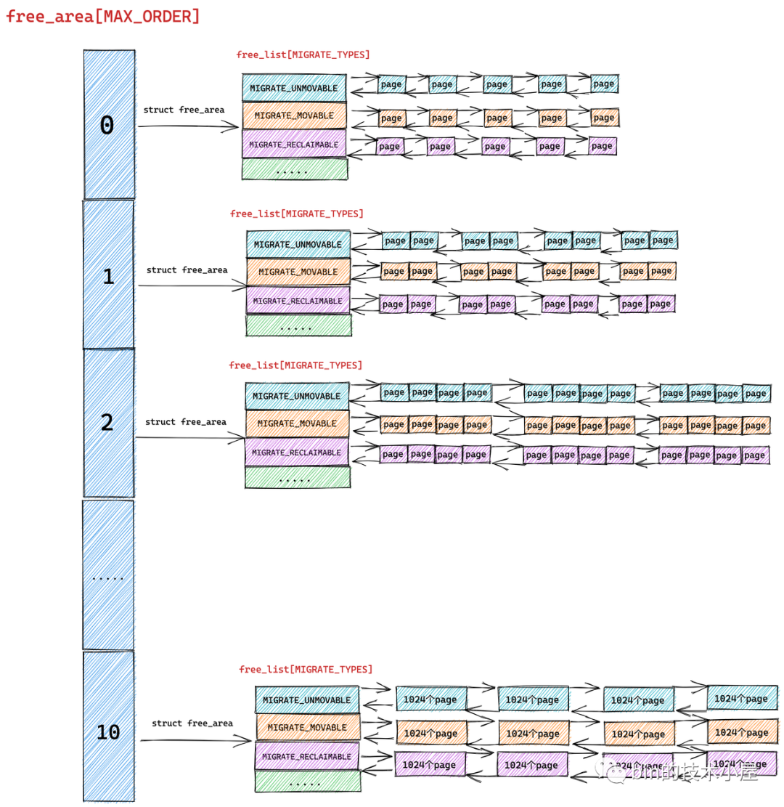

可以通过 `cat /proc/pagetypeinfo` 命令可以查看当前各个内存区域中的伙伴系统中不同页面迁移类型以及不同 order 尺寸的内存块个数。page block order 表示系统中支持的大页对应的分配阶，pages per block 表示大页中包含的 pages 个数。


内核中的伙伴指的是大小相同并且在物理内存上是连续的两个或者多个 page。比如 `free_area[1]` 中组织的是分配阶 order = 1 的内存块，内存块中包含了两个连续的空闲 page。这两个空闲 page 就是伙伴。`free_area[10]` 中组织的是分配阶 order = 10 的内存块，内存块中包含了 1024 个连续的空闲 page。这 1024 个空闲 page 就是伙伴。

##### 内存分配

一个具体的例子来明伙伴系统的整个内存分配过程，暂时忽略 `MIGRATE_TYPES` 相关的组织结构：

	

现在加上了内存 `MIGRATE_TYPES` 的组织结构，其实分配流程还是和核心流程一样的，只不过上面提到的那些高阶 order 的减半分裂情形都发生在各个 `free_area[order]` 中固定的 `free_list[MIGRATE_TYPE]` 里罢了。比如要求分配的内存迁移属性要求是 `MIGRATE_MOVABLE` 类型，那么减半分裂流程分别发生在 `free_area[2]` ，`free_area[1]` ，`free_area[0]` 对应的 `free_list[MIGRATE_MOVABLE]` 中，多了一个 `free_list` 的维度，仅此而已。

下面考虑内存分配的一种异常情形，比如想要分配特定迁移类型的内存，但是当前伙伴系统所有 `free_area[order]` 里对应的 `free_list[MIGRATE_TYPE]` 均无法满足内存分配的需求（没有足够特定迁移类型的空闲内存块）。内核根据不同迁移类型定义了不同的 fallback 规则：

```c
/*
 * This array describes the order lists are fallen back to when
 * the free lists for the desirable migrate type are depleted
 *
 * The other migratetypes do not have fallbacks.
 */
static int fallbacks[MIGRATE_TYPES][3] = {
    /* MIGRATE_UNMOVABLE 类型的 free_list 内存不足时，内核会 fallback 到 MIGRATE_RECLAIMABLE 中去获取，如果还是不足，
     * 则再次降级到 MIGRATE_MOVABLE 中获取，如果仍然无法满足内存分配，才会失败退出。
     */
	[MIGRATE_UNMOVABLE]   = { MIGRATE_RECLAIMABLE, MIGRATE_MOVABLE,   MIGRATE_TYPES },
	[MIGRATE_MOVABLE]     = { MIGRATE_RECLAIMABLE, MIGRATE_UNMOVABLE, MIGRATE_TYPES },
	[MIGRATE_RECLAIMABLE] = { MIGRATE_UNMOVABLE,   MIGRATE_MOVABLE,   MIGRATE_TYPES },
};
```

正常的分配流程先是从低阶到高阶依次查找空闲内存块，然后将高阶中的内存块依次减半分裂到低阶 `free_list` 链表中。内存分配 fallback 流程则刚好是相反的，它是先从备用 fallback 类型的迁移列表中的**最高阶**开始查找，找到一块空闲内存块之后，先迁移到最初指定的 `free_list[MIGRATE_TYPE]` 链表中，然后在指定的 `free_list[MIGRATE_TYPE]` 链表执行减半分裂。即内核 fallback 策略是：如果无法避免分配迁移类型不同的内存块，那么就分配一个尽可能大的内存块（从最高阶开始查找），避免向其他链表引入内存碎片。

比如向伙伴系统申请 `MIGRATE_UNMOVABLE` 迁移类型的内存时，假设内核在伙伴系统中的 `free_area[0]` 到 `free_area[10]` 中的所有 `free_list[MIGRATE_UNMOVABLE]` 链表中均无法找到一个空闲的内存块。那么就会 fallback 到 `MIGRATE_RECLAIMABLE` 类型，从最高阶 `free_area[10]` 中的 `free_list[MIGRATE_RECLAIMABLE]` 链表开始查找，如果找到一个空闲的内存块，则首先会迁移到对应的 order 的 `free_list[MIGRATE_UNMOVABLE]` 链表，然后流程继续回到核心流程，在各个 `free_area[order]` 对应的 `free_list[MIGRATE_UNMOVABLE]` 链表中执行减半分裂。

##### 内存回收


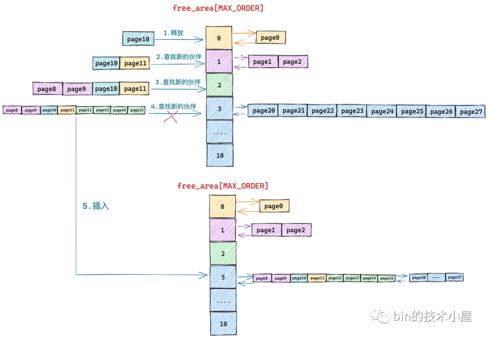

`get_page_from_freelist` 主干框架就是通过 `for_next_zone_zonelist_nodemask` 来遍历当前 NUMA 节点以及备用节点的所有内存区域（zonelist），然后逐个通过 `zone_watermark_fast` 检查这些内存区域 zone 中的剩余空闲内存容量是否在指定的水位线 mark 之上。如果满足水位线的要求则直接调用 `rmqueue `进入伙伴系统分配内存，分配成功之后通过 `prep_new_page` 初始化分配好的内存页 page。

如果当前正在遍历的 zone 中剩余空闲内存容量在指定的水位线 mark 之下，就需要通过 `node_reclaim` 触发内存回收，随后通过 `zone_watermark_ok` 检查经过内存回收之后，内核是否回收到了足够的内存以满足本次内存分配的需要。如果内存回收到了足够的内存则 `zone_watermark_ok = true` 随后跳转到 `try_this_zone` 分支在本内存区域 zone 中分配内存。否则继续遍历下一个 zone。


```c
/*
 * get_page_from_freelist goes through the zonelist trying to allocate
 * a page.
 */
static struct page *
get_page_from_freelist(gfp_t gfp_mask, unsigned int order, int alloc_flags,
                       const struct alloc_context *ac)
{
    struct zoneref *z;
    // 当前遍历到的内存区域 zone 引用
    struct zone *zone;
    // 最近遍历的NUMA节点
    struct pglist_data *last_pgdat = NULL;
    // 最近遍历的NUMA节点中包含的脏页数量是否在内核限制范围内
    bool last_pgdat_dirty_ok = false;
    // 如果需要避免内存碎片，则 no_fallback = true
    bool no_fallback;

retry:
    // 是否需要避免内存碎片
    no_fallback = alloc_flags & ALLOC_NOFRAGMENT;
    z = ac->preferred_zoneref;
    // 开始遍历 zonelist，查找可以满足本次内存分配的物理内存区域 zone
    for_next_zone_zonelist_nodemask(zone, z, ac->highest_zoneidx,
                    ac->nodemask) {
        // 指向分配成功之后的内存
        struct page *page;
        // 内存分配过程中设定的水位线
        unsigned long mark;
        // 检查内存区域所在 NUMA 节点是否在进程所允许的 CPU 上
        if (cpusets_enabled() &&
            (alloc_flags & ALLOC_CPUSET) &&
            !__cpuset_zone_allowed(zone, gfp_mask))
                continue;
        /* 每个 NUMA 节点中包含的脏页数量都有一定的限制。如果本次内存分配是为 page cache 分配的 page，用于写入数据（不久就会变成脏页）
         * 这里需要检查当前 NUMA 节点的脏页比例是否在限制范围内允许的。如果没有超过脏页限制则可以进行分配，如果已经超过 last_pgdat_dirty_ok = false
         */
        if (ac->spread_dirty_pages) {
            if (last_pgdat != zone->zone_pgdat) {
                last_pgdat = zone->zone_pgdat;
                last_pgdat_dirty_ok = node_dirty_ok(zone->zone_pgdat);
            }

            if (!last_pgdat_dirty_ok)
                continue;
        }

        // 如果内核设置了避免内存碎片标识，在本地节点无法满足内存分配的情况下(因为需要避免内存碎片)。这轮循环会遍历 remote 节点（跨NUMA节点）
        if (no_fallback && nr_online_nodes > 1 &&
            zone != ac->preferred_zoneref->zone) {
            int local_nid;
            // 如果本地节点分配内存失败是因为避免内存碎片的原因，那么会继续回到本地节点进行 retry 重试同时取消 ALLOC_NOFRAGMENT（允许引入碎片）
            local_nid = zone_to_nid(ac->preferred_zoneref->zone);
            if (zone_to_nid(zone) != local_nid) {
                // 内核认为保证本地的局部性会比避免内存碎片更加重要
                alloc_flags &= ~ALLOC_NOFRAGMENT;
                goto retry;
            }
        }
        // 获取本次内存分配需要考虑到的内存水位线，快速路径下是 WMARK_LOW, 慢速路径下是 WMARK_MIN
        mark = wmark_pages(zone, alloc_flags & ALLOC_WMARK_MASK);
        // 检查当前遍历到的 zone 里剩余的空闲内存容量是否在指定水位线 mark 之上。剩余内存容量在水位线之下返回 false
        if (!zone_watermark_fast(zone, order, mark,
                       ac->highest_zoneidx, alloc_flags,
                       gfp_mask)) {
            int ret;

            // 如果本次内存分配策略是忽略内存水位线，那么就在本次遍历到的zone里尝试分配内存
            if (alloc_flags & ALLOC_NO_WATERMARKS)
                goto try_this_zone;
            // 如果本次内存分配不能忽略内存水位线的限制，那么就会判断当前 zone 所属 NUMA 节点是否允许进行内存回收
            if (!node_reclaim_enabled() ||
                !zone_allows_reclaim(ac->preferred_zoneref->zone, zone))
                // 不允许进行内存回收则继续遍历下一个 NUMA 节点的内存区域
                continue;
            // 针对当前 zone 所在 NUMA 节点进行内存回收
            ret = node_reclaim(zone->zone_pgdat, gfp_mask, order);
            switch (ret) {
            case NODE_RECLAIM_NOSCAN:
                // 返回该值表示当前 NUMA 节点没有必要进行回收。比如快速分配路径下就不处理页面回收的问题
                continue;
            case NODE_RECLAIM_FULL:
                // 返回该值表示通过扫描之后发现当前 NUMA 节点并没有可以回收的内存页
                continue;
            default:
                // 该分支表示当前 NUMA 节点已经进行了内存回收操作，zone_watermark_ok 判断内存回收是否回收了足够的内存能否满足内存分配的需要
                if (zone_watermark_ok(zone, order, mark,
                    ac->highest_zoneidx, alloc_flags))
                    goto try_this_zone;

                continue;
            }
        }

try_this_zone:
        // 这里就是伙伴系统的入口，rmqueue 函数中封装的就是伙伴系统的核心逻辑，从伙伴系统中获取内存
        page = rmqueue(ac->preferred_zoneref->zone, zone, order,
                gfp_mask, alloc_flags, ac->migratetype);
        if (page) {
            // 分配内存成功，初始化内存页 page
            prep_new_page(page, order, gfp_mask, alloc_flags);
            return page;
        } else {
        	......
        }
    }
        
    // 内存分配失败
    return NULL;
}

#define wmark_pages(z, i) (z->_watermark[i] + z->watermark_boost)

static inline bool zone_watermark_fast(struct zone *z, unsigned int order,
                					   unsigned long mark, int highest_zoneidx,
                					   unsigned int alloc_flags, gfp_t gfp_mask)
{
    long free_pages;
    /* 获取当前内存区域中所有空闲的物理内存页。free_pages 表示的当前 zone 里剩余空闲内存页的一个总量，是一个全集的概念。
     * 其中还包括了内存区域的预留内存 lowmem_reserve 以及为 highatomic 预留的紧急内存。这些预留内存都有自己特定的用途，普通内存的申请不会用到预留内存。
     */
    free_pages = zone_page_state(z, NR_FREE_PAGES);

    // 快速检查分配阶 order = 0 情况下相关水位线，空闲内存需要刨除掉为 highatomic 预留的紧急内存
    if (!order) {
        long usable_free;
        long reserved;
        // 可供本次内存分配使用的符合要求的真实可用内存，初始为 free_pages，即空闲内存页的全集，其中也包括了不能为本次内存分配提供内存的空闲内存
        usable_free = free_pages;
        // 获取本次不能使用的空闲内存页数量。
        reserved = __zone_watermark_unusable_free(z, 0, alloc_flags);

        // 计算真正可供内存分配的空闲页数量：空闲内存页全集 - 不能使用的空闲页
        usable_free -= min(usable_free, reserved);
        // 如果可用的空闲内存页数量大于内存水位线与预留内存之和，那么表示物理内存区域中的可用空闲内存能够满足本次内存分配的需要
        if (usable_free > mark + z->lowmem_reserve[highest_zoneidx])
            return true;
    }
    // 近一步检查内存区域伙伴系统中是否有足够的 order 阶的内存块可供分配
    if (__zone_watermark_ok(z, order, mark, highest_zoneidx, alloc_flags,
                    free_pages))
        return true;

        ......

    // 水位线检查失败
    return false;
}

static inline long __zone_watermark_unusable_free(struct zone *z,
                unsigned int order, unsigned int alloc_flags)
{
    // ALLOC_HARDER 的设置表示可以使用 high-atomic 紧急预留内存
    const bool alloc_harder = (alloc_flags & (ALLOC_HARDER|ALLOC_OOM));
    long unusable_free = (1 << order) - 1;
    // 如果没有设置 ALLOC_HARDER 则不能使用  high_atomic 紧急预留内存
    if (likely(!alloc_harder))
        // 不可用内存的数量需要统计上 high-atomic 这部分内存
        unusable_free += z->nr_reserved_highatomic;

#ifdef CONFIG_CMA
    // 如果没有设置 ALLOC_CMA 则表示本次内存分配不能从 CMA 区域获取
    if (!(alloc_flags & ALLOC_CMA))
        // 不可用内存的数量需要统计上 CMA 区域中的空闲内存页
        unusable_free += zone_page_state(z, NR_FREE_CMA_PAGES);
#endif
    // 返回不可用内存的数量，表示本次内存分配不能使用的内存容量
    return unusable_free;
}

bool __zone_watermark_ok(struct zone *z, unsigned int order, unsigned long mark,
             int highest_zoneidx, unsigned int alloc_flags,
             long free_pages)
{
    // 保证内存分配顺利进行的最低水位线
    long min = mark;
    int o;
    const bool alloc_harder = (alloc_flags & (ALLOC_HARDER|ALLOC_OOM));

    // 获取真正可用的剩余空闲内存页数量
    free_pages -= __zone_watermark_unusable_free(z, order, alloc_flags);

    // 如果设置了 ALLOC_HIGH 则水位线降低二分之一，使内存分配更加努力激进一些
    if (alloc_flags & ALLOC_HIGH)
        min -= min / 2;

    if (unlikely(alloc_harder)) {
        // 在要进行 OOM 的情况下内存分配会比普通的 ALLOC_HARDER 策略更加努力激进一些，所以这里水位线会降低二分之一
        if (alloc_flags & ALLOC_OOM)
            min -= min / 2;
        else
            // ALLOC_HARDER 策略下水位线只会降低四分之一 
            min -= min / 4;
    }

    // 检查当前可用剩余内存是否在指定水位线之上。内存的分配必须保证可用剩余内存容量在指定水位线之上，否则不能进行内存分配
    if (free_pages <= min + z->lowmem_reserve[highest_zoneidx])
        return false;

    // 流程走到这里，对应内存分配阶 order = 0 的情况下就已经 OK 了。剩余空闲内存在水位线之上，那么肯定能够分配一页出来
    if (!order)
        return true;

    /* 但是对于 high-order 的内存分配，这里还需要近一步检查伙伴系统。
     * 根据伙伴系统内存分配的原理，这里需要检查高阶 free_list 中是否有足够的空闲内存块可供分配。
     */
    for (o = order; o < MAX_ORDER; o++) {
        // 从当前分配阶 order 对应的 free_area 中检查是否有足够的内存块
        struct free_area *area = &z->free_area[o];
        int mt;
        // 如果当前 free_area 中的 nr_free = 0 表示对应 free_list 中没有合适的空闲内存块，那么继续到高阶 free_area 中查找
        if (!area->nr_free)
            continue;
         // 检查 free_area 中所有的迁移类型 free_list 是否有足够的内存块
        for (mt = 0; mt < MIGRATE_PCPTYPES; mt++) {
            if (!free_area_empty(area, mt))
                return true;
        }

#ifdef CONFIG_CMA
       // 如果内存分配指定需要从 CMA 区域中分配连续内存，那么就需要检查 MIGRATE_CMA 对应的 free_list 是否是空
        if ((alloc_flags & ALLOC_CMA) &&
            !free_area_empty(area, MIGRATE_CMA)) {
            return true;
        }
#endif
        // 如果设置了 ALLOC_HARDER，则表示可以从 HIGHATOMIC 区中的紧急预留内存中分配，检查对应 free_list
        if (alloc_harder && !free_area_empty(area, MIGRATE_HIGHATOMIC))
            return true;
    }
    // 伙伴系统中的剩余内存块无法满足 order 阶的内存分配
    return false;
}

static void prep_new_page(struct page *page, unsigned int order, gfp_t gfp_flags,
                            unsigned int alloc_flags)
{
    // 初始化 struct page，清除一些页面属性标记
    post_alloc_hook(page, order, gfp_flags);

    // 设置复合页
    if (order && (gfp_flags & __GFP_COMP))
        prep_compound_page(page, order);

    if (alloc_flags & ALLOC_NO_WATERMARKS)
        // 使用 set_page_XXX(page) 方法设置 page 的 PG_XXX 标志位
        set_page_pfmemalloc(page);
    else
         // 使用 clear_page_XXX(page) 方法清除 page 的 PG_XXX 标志位
        clear_page_pfmemalloc(page);
}

/* 当内核向伙伴系统申请复合页 compound_page 的时候，会在 gfp_flags 掩码中设置 __GFP_COMP 标识，表次本次内存分配要分配一个复合页，
 * 复合页中的 page 个数由分配阶 order 决定。当内核向伙伴系统申请了 2 ^ order 个内存页 page 时，在伙伴系统的视角中内存还是一页一页的，
 * 伙伴系统并不知道有复合页的存在。申请成功之后，需要在 prep_new_page 函数中将这 2 ^ order 个内存页 page 组装成一个 复合页 compound_page。
 */
void prep_compound_page(struct page *page, unsigned int order)
{
    int i;
    int nr_pages = 1 << order;
    // 设置首页 page 中的 flags 为 PG_head
    __SetPageHead(page);
    // 首页之后的 page 全部是尾页，循环遍历设置尾页
    for (i = 1; i < nr_pages; i++)
        prep_compound_tail(page, i);
    // 最后设置首页相关属性
    prep_compound_head(page, order);
}
    
static void prep_compound_tail(struct page *head, int tail_idx)
{
    // 由于复合页中的 page 全部是连续的，直接使用偏移即可获得对应尾页
    struct page *p = head + tail_idx;
    // 设置尾页标识
    p->mapping = TAIL_MAPPING;
    // 尾页 page 结构中的 compound_head 指向首页
    set_compound_head(p, head);
}

static __always_inline void set_compound_head(struct page *page, struct page *head)
{
	WRITE_ONCE(page->compound_head, (unsigned long)head + 1);
}

static void prep_compound_head(struct page *page, unsigned int order)
{
    // 设置首页相关属性
    set_compound_page_dtor(page, COMPOUND_PAGE_DTOR);
    set_compound_order(page, order);
    atomic_set(compound_mapcount_ptr(page), -1);
    atomic_set(compound_pincount_ptr(page), 0);
}

/*
 * Allocate a page from the given zone. Use pcplists for order-0 allocations.
 */
static inline
struct page *rmqueue(struct zone *preferred_zone,
            struct zone *zone, unsigned int order,
            gfp_t gfp_flags, unsigned int alloc_flags,
            int migratetype)
{
    unsigned long flags;
    struct page *page;

    if (likely(order == 0)) {
        // 申请一个物理页面（order = 0）时，内核首先会从 CPU 高速缓存列表 pcplist 中直接分配，而不会走伙伴系统，提高内存分配速度
        page = rmqueue_pcplist(preferred_zone, zone, gfp_flags,
                    migratetype, alloc_flags);
        goto out;
    }
    // 加锁并关闭中断，防止并发访问
    spin_lock_irqsave(&zone->lock, flags);

    // 当申请页面超过一个 （order > 0）时，则从伙伴系统中进行分配
    do {
        page = NULL;
        if (alloc_flags & ALLOC_HARDER) {
            // 如果设置了 ALLOC_HARDER 分配策略，则从伙伴系统的 HIGHATOMIC 迁移类型的 freelist 中获取
            page = __rmqueue_smallest(zone, order, MIGRATE_HIGHATOMIC);
        }
        if (!page)
            // 从伙伴系统中申请分配阶 order 大小的物理内存块
            page = __rmqueue(zone, order, migratetype, alloc_flags);
    } while (page && check_new_pages(page, order));
    // 解锁
    spin_unlock(&zone->lock);
    if (!page)
        goto failed;
    // 重新统计内存区域中的相关统计指标
    zone_statistics(preferred_zone, zone);
    // 打开中断
    local_irq_restore(flags);

out:
    return page;

failed:
    // 分配失败
    local_irq_restore(flags);
    return NULL;
}

/* Lock and remove page from the per-cpu list */
static struct page *rmqueue_pcplist(struct zone *preferred_zone,
            struct zone *zone, gfp_t gfp_flags,
            int migratetype, unsigned int alloc_flags)
{
    struct per_cpu_pages *pcp;
    struct list_head *list;
    struct page *page;
    unsigned long flags;
    // 关闭中断
    local_irq_save(flags);
    // 获取运行当前进程的 CPU 高速缓存列表 pcplist
    pcp = &this_cpu_ptr(zone->pageset)->pcp;
    // 获取指定页面迁移类型的 pcplist
    list = &pcp->lists[migratetype];
    // 从指定迁移类型的 pcplist 中移除一个页面，用于内存分配
    page = __rmqueue_pcplist(zone,  migratetype, alloc_flags, pcp, list);
    if (page) {
        // 统计内存区域内的相关信息
        zone_statistics(preferred_zone, zone);
    }
    // 开中断
    local_irq_restore(flags);
    return page;
}

/* Remove page from the per-cpu list, caller must protect the list */
static struct page *__rmqueue_pcplist(struct zone *zone, int migratetype,
            unsigned int alloc_flags,
            struct per_cpu_pages *pcp,
            struct list_head *list)
{
    struct page *page;

    do {
        // 如果当前 pcplist 中的页面为空，那么则从伙伴系统中获取 batch 个页面放入 pcplist 中
        if (list_empty(list)) {
            pcp->count += rmqueue_bulk(zone, 0,
                    pcp->batch, list,
                    migratetype, alloc_flags);
            if (unlikely(list_empty(list)))
                return NULL;
        }
        // 获取 pcplist 上的第一个物理页面
        page = list_first_entry(list, struct page, lru);
        // 将该物理页面从 pcplist 中摘除
        list_del(&page->lru);
        // pcplist 中的 count  减一
        pcp->count--;
    } while (check_new_pcp(page));

    return page;
}

/*
 * Go through the free lists for the given migratetype and remove
 * the smallest available page from the freelists
 */
static __always_inline
struct page *__rmqueue_smallest(struct zone *zone, unsigned int order,
                        int migratetype)
{
    unsigned int current_order;
    struct free_area *area;
    struct page *page;

    /* 从当前分配阶 order 开始在伙伴系统对应的  free_area[order]  里查找合适尺寸的内存块 */
    for (current_order = order; current_order < MAX_ORDER; ++current_order) {
        // 获取当前 order 在伙伴系统中对应的 free_area[order] 
        area = &(zone->free_area[current_order]);
        // 从 free_area[order] 中对应的 free_list[MIGRATE_TYPE] 链表中获取空闲内存块
        page = get_page_from_free_area(area, migratetype);
        if (!page)
            // 如果当前 free_area[order] 中没有空闲内存块则继续向上查找
            continue;
        // 如果在当前 free_area[order] 中找到空闲内存块，则从 free_list[MIGRATE_TYPE] 链表中摘除
        del_page_from_free_area(page, area);
        // 将摘下来的内存块进行减半分裂并插入对应的尺寸的 free_area 中
        expand(zone, page, order, current_order, area, migratetype);
        // 设置页面的迁移类型
        set_pcppage_migratetype(page, migratetype);
        // 内存分配成功返回
        return page;
    }
    // 内存分配失败返回 null
    return NULL;
}

static inline void expand(struct zone *zone, struct page *page,
    int low, int high, struct free_area *area,
    int migratetype)
{
    // 根据 order 计算实际分配了多少个 page
    unsigned long size = 1 << high;

    // 依次进行减半分裂，直到分裂出指定 order 的内存块出来
    while (high > low) {
        // free_area 要降到下一阶
        area--;
        // 分配阶要降级
        high--;
        // 内存块尺寸要减半
        size >>= 1;
        // 标记为保护页，当其伙伴被释放时，允许合并
        if (set_page_guard(zone, &page[size], high, migratetype))
            continue;
        // 将本次减半分裂出来的第二个内存块插入到对应 free_area[high] 中
        add_to_free_area(&page[size], area, migratetype);
        // 设置内存块的分配阶 high
        set_page_order(&page[size], high);

        // 本次分裂出来的第一个内存块继续循环进行减半分裂直到 high = low，即已经分裂出来了指定 order 尺寸的内存块无需在进行分裂了
    }
}

static __always_inline struct page *
__rmqueue(struct zone *zone, unsigned int order, int migratetype,
                        unsigned int alloc_flags)
{
    struct page *page;

retry:
    // 首先进入伙伴系统到指定页面迁移类型的 free_list[migratetype] 获取空闲内存块
    page = __rmqueue_smallest(zone, order, migratetype);
    if (unlikely(!page)) {
        // 如果 alloc_flags 包含 ALLOC_CMA 则优先 fallback 到 CMA 区中分配内存
        if (alloc_flags & ALLOC_CMA)
            page = __rmqueue_cma_fallback(zone, order);
        // 走常规的伙伴系统 fallback 流程
        if (!page && __rmqueue_fallback(zone, order, migratetype,
                                alloc_flags))
            goto retry;
    }
    // 内存分配成功
    return page;
}

static __always_inline bool
__rmqueue_fallback(struct zone *zone, int order, int start_migratetype,
                        unsigned int alloc_flags)
{
    // 最终会 fall back 到伙伴系统的哪个 free_area 中分配内存
    struct free_area *area;
    // fallback 和正常的分配流程正好相反，是从最高阶的 free_area[MAX_ORDER - 1] 开始查找空闲内存块
    int current_order;
    // 最初指定的内存分配阶
    int min_order = order;
    struct page *page;
    // 最终计算出 fallback 到哪个页面迁移类型 free_list 上
    int fallback_mt;
    // 是否可以从 free_list[fallback] 中窃取内存块到 free_list[start_migratetype] 中，start_migratetype 表示最初指定的页面迁移类型
    bool can_steal;
    
    // 如果设置了 ALLOC_NOFRAGMENT 表示不希望引入内存碎片，在这种情况下内核会更加倾向于分配一个尽可能大的内存块，避免向其他链表引入内存碎片
    if (alloc_flags & ALLOC_NOFRAGMENT)
        // pageblock_order 用于定义系统支持的大页对应的分配阶，默认为最大分配阶 - 1 = 9
        min_order = pageblock_order;

    // fallback 内存分配流程从最高阶 free_area 开始查找空闲内存块（页面迁移类型为 fallback 类型）
    for (current_order = MAX_ORDER - 1; current_order >= min_order;
                --current_order) {
        // 获取伙伴系统中最高阶的 free_area
        area = &(zone->free_area[current_order]);
        // 按照上述的内存分配 fallback 规则查找最合适的 fallback 迁移类型
        fallback_mt = find_suitable_fallback(area, current_order,
                start_migratetype, false, &can_steal);
        // 如果没有合适的 fallback_mt，则继续降级到下一个分配阶 free_area 中查找
        if (fallback_mt == -1)
            continue;

        /* can_steal 会在 find_suitable_fallback 的过程中被设置
         * 当指定的页面迁移类型为 MIGRATE_MOVABLE 并且无法从其他 fallback 迁移类型列表中窃取页面 can_steal = false 时
         * 内核会更加倾向于 fallback 分配最小的可用页面，即尺寸和指定 order 最接近的页面数量而不是尺寸最大的
         * 因为这里的条件是分配可移动的页面类型，天然可以避免永久内存碎片，无需按照最大的尺寸分配
         */
        if (!can_steal && start_migratetype == MIGRATE_MOVABLE
                    && current_order > order)
            goto find_smallest;
        // can_steal = true，则开始从 free_list[fallback] 列表中窃取页面
        goto do_steal;
    }

    return false;

find_smallest:
    // 该分支目的在于寻找尺寸最贴近指定 order 大小的最小可用页面，从指定 order 开始 fallback
    for (current_order = order; current_order < MAX_ORDER;
                            current_order++) {
        area = &(zone->free_area[current_order]);
        fallback_mt = find_suitable_fallback(area, current_order,
                start_migratetype, false, &can_steal);
        if (fallback_mt != -1)
            break;
    }

do_steal:
    // 从上述流程获取到的伙伴系统 free_area 中获取 free_list[fallback_mt]
    page = get_page_from_free_area(area, fallback_mt);
    // 从 free_list[fallback_mt] 中窃取页面到 free_list[start_migratetype] 中
    steal_suitable_fallback(zone, page, alloc_flags, start_migratetype,
                                can_steal);
    // 返回到 __rmqueue 函数中进行 retry 重试流程，此时 free_list[start_migratetype] 中已经有足够的内存页面可供分配了
    return true;

}

int find_suitable_fallback(struct free_area *area, unsigned int order,
            int migratetype, bool only_stealable, bool *can_steal)
{
    int i;
    // 最终选取的 fallback 页面迁移类型
    int fallback_mt;
    // 当前 free_area[order] 中以无空闲页面，则返回失败
    if (area->nr_free == 0)
        return -1;

    *can_steal = false;
    // 按照 fallback 优先级，循环在 free_list[fallback] 中查询是否有空闲内存块
    for (i = 0;; i++) {
        // 按照优先级获取 fallback 页面迁移类型
        fallback_mt = fallbacks[migratetype][i];
        if (fallback_mt == MIGRATE_TYPES)
            break;
        // 如果当前 free_list[fallback] 为空则继续循环降级查找
        if (free_area_empty(area, fallback_mt))
            continue;
        // 判断是否可以从 free_list[fallback] 窃取页面到指定 free_list[migratetype] 中
        if (can_steal_fallback(order, migratetype))
            *can_steal = true;

        if (!only_stealable)
            return fallback_mt;

        if (*can_steal)
            return fallback_mt;
    }

    return -1;
}

/* 这里窃取页面的目的是从 fallback 类型的 freelist 中拿到一个高阶的大内存块，之所以要窃取尽可能大的内存块是为了避免引入内存碎片
 * 但 MIGRATE_MOVABLE 类型的页面本身就可以避免永久内存碎片。所以 fallback MIGRATE_MOVABLE 类型的页面时，
 * 会跳转到 find_smallest 分支只需要选择一个合适的 fallback 内存块即可
 */
static bool can_steal_fallback(unsigned int order, int start_mt)
{
    if (order >= pageblock_order)
        return true;

    /* MIGRATE_RECLAIMABLE 或 MIGRATE_UNMOVABLE 最终会 fallback 到 MIGRATE_MOVABLE 可移动页面类型中，这样造成内存碎片的情况会少一些。
     * 当内核全局变量 page_group_by_mobility_disabled 设置为 1 时，则所有物理内存页面都是不可移动的，这时内核也允许窃取页面。
     * 在系统初始化期间，所有页都被标记为 MIGRATE_MOVABLE 可移动的页面类型，其他的页面迁移类型都是后来通过 __rmqueue_fallback 窃取产生的。
     */
    if (order >= pageblock_order / 2 ||
        start_mt == MIGRATE_RECLAIMABLE ||
        start_mt == MIGRATE_UNMOVABLE ||
        page_group_by_mobility_disabled)
        return true;
    // 跳转到 find_smallest 分支选择一个合适的 fallback 内存块
    return false;
}
```

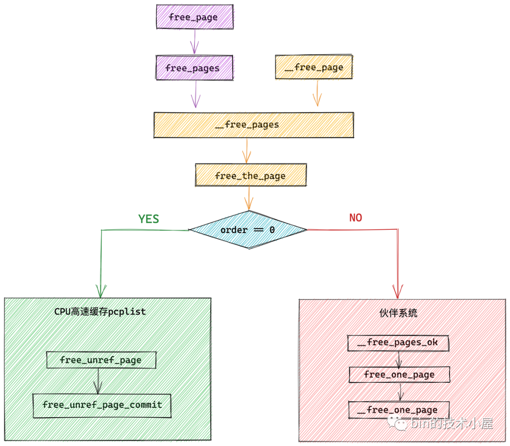

```c
void free_pages(unsigned long addr, unsigned int order)
{
    if (addr != 0) {
        // 校验虚拟内存地址 addr 的有效性
        VM_BUG_ON(!virt_addr_valid((void *)addr));
        // 将虚拟内存地址 addr 转换为 page，最终还是调用 __free_pages
        __free_pages(virt_to_page((void *)addr), order);
    }
}

void __free_pages(struct page *page, unsigned int order)
{
	if (put_page_testzero(page))
		free_the_page(page, order);
}

static inline void free_the_page(struct page *page, unsigned int order)
{
    if (order == 0)     
        // 如果释放一页的话，则直接释放到 CPU 高速缓存列表 pcplist 中
        free_unref_page(page);
    else
        // 如果释放多页的话，则进入伙伴系统回收这部分内存
        __free_pages_ok(page, order);
}

/*
 * Free a 0-order page
 */
void free_unref_page(struct page *page)
{
    unsigned long flags;
    // 获取要释放的物理内存页对应的物理页号 pfn
    unsigned long pfn = page_to_pfn(page);

    local_irq_save(flags);
    // 释放物理内存页至 pcplist 中
    free_unref_page_commit(page, pfn);

    local_irq_restore(flags);
}

static void free_unref_page_commit(struct page *page, unsigned long pfn)
{
    // 获取内存页所在物理内存区域 zone
    struct zone *zone = page_zone(page);
    // 运行当前进程的 CPU 高速缓存列表 pcplist
    struct per_cpu_pages *pcp;

    // 页面的迁移类型
    int migratetype;
    migratetype = get_pcppage_migratetype(page);
    
    // 内核这里只会将 UNMOVABLE,MOVABLE,RECLAIMABLE 这三种页面迁移类型放入 pcplist 中，其余的迁移类型均释放回伙伴系统
    if (migratetype >= MIGRATE_PCPTYPES) {
        if (unlikely(is_migrate_isolate(migratetype))) {
            // 释放回伙伴系统
            free_one_page(zone, page, pfn, 0, migratetype);
            return;
        }
        // 内核这里会将 HIGHATOMIC 类型页面当做 MIGRATE_MOVABLE 类型处理
        migratetype = MIGRATE_MOVABLE;
    }
    // 获取运行当前进程的 CPU 高速缓存列表 pcplist
    pcp = &this_cpu_ptr(zone->pageset)->pcp;
    // 将要释放的物理内存页添加到 pcplist 中
    list_add(&page->lru, &pcp->lists[migratetype]);
    // pcplist 页面计数加一
    pcp->count++;
    // 如果 pcp 中的页面总数超过了 high 水位线，则将 pcp 中的 batch 个页面释放回伙伴系统中，这个过程称之为惰性合并。
    if (pcp->count >= pcp->high) {
        unsigned long batch = READ_ONCE(pcp->batch);
        // 释放 batch 个页面回伙伴系统中
        free_pcppages_bulk(zone, batch, pcp);
    }
}

static void __free_pages_ok(struct page *page, unsigned int order)
{
    unsigned long flags;
    int migratetype;
    // 获取释放内存页对应的物理页号 pfn
    unsigned long pfn = page_to_pfn(page);
    // 在将内存页回收至伙伴系统之前，需要将内存页 page 相关的无用属性清理一下
    if (!free_pages_prepare(page, order, true))
        return;
    // 获取页面迁移类型，后续会将内存页释放至伙伴系统中的 free_list[migratetype] 中
    migratetype = get_pfnblock_migratetype(page, pfn);
    
    local_irq_save(flags);
    // 进入伙伴系统，释放内存
    free_one_page(page_zone(page), page, pfn, order, migratetype);
    
    local_irq_restore(flags);
}

static void free_one_page(struct zone *zone,
                struct page *page, unsigned long pfn,
                unsigned int order,
                int migratetype)
{

    spin_lock(&zone->lock);
    // 正式进入伙伴系统回收内存
    __free_one_page(page, pfn, zone, order, migratetype);

    spin_unlock(&zone->lock);
}

/*
 * Freeing function for a buddy system allocator.
 */
static inline void __free_one_page(struct page *page,
        unsigned long pfn,
        struct zone *zone, unsigned int order,
        int migratetype)
{
    // 释放内存块与其伙伴内存块合并之后新内存块的 pfn
    unsigned long combined_pfn;
    // 伙伴内存块的 pfn
    unsigned long buddy_pfn;
    // 伙伴内存块的首页 page 指针
    struct page *buddy;
    // 伙伴系统中的最大分配阶
    unsigned int max_order;
    
continue_merging:
    // 从释放内存块的当前分配阶开始一直向高阶合并内存块，直到不能合并为止
    while (order < max_order - 1) {
        // 在 free_area[order] 中查找伙伴内存块的 pfn
        buddy_pfn = __find_buddy_pfn(pfn, order);
        // 根据偏移 buddy_pfn - pfn 计算伙伴内存块中的首页 page 地址
        buddy = page + (buddy_pfn - pfn);
        // 检查伙伴 pfn 的有效性
        if (!pfn_valid_within(buddy_pfn))
            // 无效停止合并
            goto done_merging;
        // 检查是否为伙伴
        if (!page_is_buddy(page, buddy, order))
            // 不是伙伴停止合并
            goto done_merging;
        // 将伙伴内存块从当前 free_area[order] 列表中摘下
        del_page_from_free_area(buddy, &zone->free_area[order]);
        // 合并后新内存块首页 page 的 pfn
        combined_pfn = buddy_pfn & pfn;
        // 合并后新内存块首页 page 指针
        page = page + (combined_pfn - pfn);
        // 以合并后的新内存块为基础继续向高阶 free_area 合并
        pfn = combined_pfn;
        // 继续向高阶 free_area 合并，直到不能合并为止
        order++;
    }
    
done_merging:
    // 表示在当前伙伴系统 free_area[order] 中没有找到伙伴内存块，停止合并。设置内存块的分配阶 order，存储在第一个 page 结构中的 private 属性中
    set_page_order(page, order);
    // 将最终合并的内存块插入到伙伴系统对应的 free_are[order] 中
    add_to_free_area(page, &zone->free_area[order], migratetype);

}

static inline unsigned long
__find_buddy_pfn(unsigned long page_pfn, unsigned int order)
{
	return page_pfn ^ (1 << order);
}

/* 伙伴系统所管理的内存页必须是可用的，不能处于内存空洞中，通过 page_is_guard 函数判断。
 *
 * 伙伴必须是空闲的内存块，这些内存块必须存在于伙伴系统中，组成内存块的内存页 page 结构中的 flag 标志设置了 PG_buddy 标记。
 * 通过 PageBuddy 判断这些内存页是否在伙伴系统中。
 *
 * 两个互为伙伴的内存块必须拥有相同的分配阶 order，也就是它们之间的大小尺寸必须一致。通过 page_order(buddy) == order 判断
 *
 * 互为伙伴关系的内存块必须处于相同的物理内存区域 zone 中。通过 page_zone_id(page) == page_zone_id(buddy) 判断。 
 */
static inline int page_is_buddy(struct page *page, struct page *buddy,
							unsigned int order)
{
	if (page_is_guard(buddy) && page_order(buddy) == order) {
		if (page_zone_id(page) != page_zone_id(buddy))
			return 0;

		return 1;
	}

	if (PageBuddy(buddy) && page_order(buddy) == order) {
		if (page_zone_id(page) != page_zone_id(buddy))
			return 0;

		return 1;
	}
	return 0;
}
```


### Virtual Address Translation

在Linux，Windows等操作系统中，为什么不直接使用Physical Address（物理地址），而要用Virtual Address（虚拟地址）呢？因为虚拟地址可以带来诸多好处: 

1. 在支持多进程的系统中，如果各个进程的镜像文件都使用物理地址，则在加载到同一物理内存空间的时候，可能发生冲突。
2. 直接使用物理地址，不便于进行进程地址空间的隔离。
3. 物理内存是有限的，在物理内存整体吃紧的时候，可以让多个进程通过分时复用的方法共享一个物理页面（某个进程需要保存的内容可以暂时swap到外部的disk/flash），这有点类似于多线程分时复用共享CPU的方式。

既然使用虚拟地址，就涉及到将虚拟地址转换为物理地址的过程，这需要MMU（Memory Management Unit）和页表（page table）的共同参与。

#### MMU

MMU是处理器/核（processer）中的一个硬件单元，通常每个核有一个MMU。MMU由两部分组成：TLB(Translation Lookaside Buffer)和table walk unit。

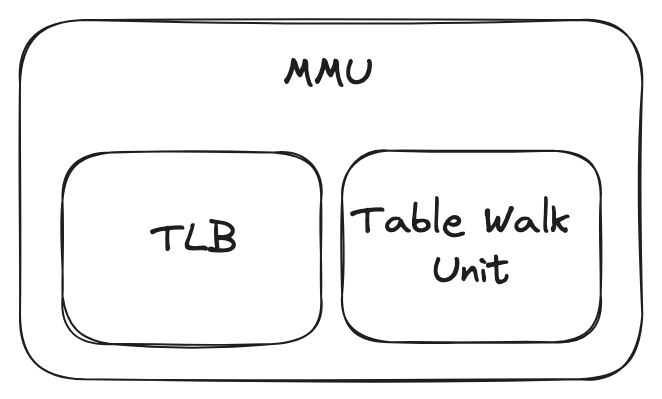

#### **Page Table**

page table是每个进程独有的，是软件实现的，是存储在main memory（比如DDR）中的。

#### Address Translation

因为访问内存中的页表相对耗时，尤其是在现在普遍使用多级页表的情况下，需要多次的内存访问，为了加快访问速度，给page table设计了一个硬件缓存 - **TLB**，CPU会首先在TLB中查找，因为在TLB中找起来很快。TLB之所以快，一是因为它含有的entries的数目较少，二是TLB是集成进CPU的，它几乎可以按照CPU的速度运行。

如果在TLB中找到了含有该虚拟地址的entry（TLB hit），则可从该entry中直接获取对应的物理地址，否则就不幸地TLB miss了，就得去查找当前进程的page table。这个时候，组成MMU的另一个部分table walk unit就被召唤出来了，这里面的table就是page table。

使用table walk unit硬件单元来查找page table的方式被称为hardware TLB miss handling，通常被CISC架构的处理器（比如IA-32）所采用。它要在page table中查找不到，出现page fault的时候才会交由软件（操作系统）处理。

与之相对的通常被RISC架构的处理器（比如Alpha）采用的software TLB miss handling，TLB miss后CPU就不再参与了，由操作系统通过软件的方式来查找page table。使用硬件的方式更快，而使用软件的方式灵活性更强。IA-64提供了一种混合模式，可以兼顾两者的优点。

如果在page table中找到了该虚拟地址对应的entry的p（present）位是1，说明该虚拟地址对应的物理页面当前驻留在内存中，也就是page table hit。找到了还没完，接下来还有两件事要做：

1. 既然是因为在TLB里找不到才找到这儿来的，自然要更新TLB。
2. 进行权限检测，包括可读/可写/可执行权限，user/supervisor模式权限等。如果没有正确的权限，将触发SIGSEGV（Segmantation Fault）。

如果该虚拟地址对应的entry的p位是0，就会触发page fault，可能有这几种情况：

1. 这个虚拟地址被分配后还从来没有被access过（比如malloc之后还没有操作分配到的空间，则不会真正分配物理内存）。触发page fault后分配物理内存，也就是demand paging，有了确定的demand了之后才分，然后将p位置1。
2. 对应的这个物理页面的内容被换出到外部的disk/flash了，这个时候page table entry里存的是换出页面在外部swap area里暂存的位置，可以将其换回物理内存，再次建立映射，然后将p位置1。

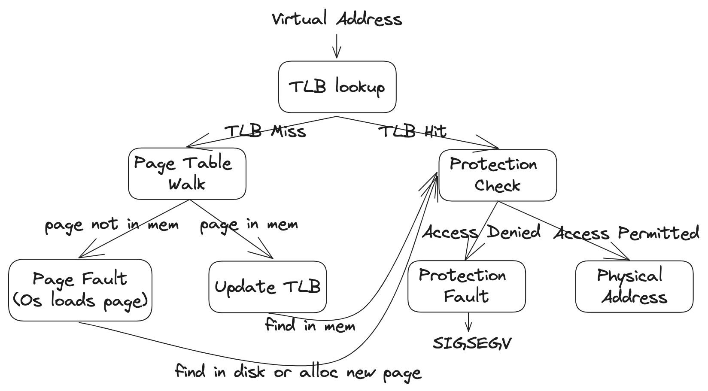

#### Page Table Walk Example

假设当前CPU支持的虚拟地址是14位，物理地址是12位，page size为64字节（这里要说明一下，通常情况下，虚拟地址和物理地址的位数是一样的，但其实并不一定需要一样，因为允许多个虚拟地址指向同一个物理地址）。


不管是虚拟地址还是物理地址，因为最小管理单位都是page，在转换过程中，代表page内的偏移地址（offset）的低位bits部分是不需要参与的，需要转换的只是代表page唯一性标识的高位bits部分，称作page number。由此产生了4个概念：VPN（virtual page number），PPN（physical page number）or in Linux PFN（page frame number），VPO（virtual page offset）和PPO（physical page offset）
$$
PPO = VPO = log_2pageSize
$$


虚拟地址中剩下的bit位就成了VPN，物理地址中剩下的bit位就成了PPN


TLB本身就是一个hardware cache, 假设TLB一共有16个entries，是4路组相关（4-way set associative）的，则有16/4=4个sets。TLB Index（以下简称TI）的值为 2，剩下的bit位就成了TLB Tag（以下简称TT）。


后续使用直接映射，size为64bytes，cache line size为4bytes的cache，结构如下：


TLB结构如下：


page table 结构如下：


cache 结构如下：


下面读取虚拟地址为0x0334处的内容

1. 将这一地址分割成VPN和VPO


2. 将VPN分割成TT和TI


3. 使用TT (0x03) 和TI (0) 在TLB中查找。作为cache，TLB index是用来索引的，不会存储在TLB entry中，TLB entry中存的只有tag, 权限位，有效位和内容（对于TLB来说就是PPN）。一个TLB entry的构成如下：


虽然在set/index为0这一行，找到了tag为03的一个entry，但这个entry中PPN是不存在的，整个entry目前是invalid的，也就是说TLB miss了，需要去page table中找。

4. 使用VPN (0x0C) 作为index在page table中查找。index作为索引，也是不会存储于page table entry中的，PTE存的只有权限位，有效位和内容（对于PTE来说也是PPN）。一个只有one level的page table（单级页表）构成如下：


对应的PTE（page table entry）中的PPN不存在，依然是invalid的，这将触发一个page fault。

读取虚拟地址0x0255，先分解VPN和VPO：


分解VPN为TT和TI：


在TLB中查找 TT (0x02) & TI (1) ，没有匹配的entry，TLB miss


在页表中通过VPN（0x09）找PPN，找到了PPN为0x17


与之前计算出的VPO（0x15）合并，得到物理地址0x5D5


有了物理地址后，在cache中查找，计算得到CT(0x17) CI(5) CO(1)


cache中没有匹配的tag，cache miss


