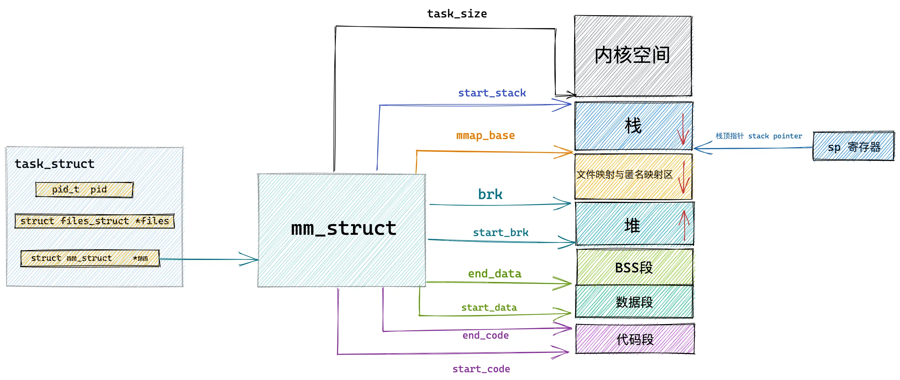
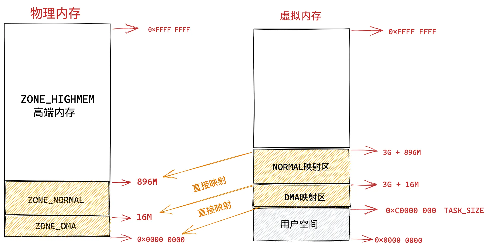
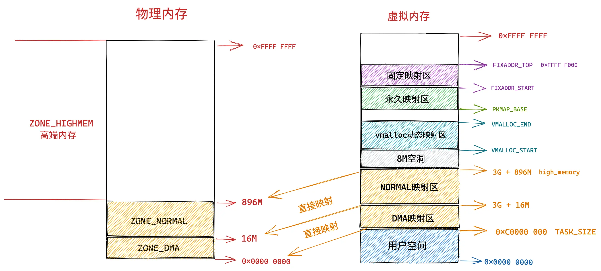
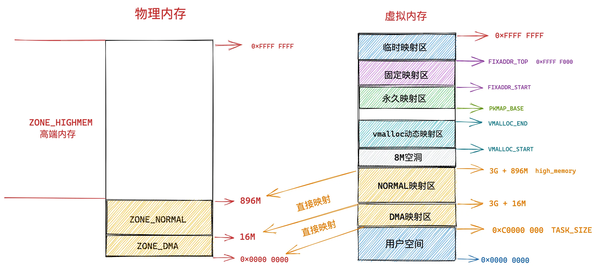
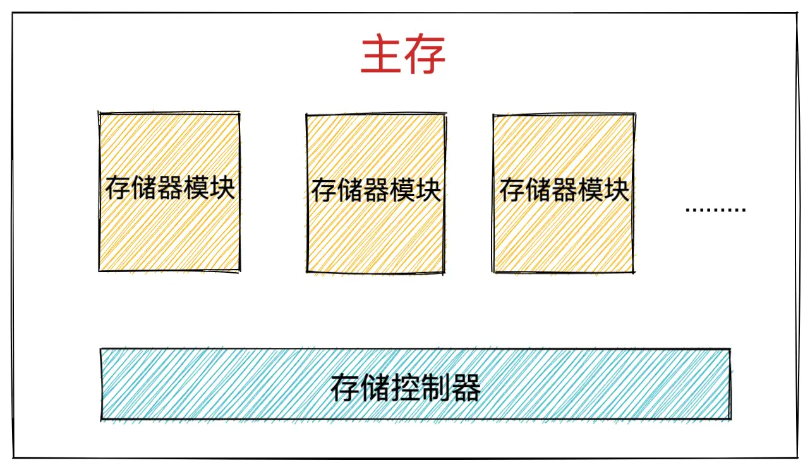
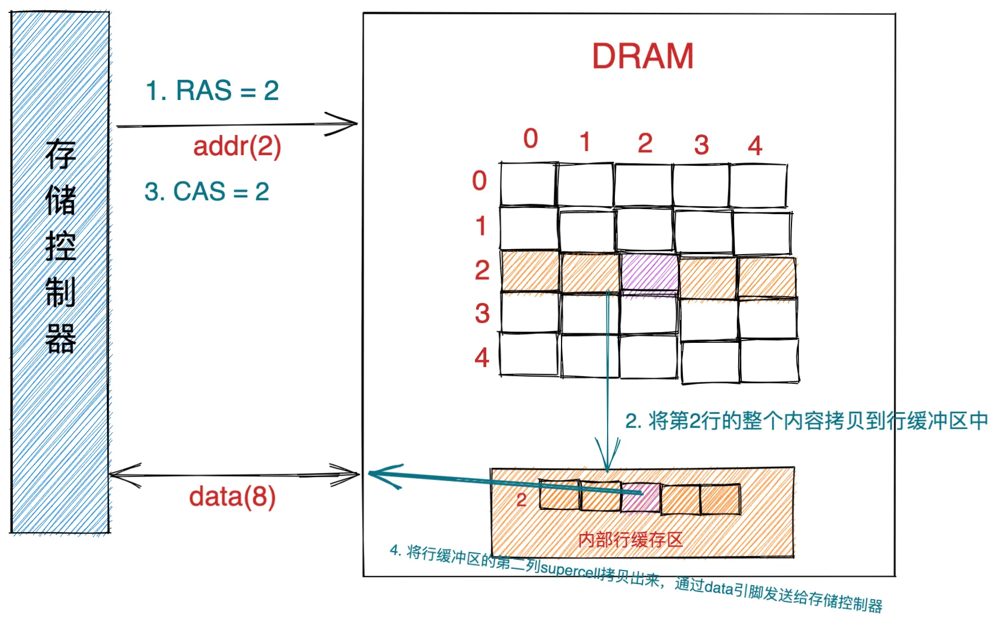
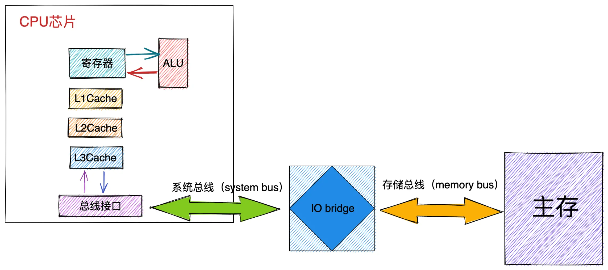
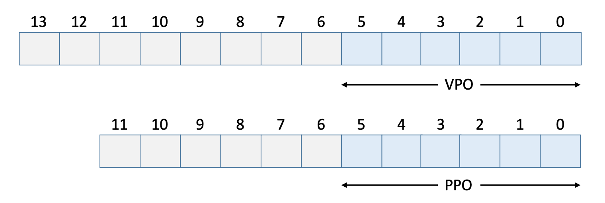
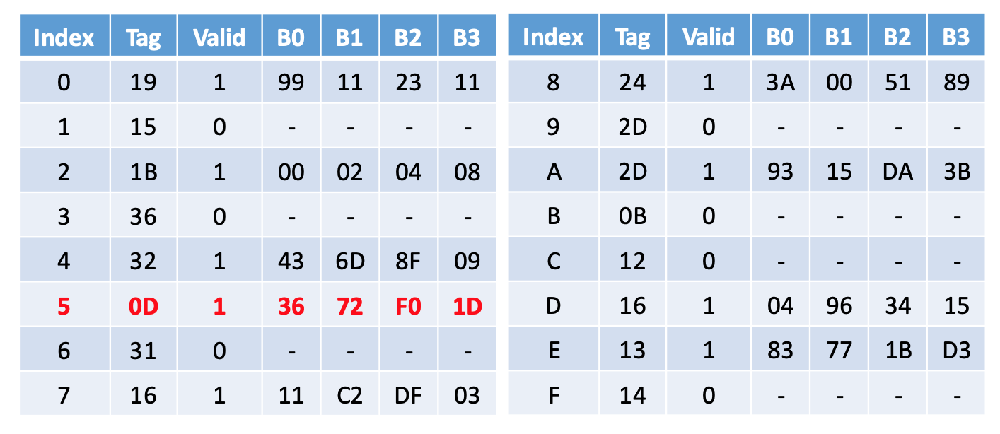

# Memory

### Address Space

#### 用户态空间


- 二进制文件中的机器指令的代码段
- 二进制文件中定义的全局变量和静态变量的数据段和 BSS 段。
- 程序运行过程中动态申请内存的堆。
- 动态链接库以及内存映射区域的文件映射与匿名映射区。
- 函数调用过程中的局部变量和函数参数的栈。

###### 32 位机器上进程虚拟内存空间分布


###### 64 位机器上进程虚拟内存空间分布


###### mm_struct


```c
struct mm_struct {
    unsigned long task_size;    /* size of task vm space */
    /* start_code 和 end_code 定义代码段的起始和结束位置，程序编译后的二进制文件中的机器码被加载进内存之后就存放在这里。
     * start_data 和 end_data 定义数据段的起始和结束位置，二进制文件中存放的全局变量和静态变量被加载进内存中就存放在这里。
     * BSS 段在加载进内存时会生成一段 0 填充的内存区域， BSS 段的大小是固定的，不会扩展，无需记录。
     */
    unsigned long start_code, end_code, start_data, end_data;
    /* start_brk 定义堆的起始位置，brk 定义堆当前的结束位置。start_stack 是栈的起始位置在 RBP 寄存器中存储，
     * 栈的结束位置也就是栈顶指针 stack pointer 在 RSP 寄存器中存储。在栈中内存地址的增长方向也是由高地址向低地址增长。
	 */
    unsigned long start_brk, brk, start_stack;
    /* arg_start 和 arg_end 是参数列表的位置， env_start 和 env_end 是环境变量的位置。它们都位于栈中的最高地址处。*/
    unsigned long arg_start, arg_end, env_start, env_end;
    /* 内存映射区内存地址的增长方向是由高地址向低地址增长，mmap_base 定义内存映射区的起始地址。
     * 进程运行时所依赖的动态链接库中的代码段，数据段，BSS 段以及我们调用 mmap 映射出来的一段虚拟内存空间就保存在这个区域。
     */
    unsigned long mmap_base;  /* base of mmap area */
    /* total_vm 表示在进程虚拟内存空间中总共与物理内存映射的页的总数。*/
    unsigned long total_vm;    /* Total pages mapped */
    /* 当内存吃紧的时候，有些页可以换出到硬盘上，而有些页因为比较重要，不能换出。locked_vm 就是被锁定不能换出的内存页总数。*/
    unsigned long locked_vm;  /* Pages that have PG_mlocked set */
    /* pinned_vm  表示既不能换出，也不能移动的内存页总数。*/
    unsigned long pinned_vm;  /* Refcount permanently increased */
    /* data_vm 表示数据段中映射的内存页数目 */
    unsigned long data_vm;    /* VM_WRITE & ~VM_SHARED & ~VM_STACK */
    /* exec_vm 是代码段中存放可执行文件的内存页数目 */
    unsigned long exec_vm;    /* VM_EXEC & ~VM_WRITE & ~VM_STACK */
    /* stack_vm 是栈中所映射的内存页数目 */
    unsigned long stack_vm;    /* VM_STACK */
    /* struct vm_area_struct 双向链表的头指针 */
    struct vm_area_struct *mmap;  /* list of VMAs */
    /* struct vm_area_struct 红黑树的根节点 */
    struct rb_root mm_rb;
	......
}
```



###### vm_area_struct

每个 `vm_area_struct` 结构对应于虚拟内存空间中的唯一虚拟内存区域 VMA，`vm_start` 指向了这块虚拟内存区域的起始地址（最低地址），`vm_start` 本身包含在这块虚拟内存区域内。`vm_end` 指向了这块虚拟内存区域的结束地址（最高地址），而 `vm_end` 本身包含在这块虚拟内存区域之外，所以 `vm_area_struct` 结构描述的是 `[vm_start，vm_end)` 这样一段左闭右开的虚拟内存区域。

```c
struct vm_area_struct {
    /*  vm_next ，vm_prev 指针分别指向 VMA 节点所在双向链表中的后继节点和前驱节点，内核中的这个 VMA 双向链表是有顺序的，
     * 所有 VMA 节点按照低地址到高地址的增长方向排序。可以通过 cat /proc/pid/maps 或者 pmap pid 查看进程的虚拟内存空间布局
     * 以及其中包含的所有内存区域。这两个命令背后的实现原理就是通过遍历内核中的 vm_area_struct 双向链表获取的。
     */
    struct vm_area_struct *vm_next, *vm_prev;
    /* 红黑树节点 */
 	struct rb_node vm_rb;
    struct list_head anon_vma_chain; 
    /* 指向了所属的虚拟内存空间 mm_struct。 */
 	struct mm_struct *vm_mm; /* The address space we belong to. */
    
    unsigned long vm_start;  /* Our start address within vm_mm. */
    unsigned long vm_end;  /* The first byte after our end address within vm_mm. */
    /*
  	* Access permissions of this VMA.
  	*/
    pgprot_t vm_page_prot;
    unsigned long vm_flags; 

    /*  mmap 在上图虚拟内存空间中的文件映射与匿名映射区创建出一块 VMA 内存区域（这里是匿名映射）*/
    struct anon_vma *anon_vma; /* Serialized by page_table_lock */
    /* 关联文件映射中被映射的文件，匿名映射 vm_file 为空 */
    struct file * vm_file;  /* File we map to (can be NULL). */
    /* 表示文件映射进虚拟内存中的文件内容，在文件中的偏移。 */
    unsigned long vm_pgoff;  /* Offset (within vm_file) in PAGE_SIZE units */ 
    /* 用于存储 VMA 中的私有数据。具体的存储内容和内存映射的类型有关 */
    void * vm_private_data;  /* was vm_pte (shared mem) */
    /* Function pointers to deal with this struct. */
    const struct vm_operations_struct *vm_ops;
}

struct vm_operations_struct {
    /* 当指定的虚拟内存区域被加入到进程虚拟内存空间中时，open 函数会被调用 */
	void (*open)(struct vm_area_struct * area);
    /* 当虚拟内存区域 VMA 从进程虚拟内存空间中被删除时，close 函数会被调用 */
	void (*close)(struct vm_area_struct * area);
    /* 当进程访问虚拟内存时，访问的页面不在物理内存中，可能是未分配物理内存也可能是被置换到磁盘中，
     * 这时就会产生缺页异常，fault 函数就会被调用。
     */
    vm_fault_t (*fault)(struct vm_fault *vmf);
    /* 当一个只读的页面将要变为可写时，page_mkwrite 函数会被调用。 */
    vm_fault_t (*page_mkwrite)(struct vm_fault *vmf);

    ......
}
```

`vm_page_prot` 偏向于定义底层内存管理架构中页这一级别的访问控制权限，它可以直接应用在底层页表中。虚拟内存区域 VMA 由许多的虚拟页 (page) 组成，每个虚拟页需要经过页表的转换才能找到对应的物理页面。页表中关于内存页的访问权限就是由 `vm_page_prot` 决定的。

`vm_flags` 则偏向于定于整个虚拟内存区域的访问权限以及行为规范。描述的是虚拟内存区域中的整体信息，而不是虚拟内存区域中具体的某个独立页面。它是一个抽象的概念。可以通过 `vma->vm_page_prot = vm_get_page_prot(vma->vm_flags)` 实现到具体页面访问权限 `vm_page_prot` 的转换。下表是一些常用的 `vm_flags`

|   vm_flags   |        访问权限        |
| :----------: | :--------------------: |
|   VM_READ    |          可读          |
|   VM_WRITE   |          可写          |
|   VM_EXEC    |         可执行         |
|   VM_SHARD   |    可多进程之间共享    |
|    VM_IO     |  可映射至设备 IO 空间  |
| VM_RESERVED  |   内存区域不可被换出   |
| VM_SEQ_READ  | 内存区域可能被顺序访问 |
| VM_RAND_READ | 内存区域可能被随机访问 |


###### 其他 file_operations

针对 socket 文件类型，这里的 `file_operations` 指向的是 `socket_file_ops`。


socket 相关的操作接口定义在 `inet_stream_ops` 函数集合中，负责对上给用户提供接口。而 socket 与内核协议栈之间的操作接口定义在 `struct sock` 中的 `sk_prot` 指针上，这里指向 `tcp_prot` 协议操作函数集合。

对 socket 发起的系统 IO 调用时，在内核中首先会调用 socket 的文件结构 `struct file` 中的 `file_operations` 文件操作集合，然后调用 `struct socket` 中的 `ops` 指向的 `inet_stream_ops` socket 操作函数，最终调用到 `struct sock` 中 `sk_prot` 指针指向的 `tcp_prot` 内核协议栈操作函数接口集合。


在 ext4 文件系统中管理的文件对应的 `file_operations` 指向 `ext4_file_operations`，专门用于操作 ext4 文件系统中的文件。还有针对 page cache 页高速缓存相关操作定义的 `address_space_operations` 。


###### 二进制文件映射到虚拟内存空间

ELF 格式的二进制文件中包含了程序运行时所需要的元信息，比如程序的机器码，程序中的全局变量以及静态变量等。ELF 格式的二进制文件中的布局也是一段一段的，每一段包含了不同的元数据。磁盘文件中的段叫做 Section，内存中的段叫做 Segment，也就是内存区域。磁盘文件中的这些 Section 会在进程运行之前加载到内存中并映射到内存中的 Segment。通常是多个 Section 映射到一个 Segment。比如磁盘文件中的 .text，.rodata 等一些只读的 Section，会被映射到内存的一个只读可执行的 Segment 里（代码段）。而 .data，.bss 等一些可读写的 Section，则会被映射到内存的一个具有读写权限的 Segment 里（数据段，BSS 段）。

内核中完成这个映射过程的函数是 `load_elf_binary` ，这个函数的作用很大，加载内核的是它，启动第一个用户态进程 init 的是它，fork 完了以后，调用 exec 运行一个二进制程序的也是它。当 exec 运行一个二进制程序的时候，除了解析 ELF 的格式之外，另外一个重要的事情就是建立上述提到的内存映射。

```c
static int load_elf_binary(struct linux_binprm *bprm)
{
      ......
  /* 设置虚拟内存空间中的内存映射区域起始地址 mmap_base */
  setup_new_exec(bprm);

     .....
  /* 创建并初始化栈对应的 vm_area_struct 结构。
   * 设置 mm->start_stack 就是栈的起始地址也就是栈底，并将 mm->arg_start 是指向栈底的。
   */
  retval = setup_arg_pages(bprm, randomize_stack_top(STACK_TOP),
         executable_stack);

     ......
  /* 将二进制文件中的代码部分映射到虚拟内存空间中 */
  error = elf_map(bprm->file, load_bias + vaddr, elf_ppnt,
        elf_prot, elf_flags, total_size);

     ......
  /* 创建并初始化堆对应的的 vm_area_struct 结构，设置 current->mm->start_brk = current->mm->brk，
   * 设置堆的起始地址 start_brk，结束地址 brk。 起初两者相等表示堆是空的
   */
  retval = set_brk(elf_bss, elf_brk, bss_prot);

     ......
  /* 将进程依赖的动态链接库 .so 文件映射到虚拟内存空间中的内存映射区域 */
  elf_entry = load_elf_interp(&loc->interp_elf_ex,
              interpreter,
              &interp_map_addr,
              load_bias, interp_elf_phdata);

     ......
  /* 初始化内存描述符 mm_struct */
  current->mm->end_code = end_code;
  current->mm->start_code = start_code;
  current->mm->start_data = start_data;
  current->mm->end_data = end_data;
  current->mm->start_stack = bprm->p;

     ......
}
```


### 32 位体系内核虚拟内存空间布局

###### 直接映射区域

假定物理内存大小为 4G，在总共大小 1G 的内核虚拟内存空间中，位于最前边有一块 896M 大小的区域，称之为直接映射区或者线性映射区，地址范围为 3G -- 3G + 896m 。之所以这块 896M 大小的区域称为直接映射区或者线性映射区，是因为这块连续的虚拟内存地址会映射到 0 - 896M 这块连续的物理内存上。也就是说 3G -- 3G + 896m 这块 896M 大小的虚拟内存会直接映射到 0 - 896M 这块 896M 大小的物理内存上，**这块区域中的虚拟内存地址直接减去 0xC000 0000 (3G) 就得到了物理内存地址**。所以称这块区域为直接映射区。


可以通过 `cat /proc/iomem` 命令查看具体物理内存布局情况。在这段 896M 大小的物理内存中，前 1M 已经在系统启动的时候被系统占用，1M 之后的物理内存存放的是内核代码段，数据段，BSS 段（这些信息起初存放在 ELF格式的二进制文件中，在系统启动的时候被加载进内存）。

使用 fork 系统调用创建进程的时候，内核会创建一系列进程相关的描述符，比如之前提到的进程的核心数据结构 `task_struct`，进程的内存空间描述符 `mm_struct`，以及虚拟内存区域描述符 `vm_area_struct` 等。这些进程相关的数据结构也会存放在物理内存前 896M 的这段区域中，当然也会被直接映射至内核态虚拟内存空间中的 3G -- 3G + 896m 这段直接映射区域中。

当进程被创建完毕之后，在内核运行的过程中，会涉及内核栈的分配，内核会为每个进程分配一个固定大小的内核栈（一般是两个页大小，依赖具体的体系结构），每个进程的整个调用链必须放在自己的内核栈中，内核栈也是分配在直接映射区。（内核栈容量小而且是固定的，不像用户态栈可以动态扩展）

###### ZONE_DMA

在 X86 体系结构下，ISA 总线的 DMA （直接内存存取）控制器，只能对内存的前16M 进行寻址，这就导致了 ISA 设备不能在整个 32 位地址空间中执行 DMA，只能使用物理内存的前 16M 进行 DMA 操作。因此直接映射区的前 16M 专门让内核用来为 DMA 分配内存，这块 16M 大小的内存区域我们称之为 ZONE_DMA。**用于 DMA 的内存必须从 ZONE_DMA 区域中分配。**

###### ZONE_NORMAL

直接映射区中剩下的部分也就是从 16M 到 896M（不包含 896M）这段区域，称之为 ZONE_NORMAL。ZONE_NORMAL 也是属于直接映射区的一部分，对应的物理内存 16M 到 896M 这段区域也是被直接映射至内核态虚拟内存空间中的 3G + 16M 到 3G + 896M 这段虚拟内存上。

###### ZONE_HIGHMEM

物理内存 896M 以上的区域被内核划分为 ZONE_HIGHMEM 区域，称之为高端内存。本例中的物理内存假设为 4G，高端内存区域为 4G - 896M = 3200M。由于内核虚拟内存空间中的前 896M 虚拟内存已经被直接映射区所占用，而在 32 体系结构下内核虚拟内存空间总共也就 1G 的大小，这样一来内核剩余可用的虚拟内存空间就变为了 1G - 896M = 128M。显然物理内存中 3200M 大小的 ZONE_HIGHMEM 区域无法继续通过直接映射的方式映射到这 128M 大小的虚拟内存空间中。这样一来物理内存中的 ZONE_HIGHMEM 区域就只能采用动态映射的方式映射到 128M 大小的内核虚拟内存空间中，也就是说只能动态的一部分一部分的分批映射，先映射正在使用的这部分，使用完毕解除映射，接着映射其他部分。



###### vmalloc 动态映射区

内核虚拟内存空间中的 3G + 896M 这块地址在内核中定义为 high_memory，high_memory 往上有一段 8M 大小的内存空洞。空洞范围为：high_memory 到  `VMALLOC_START` 。接下来 `VMALLOC_START` 到 `VMALLOC_END` 之间的这块区域成为动态映射区。采用动态映射的方式映射物理内存中的高端内存。

在这块动态映射区内核是使用 vmalloc 进行内存分配。由于之前介绍的动态映射的原因，vmalloc 分配的内存在虚拟内存上是连续的，但是物理内存是不连续的。通过页表来建立物理内存与虚拟内存之间的映射关系，从而可以将不连续的物理内存映射到连续的虚拟内存上。由于 vmalloc 获得的物理内存页是不连续的，因此它只能将这些物理内存页一个一个地进行映射，在性能开销上会比直接映射大得多。


###### 永久映射区

而在 `PKMAP_BASE` 到 `FIXADDR_START` 之间的这段空间称为永久映射区。在内核的这段虚拟地址空间中允许建立与物理高端内存的长期映射关系。比如内核通过 `alloc_pages()` 函数在物理内存的高端内存中申请获取到的物理内存页，这些物理内存页可以通过调用 `kmap` 映射到永久映射区中。


###### 固定映射区

内核虚拟内存空间中的下一个区域为固定映射区，区域范围为：`FIXADDR_START` 到 `FIXADDR_TOP`。

在固定映射区中的虚拟内存地址可以自由映射到物理内存的高端地址上，但是与动态映射区以及永久映射区不同的是，在固定映射区中虚拟地址是固定的，而被映射的物理地址是可以改变的。也就是说，有些虚拟地址在编译的时候就固定下来了，是在内核启动过程中被确定的，而这些虚拟地址对应的物理地址不是固定的。采用固定虚拟地址的好处是它相当于一个指针常量（常量的值在编译时确定），指向物理地址，如果虚拟地址不固定，则相当于一个指针变量。

那为什么会有固定映射这个概念呢 ?  比如：在内核的启动过程中，有些模块需要使用虚拟内存并映射到指定的物理地址上，而且这些模块也没有办法等待完整的内存管理模块初始化之后再进行地址映射。因此，内核固定分配了一些虚拟地址，这些地址有固定的用途，使用该地址的模块在初始化的时候，将这些固定分配的虚拟地址映射到指定的物理地址上去。



###### 临时映射区



临时映射是相对于永久映射来说的，永久映射的 `kmap()` 和 `kunmap()` 函数不能用于中断处理程序，因为它可能会睡眠。当必须创建一个映射而当前的上下文又不能睡眠时，内核提供了临时映射（也就是所谓的原子映射）。API 如下

```c
void *kmap_atomic(struct *page, enum kmtype type);
void kunmap_atomic(void *kvaddr, enum km_type type);
```


### 64 位体系内核虚拟内存空间布局

在 64 位体系下的内核虚拟内存空间与物理内存的映射就变得非常简单，由于虚拟内存空间足够的大，即便是内核要访问全部的物理内存，直接映射就可以了，不在需要用到高端内存那种动态映射方式。


64 位内核虚拟内存空间从 0xFFFF 8000 0000 0000 开始到 0xFFFF 8800 0000 0000 这段地址空间是一个 8T 大小的内存空洞区域。

紧着着 8T 大小的内存空洞下一个区域就是 64T 大小的直接映射区。这个区域中的虚拟内存地址减去 `PAGE_OFFSET` 就直接得到了物理内存地址。

`VMALLOC_START` 到 `VMALLOC_END` 的这段区域是 32T 大小的 vmalloc 映射区，这里类似用户空间中的堆，内核在这里使用 vmalloc 系统调用申请内存。

从 `VMEMMAP_START` 开始是 1T 大小的虚拟内存映射区，用于存放物理页面的描述符 `struct page` 结构用来表示物理内存页。

从` __START_KERNEL_map` 开始是大小为 512M 的区域用于存放内核代码段、全局变量、BSS 等。这里对应到物理内存开始的位置，减去 `__START_KERNEL_map` 就能得到物理内存的地址。这里和直接映射区有点像，但是不矛盾，因为直接映射区之前有 8T 的空洞区域，早就过了内核代码在物理内存中加载的位置。


### 物理内存

内存也叫随机访问存储器（ random-access memory ）也叫 RAM 。而 RAM 分为两类：

- 一类是静态 RAM（ `SRAM` ），这类 SRAM 用于 CPU 高速缓存 L1Cache，L2Cache，L3Cache。其特点是访问速度快，访问速度为 1 - 30 个时钟周期，但是容量小，造价高。

  

- 另一类则是动态 RAM ( `DRAM` )，这类 DRAM 用于常说的主存上，其特点的是访问速度慢（相对高速缓存），访问速度为 50 - 200 个时钟周期，但是容量大，造价便宜些（相对高速缓存）。

内存由一个一个的存储器模块（memory module）组成，它们插在主板的扩展槽上。常见的存储器模块通常以 64 位为单位（ 8 个字节）传输数据到存储控制器上或者从存储控制器传出数据。


如图所示内存条上黑色的元器件就是存储器模块（memory module）。多个存储器模块连接到存储控制器上，就聚合成了主存。



而 DRAM 芯片就包装在存储器模块中，每个存储器模块中包含 8 个 DRAM 芯片，依次编号为 0 - 7 。


而每一个 DRAM 芯片的存储结构是一个二维矩阵，二维矩阵中存储的元素称为超单元（supercell），每个 supercell 大小为一个字节（8 bit）。每个 supercell 都由一个坐标地址（i，j）。i 表示二维矩阵中的行地址，在计算机中行地址称为 RAS (row access strobe，行访问选通脉冲)。 j 表示二维矩阵中的列地址，在计算机中列地址称为 CAS (column access strobe，列访问选通脉冲)。下图中的 supercell 的 RAS = 2，CAS = 2。


DRAM 芯片中的信息通过引脚流入流出 DRAM 芯片。每个引脚携带 1 bit的信号。

图中 DRAM 芯片包含了两个地址引脚( `addr` )，因为要通过 RAS，CAS 来定位要获取的 supercell 。还有 8 个数据引脚（`data`），因为 DRAM 芯片的 IO 单位为一个字节（8 bit），所以需要 8 个 data 引脚从 DRAM 芯片传入传出数据。（注意这里只是为了解释地址引脚和数据引脚的概念，实际硬件中的引脚数量是不一定的。）

##### DRAM 芯片的访问



1. 首先存储控制器将行地址 RAS = 2 通过地址引脚发送给 DRAM 芯片。
2. DRAM 芯片根据 RAS = 2 将二维矩阵中的第二行的全部内容拷贝到内部行缓冲区中。
3. 接下来存储控制器会通过地址引脚发送 CAS = 2 到 DRAM 芯片中。
4. DRAM 芯片从内部行缓冲区中根据 CAS = 2 拷贝出第二列的 supercell 并通过数据引脚发送给存储控制器。

DRAM 芯片的 IO 单位为一个 supercell ，也就是一个字节(8 bit)。

##### CPU 如何读写主存



CPU 与内存之间的数据交互是通过总线（bus）完成的，而数据在总线上的传送是通过一系列的步骤完成的，这些步骤称为总线事务（bus transaction）。

其中数据从内存传送到 CPU 称之为读事务（read transaction），数据从 CPU 传送到内存称之为写事务（write transaction）。

总线上传输的信号包括：地址信号，数据信号，控制信号。其中控制总线上传输的控制信号可以同步事务，并能够标识出当前正在被执行的事务信息：

- 当前这个事务是到内存的？还是到磁盘的？或者是到其他 IO 设备的？
- 这个事务是读还是写？
- 总线上传输的地址信号（物理内存地址），还是数据信号（数据）？。

**总线上传输的地址均为物理内存地址**。比如：在 MESI 缓存一致性协议中当 CPU core0 修改字段 a 的值时，其他 CPU 核心会在总线上嗅探字段 a 的**物理内存地址**，如果嗅探到总线上出现字段 a 的**物理内存地址**，说明有人在修改字段 a，这样其他 CPU 核心就会失效字段 a 所在的 cache line 。

如上图所示，其中系统总线是连接 CPU 与 IO bridge 的，存储总线是来连接 IO bridge 和主存的。IO bridge 负责将系统总线上的电子信号转换成存储总线上的电子信号。IO bridge 也会将系统总线和存储总线连接到IO总线（磁盘等IO设备）上。这里 IO bridge 其实起的作用就是转换不同总线上的电子信号。

##### CPU 从内存读取数据过程

假设 CPU 现在需要将物理内存地址为 A 的内容加载到寄存器中进行运算。


首先 CPU 芯片中的总线接口会在总线上发起读事务（read transaction）。 该读事务分为以下步骤进行：

1. CPU 将物理内存地址 A 放到系统总线上。随后 IO bridge 将信号传递到存储总线上。
2. 主存感受到存储总线上的地址信号并通过存储控制器将存储总线上的物理内存地址 A 读取出来。
3. 存储控制器通过物理内存地址 A 定位到具体的存储器模块，从 DRAM 芯片中取出物理内存地址 A 对应的数据 X。
4. 存储控制器将读取到的数据 X 放到存储总线上，随后 IO bridge 将存储总线上的数据信号转换为系统总线上的数据信号，然后继续沿着系统总线传递。
5. CPU 芯片感受到系统总线上的数据信号，将数据从系统总线上读取出来并拷贝到寄存器中。

##### 根据物理内存地址从主存中读取数据

一个 supercell 存储了一个字节（ 8 bit ） 数据，从 DRAM0 到 DRAM7 依次读取到了 8 个 supercell 也就是 8 个字节，然后将这 8 个字节返回给存储控制器，由存储控制器将数据放到存储总线上。

CPU 总是以 word size 为单位从内存中读取数据，在 64 位处理器中的 word size 为 8 个字节。64 位的内存每次只能吞吐 8 个字节。CPU 每次会向内存读写一个 cache line 大小的数据（ 64 个字节），但是内存一次只能吞吐 8 个字节。

所以在物理内存地址对应的存储器模块中，DRAM0 芯片存储第一个低位字节（ supercell ），DRAM1 芯片存储第二个字节，......依次类推 DRAM7 芯片存储最后一个高位字节。


由于存储器模块中这种由 8 个 DRAM 芯片组成的物理存储结构的限制，内存读取数据只能是按照物理内存地址，8 个字节 8 个字节地顺序读取数据。所以说内存一次读取和写入的单位是 8 个字节。


而且所谓连续的物理内存地址实际上在物理上是不连续的。因为这连续的 8 个字节其实是存储于不同的 DRAM 芯片上的。每个 DRAM 芯片存储一个字节（supercell）

##### CPU 向内存写入数据过程

假设 CPU 要将寄存器中的数据 X 写到物理内存地址 A 中。同样的道理，CPU 芯片中的总线接口会向总线发起写事务（write transaction）。写事务步骤如下：

1. CPU 将要写入的物理内存地址 A 放入系统总线上。
2. 通过 IO bridge 的信号转换，将物理内存地址 A 传递到存储总线上。
3. 存储控制器感受到存储总线上的地址信号，将物理内存地址 A 从存储总线上读取出来，并等待数据的到达。
4. CPU 将寄存器中的数据拷贝到系统总线上，通过 IO bridge 的信号转换，将数据传递到存储总线上。
5. 存储控制器感受到存储总线上的数据信号，将数据从存储总线上读取出来。
6. 存储控制器通过内存地址 A 定位到具体的存储器模块，最后将数据写入存储器模块中的 8 个 DRAM 芯片中。


### Virtual Address Translation

在Linux，Windows等操作系统中，为什么不直接使用Physical Address（物理地址），而要用Virtual Address（虚拟地址）呢？因为虚拟地址可以带来诸多好处: 

1. 在支持多进程的系统中，如果各个进程的镜像文件都使用物理地址，则在加载到同一物理内存空间的时候，可能发生冲突。
2. 直接使用物理地址，不便于进行进程地址空间的隔离。
3. 物理内存是有限的，在物理内存整体吃紧的时候，可以让多个进程通过分时复用的方法共享一个物理页面（某个进程需要保存的内容可以暂时swap到外部的disk/flash），这有点类似于多线程分时复用共享CPU的方式。

既然使用虚拟地址，就涉及到将虚拟地址转换为物理地址的过程，这需要MMU（Memory Management Unit）和页表（page table）的共同参与。

#### MMU

MMU是处理器/核（processer）中的一个硬件单元，通常每个核有一个MMU。MMU由两部分组成：TLB(Translation Lookaside Buffer)和table walk unit。


#### **Page Table**

page table是每个进程独有的，是软件实现的，是存储在main memory（比如DDR）中的。

#### Address Translation

因为访问内存中的页表相对耗时，尤其是在现在普遍使用多级页表的情况下，需要多次的内存访问，为了加快访问速度，给page table设计了一个硬件缓存 - **TLB**，CPU会首先在TLB中查找，因为在TLB中找起来很快。TLB之所以快，一是因为它含有的entries的数目较少，二是TLB是集成进CPU的，它几乎可以按照CPU的速度运行。

如果在TLB中找到了含有该虚拟地址的entry（TLB hit），则可从该entry中直接获取对应的物理地址，否则就不幸地TLB miss了，就得去查找当前进程的page table。这个时候，组成MMU的另一个部分table walk unit就被召唤出来了，这里面的table就是page table。

使用table walk unit硬件单元来查找page table的方式被称为hardware TLB miss handling，通常被CISC架构的处理器（比如IA-32）所采用。它要在page table中查找不到，出现page fault的时候才会交由软件（操作系统）处理。

与之相对的通常被RISC架构的处理器（比如Alpha）采用的software TLB miss handling，TLB miss后CPU就不再参与了，由操作系统通过软件的方式来查找page table。使用硬件的方式更快，而使用软件的方式灵活性更强。IA-64提供了一种混合模式，可以兼顾两者的优点。

如果在page table中找到了该虚拟地址对应的entry的p（present）位是1，说明该虚拟地址对应的物理页面当前驻留在内存中，也就是page table hit。找到了还没完，接下来还有两件事要做：

1. 既然是因为在TLB里找不到才找到这儿来的，自然要更新TLB。
2. 进行权限检测，包括可读/可写/可执行权限，user/supervisor模式权限等。如果没有正确的权限，将触发SIGSEGV（Segmantation Fault）。

如果该虚拟地址对应的entry的p位是0，就会触发page fault，可能有这几种情况：

1. 这个虚拟地址被分配后还从来没有被access过（比如malloc之后还没有操作分配到的空间，则不会真正分配物理内存）。触发page fault后分配物理内存，也就是demand paging，有了确定的demand了之后才分，然后将p位置1。
2. 对应的这个物理页面的内容被换出到外部的disk/flash了，这个时候page table entry里存的是换出页面在外部swap area里暂存的位置，可以将其换回物理内存，再次建立映射，然后将p位置1。


#### Page Table Walk Example

假设当前CPU支持的虚拟地址是14位，物理地址是12位，page size为64字节（这里要说明一下，通常情况下，虚拟地址和物理地址的位数是一样的，但其实并不一定需要一样，因为允许多个虚拟地址指向同一个物理地址）。


不管是虚拟地址还是物理地址，因为最小管理单位都是page，在转换过程中，代表page内的偏移地址（offset）的低位bits部分是不需要参与的，需要转换的只是代表page唯一性标识的高位bits部分，称作page number。由此产生了4个概念：VPN（virtual page number），PPN（physical page number）or in Linux PFN（page frame number），VPO（virtual page offset）和PPO（physical page offset）
$$
PPO = VPO = log_2pageSize
$$


虚拟地址中剩下的bit位就成了VPN，物理地址中剩下的bit位就成了PPN


TLB本身就是一个hardware cache, 假设TLB一共有16个entries，是4路组相关（4-way set associative）的，则有16/4=4个sets。TLB Index（以下简称TI）的值为 2，剩下的bit位就成了TLB Tag（以下简称TT）。


后续使用直接映射，size为64bytes，cache line size为4bytes的cache，结构如下：


TLB结构如下：


page table 结构如下：


cache 结构如下：


下面读取虚拟地址为0x0334处的内容

1. 将这一地址分割成VPN和VPO


2. 将VPN分割成TT和TI


3. 使用TT (0x03) 和TI (0) 在TLB中查找。作为cache，TLB index是用来索引的，不会存储在TLB entry中，TLB entry中存的只有tag, 权限位，有效位和内容（对于TLB来说就是PPN）。一个TLB entry的构成如下：


虽然在set/index为0这一行，找到了tag为03的一个entry，但这个entry中PPN是不存在的，整个entry目前是invalid的，也就是说TLB miss了，需要去page table中找。

4. 使用VPN (0x0C) 作为index在page table中查找。index作为索引，也是不会存储于page table entry中的，PTE存的只有权限位，有效位和内容（对于PTE来说也是PPN）。一个只有one level的page table（单级页表）构成如下：


对应的PTE（page table entry）中的PPN不存在，依然是invalid的，这将触发一个page fault。

读取虚拟地址0x0255，先分解VPN和VPO：


分解VPN为TT和TI：


在TLB中查找 TT (0x02) & TI (1) ，没有匹配的entry，TLB miss


在页表中通过VPN（0x09）找PPN，找到了PPN为0x17


与之前计算出的VPO（0x15）合并，得到物理地址0x5D5


有了物理地址后，在cache中查找，计算得到CT(0x17) CI(5) CO(1)


cache中没有匹配的tag，cache miss




