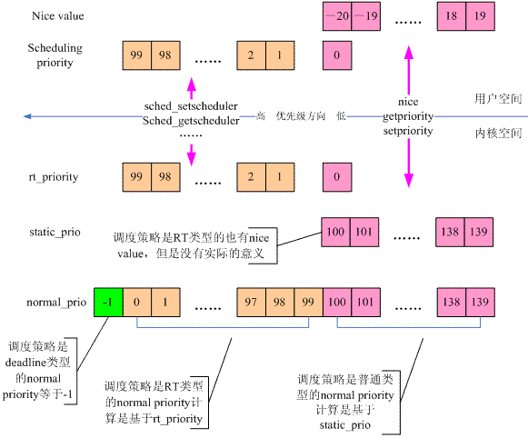

# Scheduler

### Priority Overview



### User Space View

在用户空间，进程优先级分两类：nice value和scheduling priority。对于普通进程而言，进程优先级就是nice value，从-20（优先级最高）～19（优先级最低），通过修改nice value可以改变普通进程获取cpu资源的比例。随着实时需求的提出，进程又被赋予了另外一种属性scheduling priority，而这些进程被称为实时进程。实时进程的优先级的范围可以通过sched_get_priority_min和sched_get_priority_max，对于linux而言，实时进程的scheduling priority的范围是1（优先级最低）～99（优先级最高）。当然，普通进程也有scheduling priority，被设定为0。

### Kernel Space implementation

```c
struct task_struct {
......
    int prio, static_prio, normal_prio;
    unsigned int rt_priority;
......
    unsigned int policy;
......
}
```

#### Static Priority

task_struct中的static_prio字段，被称之为静态优先级，其特点如下：

1）值越小，进程优先级越高

2）0 – 99用于real-time processes（没有实际的意义），100 – 139用于普通进程

3）缺省值是 120

4）用户空间可以通过nice()或者setpriority对该值进行修改。通过getpriority可以获取该值。

5）新创建的进程会继承父进程的static priority。

静态优先级是所有相关优先级的计算的起点，要么继承自父进程，要么用户空间自行设定。一旦修改了静态优先级，那么normal priority和动态优先级都需要重新计算。

#### Real-Time Priority

task_struct中的rt_priority成员表示该线程的实时优先级，也就是从用户空间的视角来看的scheduling priority。0是普通进程，1～99是实时进程，99的优先级最高。注：内核rt_priority和用户态设置的是直接映射关系。

#### Normalized Priority

task_struct中的normal_prio成员。我们称之归一化优先级（normalized priority），它是根据静态优先级、scheduling priority和调度策略来计算得到，代码如下：

```c
static inline int __normal_prio(struct task_struct *p)
{
    return p->static_prio;
}

static inline int normal_prio(struct task_struct *p)
{
    int prio;

    if (task_has_dl_policy(p))
        prio = MAX_DL_PRIO - 1;
    else if (task_has_rt_policy(p))
        prio = MAX_RT_PRIO - 1 - p->rt_priority;
    else
        prio = __normal_prio(p);
    return prio;
}
```

对于内核的优先级，调度器需要综合考虑各种因素，例如调度策略，nice value、scheduling priority等，把这些factor全部考虑进来，归一化成一个数轴上的number，以此来表示其优先级，这就是normalized priority。对于一个线程，其normalized priority的number越小，其优先级越大。

调度策略是deadline的进程比RT进程和normal进程的优先级还要高，因此它的归一化优先级是负数：-1。如果采用实时调度策略，那么该线程的normalized priority和rt_priority相关。task struct中的rt_priority成员是用户空间视角的实时优先级（scheduling priority），MAX_RT_PRIO - 1是99，MAX_RT_PRIO - 1 - p->rt_priority则翻转了实时进程的scheduling priority，最高优先级是0，最低是98。**顺便说一句，normalized priority是99的情况是没有意义的。**对于普通进程，normalized priority就是其静态优先级。

#### Effective Priority

task_struct中的prio成员表示了该线程的动态优先级，也就是调度器在进行调度时候使用的那个优先级。动态优先级在运行时可以被修改，例如在处理优先级翻转问题的时候，系统可能会临时调升一个普通进程的优先级。一般设定动态优先级的代码是这样的：p->prio = effective_prio(p)，具体计算动态优先级的代码如下：

```c
static inline int rt_prio(int prio)
{
    if (unlikely(prio < MAX_RT_PRIO))
        return 1;
    return 0;
}

static int effective_prio(struct task_struct *p)
{
    p->normal_prio = normal_prio(p);
    if (!rt_prio(p->prio))
        return p->normal_prio;
    return p->prio;
}
```

rt_prio()是一个根据当前优先级来确定是否是实时进程的函数，包括两种情况，一种情况是该进程是实时进程，调度策略是SCHED_FIFO或者SCHED_RR。另外一种情况是人为的将该进程提升到RT priority的区域（例如在使用优先级继承的方法解决系统中优先级翻转问题的时候）。在这两种情况下，我们都不改变其动态优先级，即effective_prio返回当前动态优先级p->prio。其他情况，进程的动态优先级跟随归一化的优先级。

### Code Review

```c
void set_user_nice(struct task_struct *p, long nice)
{
    bool queued, running;
    int old_prio;
    struct rq_flags rf;
    struct rq *rq;

    if (task_nice(p) == nice || nice < MIN_NICE || nice > MAX_NICE)
		    return;
    /*
     * We have to be careful, if called from sys_setpriority(),
     * the task might be in the middle of scheduling on another CPU.
     */
    rq = task_rq_lock(p, &rf);
    update_rq_clock(rq);

    /*
     * The RT priorities are set via sched_setscheduler(), but we still
     * allow the 'normal' nice value to be set - but as expected
     * it wont have any effect on scheduling until the task is
     * SCHED_DEADLINE, SCHED_FIFO or SCHED_RR:
     */
    if (task_has_dl_policy(p) || task_has_rt_policy(p)) {
        p->static_prio = NICE_TO_PRIO(nice);
        goto out_unlock;
    }
    queued = task_on_rq_queued(p);
    running = task_current(rq, p);
    if (queued)
        dequeue_task(rq, p, DEQUEUE_SAVE | DEQUEUE_NOCLOCK); /* nice调整后，需要重新组织红黑树 */
    if (running)
        put_prev_task(rq, p);

    p->static_prio = NICE_TO_PRIO(nice);
    set_load_weight(p, true); /* nice调整后，load需要重新计算 */
    old_prio = p->prio;
    p->prio = effective_prio(p);

    if (queued)
        enqueue_task(rq, p, ENQUEUE_RESTORE | ENQUEUE_NOCLOCK);
    if (running)
        set_next_task(rq, p);

    /*
     * If the task increased its priority or is running and
     * lowered its priority, then reschedule its CPU:
     */
    p->sched_class->prio_changed(rq, p, old_prio);

 out_unlock:
    task_rq_unlock(rq, p, &rf);
}
```

``` c
int sched_fork(unsigned long clone_flags, struct task_struct *p)
{
……
    p->prio = current->normal_prio; /* 子进程的prio继承父进程的normal_prio */

    if (unlikely(p->sched_reset_on_fork)) {
        /* 缺省的调度策略是SCHED_NORMAL，静态优先级等于120（nice value等于0），rt priority等于0（普通进程） */
        if (task_has_dl_policy(p) || task_has_rt_policy(p)) { 
            p->policy = SCHED_NORMAL;
            p->static_prio = NICE_TO_PRIO(0);
            p->rt_priority = 0;
        } else if (PRIO_TO_NICE(p->static_prio) < 0)
            p->static_prio = NICE_TO_PRIO(0);

        /* 既然调度策略和静态优先级已经修改了，那么也需要更新动态优先级和归一化优先级。此外，load weight也需要更新。
         * 随后sched_reset_on_fork这个flag可以clear掉了。
         */
        p->prio = p->normal_prio = __normal_prio(p);
        set_load_weight(p); 
        p->sched_reset_on_fork = 0;
    }
……
}
```

### History of Scheduler Evolution

调度器的评价标准：

1、对于time-sharing的进程，调度器必须是公平的

2、快速的进程响应时间

3、系统的throughput要高

4、功耗要小

#### Linux 2.4.18 O(n)Scheduler

##### 1. process description


```c
struct task_struct {
		volatile long need_resched; /* e.g. 时间片用完置位，等待下一个调度点切出 */
		long counter; /* counter = NICE_TO_TICKS(nice)，每个tick到来减一 */
		long nice; /* 普通线程的静态优先级 */
		unsigned long policy; /* SCHED_OTHER/SCHED_RR/SCHED_FIFO/SCHED_YIELD（处理sched_yield系统调用） */
		int processor; /* 正在执行（或者上次执行）的逻辑CPU号 */
		unsigned long cpus_runnable; /* 如果该进程没有被任何CPU执行，那么所有的bit被设定为1，如果进程正在被某个CPU执行，那么正在执行的CPU bit设定为1，其他设定为0 */
  	unsigned long cpus_allowed; /* task允许在那些CPU上执行的掩码 */
		struct list_head run_list; /* run_list成员是链接入各种链表的节点 */
		unsigned long rt_priority; /* 实时线程的静态优先级 */
		......
};
```

##### 2. scheduler management

调度器模块定义了一个runqueue_head的链表头变量，无论进程是普通进程还是实时进程，只要进程状态变成可运行状态的时候，它会被挂入这个全局runqueue链表中。随着系统的运行，runqueue链表中的进程会不断的插入或者移除。由于整个系统中的所有CPU共享一个runqueue，为了解决同步问题，调度器模块定义了一个自旋锁来保护对这个全局runqueue的并发访问

除了这个runqueue队列，系统还有一个囊括所有task（不管其进程状态为何）的链表，链表头定义为init_task，在一个调度周期结束后，重新为task赋初始时间片值的时候会用到该链表。此外，进入sleep状态的进程分别挂入了不同的等待队列中。

##### 3. dynamic priority

```c
/* rt task */
weight = 1000 + p->rt_priority; 

/* fair task */
weight = p->counter;
if (!weight)
		goto out;
weight += 20 - p->nice;
```